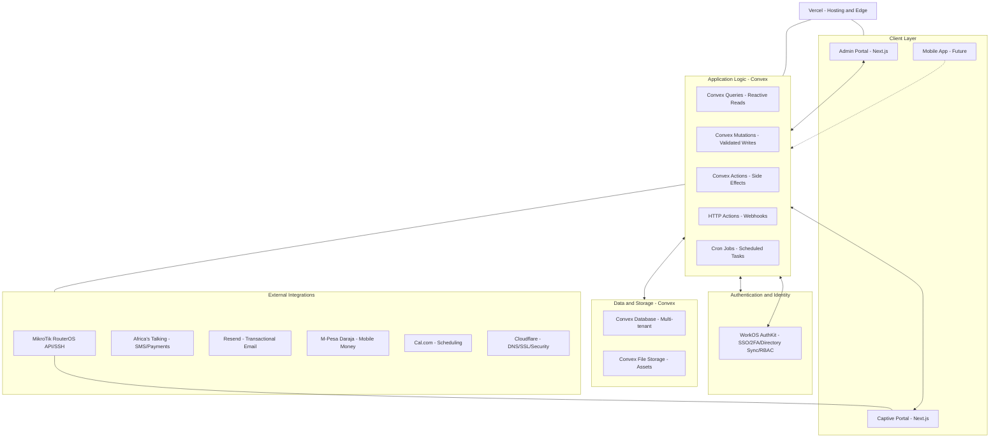
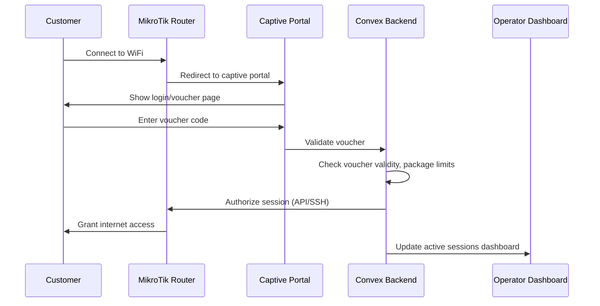
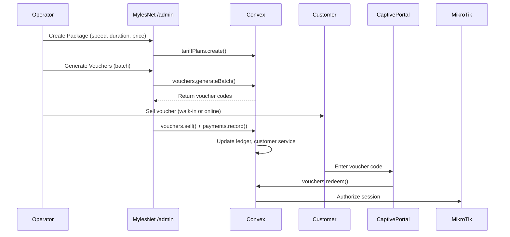

# [[MylesNet]] Master Technical Specification — Version 3 Final

![[design/logo.png]]

## Document Control

| Field | Value |
|---|---|
| Product | [[MylesNet]] |
| Company | [[MylesCorp Technologies Ltd]] |
| Author | [[Jonathan Myles]] |
| Classification | Confidential internal source of truth |
| Version | Master V3 Final |
| Date | 2026-09-09 |
| Status | Draft — pending [[Jonathan Myles]] approval |
| Vault scope | `products/mylesnet/` and child folders |
| Approved logo | `products/mylesnet/design/logo.png` |

### Canonical Service Identity

| Service | Canonical reference |
|---|---|
| GitHub repository | [mylescorp/mylesnet-dashboard](https://github.com/mylescorp/mylesnet-dashboard) |
| Local repository path | `C:\Users\Admin\Projects\mylesnet-dashboard` |
| Vercel project | [mylesnet-dashboard](https://vercel.com/mylescorp/mylesnet-dashboard) — org `team_s0Sj4NZU64m14fYzc49Q3ix2`, project `prj_AXmpSUWgx799M2zRZWsHUWmN72zq` |
| Convex project | team `mylesoft`, project `mylesnet-dashboard` — prod deployment `precious-chipmunk-720`, prod URL `https://precious-chipmunk-720.convex.cloud`, dev deployment `local:local-mylesoft-mylesnet_dashboard`, site URL `https://127.0.0.1:3211` |
| WorkOS workspace | MylesCorp Technologies — MylesNet (sandbox): client `client_01KW2CDMPAS1H8FD68QQWY6713`, environment `environment_01KW2CDM74D4ZK4G89PFM92KF6` |
| WorkOS organizations | MylesNet Platform `org_01KWQ9Q1T5WKX4KEDWPVJ395Y4`; MylesNet Network `org_01KWQ9Q6XPN5Z0MRXCTMGR94X4`; one WorkOS organization per ISP tenant |
| Bootstrap owner email | `ayany004@gmail.com` |
| Production hostname | `https://mylesnetisp.mylescorptech.com` |
| Auth callbacks | local `http://localhost:3000/auth/callback`; production `https://mylesnetisp.mylescorptech.com/auth/callback` |
| Collector | `collector/` in repo — keys `MYLESNET_COLLECTOR_*` in `collector/.env.example`; shared secret held in Convex prod environment, never committed |

The identity details above are stored as identifiers only and never as secrets. Live credentials live only in untracked `.env.local` files and managed secret storage, never in vault notes or source control.

## Source Of Truth Rule

This file is the canonical [[MylesNet]] development source of truth as of 2026-09-09, once [[Jonathan Myles]] approves it. If any vault note, report, or company document conflicts with this file, this file wins until [[Jonathan Myles]] records a newer decision.

This document is assembled from three authoritative inputs:

- **Part A** — [[techspec-v2|MylesNet Technical Specification v2]] (2026-07-13), reproduced verbatim as the governing baseline for the product, modules, RBAC, page, and database specification, with three signed annotations listed at the start of Part A.
- **Part B** — [[Reports/MylesNet_Multi_Tenant_ISP_Radius_SaaS_Technical_Specification_v3|MylesNet Technical Specification v3]] (2026-09-08) additions: multi-tenant shared backend, in-place transition and cutover, RADIUS AAA, edge connectors, tenant onboarding, availability, security and abuse controls, production stack, delivery phases, data domains, workflows, API/worker contracts, and acceptance criteria.
- **Part C** — Reconciliation ledger: the v2↔v3 naming and role map, historical decision ledger, design-token migration note, and resolution of the 2026-07-08 clean-rebuild directive against the 2026-09-08 in-place transition.

The 2026-07-08 Clean Rebuild Directive in the old v3.0 techspec is superseded. The v3 (2026-09-08) in-place transition of the active `mylesnet-dashboard` repository is the governing path; see Part C §C3. Panel naming decisions are locked in Annotation 1 and Part C §C1.

## Part A — MylesNet Technical Specification v2 (governing baseline)

Part A reproduces `techspec-v2.md` (2026-07-13) verbatim except for the canonical identity rows in its Document Control (the old identity facts are historical, not current) and the three signed annotations below.

**Annotation 1 — Panel naming (canonical).** v2 names are canonical in display and documentation: **Master Admin** `/platform`, **Super Admin** `/admin`, **Tenant App** `/dashboard`. v3 synonyms (**Platform**, **Admin**, **Dashboard**/portal, **Reseller**) are accepted and mapped in Part C §C1. Route slugs `/platform`, `/admin`, `/dashboard` are identical in v2 and v3. Forbidden token variants (`master-admin`, `super-admin`, `tenant-app`, and similar) are not used in code, routes, folders, documentation, or audit records (v3 §7).

**Annotation 2 — Pricing and providers are approval-gated.** Concrete pricing figures appearing in Part A (trial duration and price, referral commission) are historical and approval-gated, not current commitments; no current pricing commitment exists in this draft. Named providers ([[M-Pesa Daraja]], [[Airtel Money]], [[Africa's Talking]], [[Resend]]) remain required directions, but each is gated behind sandbox verification, provider contracts (v3 §2, §14, §19), and explicit [[Jonathan Myles]] approval. Referral and commission rates are likewise approval-gated.

**Annotation 2 resolution (2026-09-10).** [[Jonathan Myles]] approved the public pricing contract for the pricing figures in Part A: monthly plans **Starter KES 500 · Growth KES 1,400 · Pro KES 3,500** (KES is the base, authoritative currency), a **14-day free trial** for new operators, and a **referral commission of 20% for 12 months** on the referred operator's subscription payments. Currency is auto-displayed by visitor country (server geo header; KE→KES, UG→UGX, else USD) with a manual switcher, converted from a **repo-managed cached reference-rate snapshot** (no runtime FX call, no new dependency). These figures are now current commitments for the **public pricing surface** (landing `/pricing`) and any future commercial surface under this approval; the Master itself remains draft-pending-approval. Recorded in the C3 ledger and the 2026-09-10 decisions log. Providers remain approval-gated as stated above.

**Annotation 3 — Design tokens.** The approved token contract is `design/tokens.md` v3.0 (approved for execution 2026-09-14): Centipid parity — primary `#FA8200`, graphite neutrals `#0E1116`, no navy. The legacy `--net-*` namespace and the retired v2 palette (`#F57C00` / `#1A395B` / `#FFF3E0`) are retired and must not be referenced in new code or documentation. See Part C §C4.

**Annotation 4 — Identity precedence inside Part A.** The v2 Document Control below is corrected to the canonical identity set. Host, repository, and Convex deployment values preserved verbatim elsewhere in the v2 sections (Gap Analysis, deployment tables, open questions) are historical to v2 and are resolved by the Document Control block at the top of this Master and Part C §C5: production host `https://mylesnetisp.mylescorptech.com`; Convex prod `precious-chipmunk-720` (team `mylesoft`, project `mylesnet-dashboard`); panel hostnames follow `admin.<product-domain>` / `network.<product-domain>` / `agency.<product-domain>` / `reseller.<product-domain>` / `partner.<product-domain>` / `<tenant>.<product-domain>` (v3 §7). Any `mylesnet.mylescorptech.com` reference not restated in the Document Control block is historical or belongs to a separate property (the marketing website).

---

# [[MylesNet]] Technical Specification v2

![[design/logo.png]]

## Document Control

| Field | Value |
|---|---|
| Product | [[MylesNet]] |
| Company | [[MylesCorp Technologies Ltd]] |
| Author | [[Jonathan Myles]] |
| Classification | Confidential internal source of truth |
| Version | v2.0 |
| Date | 2026-07-13 |
| Status | Draft, pending [[Jonathan Myles]] approval |
| Supersedes | [[MylesNet_Master_Technical_Specification_v3\|MylesNet Technical Specification]] v3.0 (retained as historical record) |
| Vault scope | `products/mylesnet/` and child folders |
| Approved logo | `products/mylesnet/design/logo.png` |
| Current live host | `https://mylesnetisp.mylescorptech.com` |
| Repository path | `C:\Users\Admin\Projects\mylesnet-dashboard` |
| Repository | [mylescorp/mylesnet-dashboard](https://github.com/mylescorp/mylesnet-dashboard) |
| Convex dev deployment | `local:local-mylesoft-mylesnet_dashboard` |
| Convex prod deployment | `precious-chipmunk-720` |

## Source Of Truth Rule

This file is the canonical [[MylesNet]] development source of truth as of 2026-07-13 once [[Jonathan Myles]] approves it. The previous v3.0 techspec at [[MylesNet_Master_Technical_Specification_v3]] remains as historical record. If any vault note, report, or company document conflicts with this file, this file wins until [[Jonathan Myles]] records a newer decision.

After approval, update `company-documents/product-technical/mylesnet-technical-specification.md` to reference this spec. Do not silently rewrite the company document registry version; note the pending sync as an open item.

---

## Gap Analysis

This gap analysis was produced from the complete Phase 0 read of all vault sources (44+ documents), 39 reference screenshots, the actual codebase, company document registry, and RBAC architecture files.

### Module Coverage

| Area | Vault Says | Codebase Has | Gap / Drift | Recommendation |
|---|---|---|---|---|
| Dashboard (01) | Listed in techspec v3.0 Section 2, page-inventory `/admin` | No route files, no backend | Phase 0 only, expected | Build in Phase 6 after backend |
| Active Users (02) | Listed in page-inventory `/admin/active-users` | No code | Expected | Phase 6 |
| IP Bindings (03) | Listed in page-inventory `/admin/ip-bindings` | No code; `ipBindings` table planned in schema-plan | Expected | Schema in Phase 1, UI in Phase 6 |
| PPPoE Users (04) | Listed in page-inventory `/admin/pppoe-users` | No code; `pppoeUsers` table planned | Expected | Schema in Phase 1, UI in Phase 6 |
| Blocked Devices (05) | Listed in page-inventory `/admin/blocked-devices` | No code; `blockedDevices` table planned | Expected | Schema in Phase 1, UI in Phase 6 |
| Feedback (06) | Listed in page-inventory `/admin/feedback` | No code; `customerFeedback` table planned | Expected | Phase 1/6 |
| Leads (07) | Listed in techspec Section 9, page-inventory `/admin/leads` | No code; `leads` table planned | Expected | Phase 1/6 |
| Customer Analytics (08) | Listed in page-inventory `/admin/customer-analytics` | No code | Expected | Phase 3/6 |
| Expenses (09) | Listed in page-inventory `/admin/expenses` | No code; `expenses` table planned | Expected | Phase 1/6 |
| Finance Analytics (10) | Listed in page-inventory `/admin/finance-analytics` | No code | Expected | Phase 3/6 |
| Voucher Agents (11) | Listed in page-inventory `/admin/voucher-agents` | No code; `voucherAgents` table planned | Expected | Phase 1/6 |
| Revenue History (12) | Listed in page-inventory `/admin/revenue-history` | No code | Expected | Phase 3/6 |
| Withdrawals (13) | Listed in page-inventory `/admin/withdrawals` | No code; `withdrawals` table planned | Expected | Phase 1/6 |
| Referrals (14) | Listed in page-inventory `/admin/referrals` | No code; `referrals` table planned | Expected | Phase 1/6 |
| Access Points (15) | Listed in page-inventory `/admin/access-points` | No code; `accessPoints` table planned | Expected | Phase 1/6 |
| Equipment (16) | Listed in page-inventory `/admin/equipment` | No code; `equipment` table planned | Expected | Phase 1/6 |
| Advertisements (17) | Listed in page-inventory `/admin/advertisements` | No code; `advertisements` table planned | Expected | Phase 1/6 |
| Messages (18) | Listed in page-inventory `/admin/messages` | No code; `messages` table planned | Expected | Phase 1/6 |
| Campaigns (19) | Listed in page-inventory `/admin/campaigns` | No code; `campaigns` table planned | Expected | Phase 1/6 |
| System Users (20) | Listed in page-inventory `/admin/system-users` | No code | Expected | Phase 2/6 |
| Staff & Access (21) | Listed in page-inventory `/admin/staff-access` | No code | Expected | Phase 2/6 |
| Billing & Subscription (22) | Listed in page-inventory `/admin/billing-subscription` | No code; `platformSubscriptions` table planned | Expected | Phase 1/6 |
| Payment History (23) | Listed in page-inventory `/admin/payment-history` | No code | Expected | Phase 1/6 |
| Customers (24) | Listed in techspec Section 3, page-inventory `/admin/customers` | No code; `customers` table planned | Expected | Phase 1/6 |
| Expired Users (25) | Listed in page-inventory `/admin/expired-users` | No code | Expected | Phase 6 (filter of customers) |
| Packages (26) | Listed in techspec Section 4, page-inventory `/admin/packages` | No code; `tariffPlans` table planned | Expected | Phase 1/6 |
| Vouchers (27) | Listed in techspec Section 4, page-inventory `/admin/vouchers` | No code; `vouchers`, `voucherBatches` tables planned | Expected | Phase 1/6 |
| Payments (28) | Listed in techspec Section 5, page-inventory `/admin/payments` | No code; `payments` table planned | Expected | Phase 1/6 |
| Support Tickets (29) | Listed in techspec Section 8, page-inventory `/admin/support-tickets` | No code; `tickets`, `ticketMessages` tables planned | Expected | Phase 1/6 |
| Settings (30-37) | 8 settings tabs in page-inventory | No code; grouped settings tables planned | Expected | Phase 1/6 |
| MikroTik (38) | Listed in page-inventory `/admin/mikrotik` | No code; `routers` table planned | Expected | Phase 1/6 |
| Registration (00) | Screenshot shows operator registration flow | Not in page-inventory as distinct route | **Gap**: registration/onboarding flow not explicitly in page-inventory | Add `/get-started` or `/register` route to page-inventory |

### RBAC Matrix

| Area | Vault Says | Codebase Has | Gap / Drift | Recommendation |
|---|---|---|---|---|
| Company 7-tier hierarchy | `architecture/rbac-panel-hierarchy/` defines platform_admin, network_operator, operator_manager, agency_super_admin, reseller_super_admin, partner_admin, client_admin | No RBAC code | Expected (Phase 2) | Implement in Phase 2 |
| MylesNet-specific roles | techspec v3.0 defines 14 roles including finance, customer-care, sales, network-engineer, technician, installer, support-agent, customer | No role code | Expected | Reconcile with 7-tier model in Phase 2 |
| Company RBAC doc | `company-documents/product-technical/mylesnet-role-permission-matrix.md` is "Missing" stub | N/A | **Drift**: company doc registry has no actual content | Populate after v2 approval |
| Screenshot roles | `21_staff_access.webp` shows Administrator, Customer Support, Finance & Sales, Network Technician | No code | Reference only | Map to MylesNet roles in spec |
| WorkOS roles created | `org-platform_admin`, `org-network_admin`, `org-client_admin`, `org-manager`, `org-technician`, `org-user` | Not connected | Auth direction **confirmed** (WorkOS AuthKit, 2026-07-13) | Connect in Phase 2 |

### Panel Structure

| Area | Vault Says | Codebase Has | Gap / Drift | Recommendation |
|---|---|---|---|---|
| Master Admin | `/platform` in `apps/admin` | `apps/admin/` directory exists, empty | Aligned | Build in Phase 6 |
| Super Admin | `/admin` in `apps/network` | `apps/network/` directory exists, empty | Aligned | Build in Phase 6 |
| Tenant App | `/dashboard` in `apps/web` | `apps/web/` directory exists, empty | Aligned | Build in Phase 6 |
| Mobile | `apps/mobile` | `apps/mobile/` directory exists, empty | Aligned | Phase 7 |
| Portal | `apps/portal` approval-gated | Does not exist in scaffold | Aligned with rules | Do not create without approval |
| Domain routing | `admin.mylesnet.com`, `network.mylesnet.com` in design/panels.md | Production is `mylesnet.mylescorptech.com` | **Drift**: domain scheme undecided | Flag as open question |

### Design Tokens

| Area | Vault Says | Codebase Has | Gap / Drift | Recommendation |
|---|---|---|---|---|
| `products/mylesnet/design/tokens.md` | v3.0 (2026-09-14): Primary `#FA8200`, graphite neutrals `#0E1116`, no navy, prefix `--` | Implemented (v3.0) in `apps/web/app/globals.css`; enforced by `tokens:check` | None | Keep |
| `doc/mylesnet-tokens-MERGE.md` | Superseded by v3.0 | N/A | Historical record of retired v2 palette | tokens.md is authoritative |
| `doc/brand-FINAL.md` | Superseded by v3.0 | N/A | Historical record of retired v2 palette | No action |
| `doc/registry-FINAL.md` | Confirms same values | N/A | Aligned | No action |
| Dark mode tokens | Defined in `design/system.md` `.dark` class | Not implemented | Expected | Phase 5 |

### Payment / Integration Scope

| Area | Vault Says | Codebase Has | Gap / Drift | Recommendation |
|---|---|---|---|---|
| [[M-Pesa Daraja]] | STK Push, callbacks, idempotency, reconciliation | No code | Expected (Phase 4) | Phase 4 |
| [[Airtel Money]] | Uganda primary payment rail | No code | Expected (Phase 4) | Phase 4 |
| [[Africa's Talking]] | SMS, OTP, delivery reports, bulk chunking | No code | Expected (Phase 4) | Phase 4 |
| [[Resend]] | Transactional email, bounces, webhooks | No code | Expected (Phase 4) | Phase 4 |
| WhatsApp | Screenshot 34 shows WhatsApp config toggle | No code | Screenshots show it as a settings toggle, not a full integration | Document as planned integration gated on provider approval |
| [[WorkOS]] AuthKit | Environment configured, orgs created, JWT template created | `workosConfig` table in schema, env vars set | **Confirmed** as sole auth provider (2026-07-13) | Implement in Phase 2 |
| MikroTik/RADIUS | Screenshot 38 shows router management, screenshot 03/04 show IP bindings/PPPoE | No code | Manual records first, automation approval-gated | Phase 3 manual, later automation |
| [[Cal.com]] | Mentioned in techspec as optional scheduling | No code | Not in screenshots | Defer unless Myles approves |

### Items From Screenshots Not In Written Docs

| Screenshot Feature | Document Coverage | Finding |
|---|---|---|
| Registration flow with subdomain provisioning (00) | Not explicitly documented as a standalone route | **New finding**: operator self-registration with company name, subdomain, email verification, phone (+256 Uganda default), referral code, and 21-day trial at USh 25,000/month needs explicit spec |
| Brand color override in Settings (30) | Not in techspec | **New finding**: per-tenant branding (logo upload, brand color, captive portal color override, portal gradient, portal font) needs schema support |
| Captive Portal URL + PPPoE Subscription Portal URL (30) | Mentioned generally | **New finding**: settings show distinct captive portal URL and PPPoE subscription portal URL fields |
| Customer ID Prefix (32) | Not in techspec | **New finding**: hotspot settings include configurable customer ID prefix (e.g. "MY"), voucher code prefix, hotspot template selection, captive portal language, prune inactive users setting, auto-reconnect method, device remember duration |
| Mobile Money Voucher Code Length (32) | Not in techspec | **New finding**: configurable mobile money voucher code length (min 8 chars) |
| Referral program with 20% commission for 12 months (14) | `referrals` table in schema-plan but no business rules | **New finding**: referral code, referral link, 20% commission on subscription payments for 12 months, withdrawal history |
| "Revenue today" as a wallet icon on dashboard (01) | Dashboard KPIs documented generally | Already covered |
| Trial countdown badge "20 days left" (01) | Subscription billing documented | Already covered |
| Online/Offline voucher filter tabs (02) | Voucher tabs documented | Already covered |

### Source-of-Truth-Refresh Items Already Resolved

The 2026-07-07 refresh report resolved:
- Design tokens confirmed (orange-forward, not navy-gold) -- **confirmed still resolved**
- Logo imported and approved -- **confirmed still resolved**
- 39 screenshots imported -- **confirmed still resolved**
- Reference system stack demoted to historical -- **confirmed still resolved**
- Auth reconciliation flagged -- **still open, correctly flagged**

---

## 1. Executive Summary

[[MylesNet]] is a multi-tenant ISP and WiFi hotspot management SaaS platform built by [[MylesCorp Technologies Ltd]] for East African connectivity operators. It serves hotspot operators, WiFi service providers, estate network managers, hospitality venues, campus networks, community networks, and eventually larger ISP operations with a complete suite of customer management, package and voucher sales, payment processing, financial analytics, network device inventory, support ticketing, communications, and customer self-service capabilities.

### Business Context

[[Jonathan Myles]] operates a real WiFi reselling business in Uganda and Kenya. [[MylesNet]] is being built as both the operational tool for that business (dogfood/first-tenant case) and as a SaaS product for other operators. The product must work in the field -- on low-end Android phones in direct sunlight, on unreliable network connections, with mobile money as the primary payment method.

### Business Model

Subscription-based SaaS with three tiers:

| Plan | Target Operator | UGX Price | KES Price | Capability |
|---|---|---|---|---|
| Starter | Single-site operator | UGX 28,000/mo | KSh 1,000/mo | One location, limited customer count, core registration, payment recording, basic analytics |
| Growth | Growing operator | UGX 78,000/mo | KSh 2,800/mo | Multiple locations, full analytics, CSV exports, SMS reminders, staff roles |
| Pro | Multi-site or franchise | UGX 196,000/mo | KSh 7,000/mo | Unlimited locations, white-label controls, API access, advanced integrations, priority support |

UGX is the primary currency (no decimal places). KES is secondary. Exact prices require [[Jonathan Myles]] confirmation before public display.

Additionally, the platform supports:
- 21-day free trial for new operators (per screenshot 00, starting at USh 25,000/month after trial)
- Referral program: 20% commission on referred operator subscription payments for 12 months (per screenshot 14)
- Voucher agent commissions and withdrawal flows

### Seven-Tier Hierarchy Fit

[[MylesNet]] fits the [[MylesCorp Technologies Ltd]] seven-tier panel hierarchy:

| Tier | MylesNet Implementation |
|---|---|
| 1. Platform Admin | `/platform` in `apps/admin` -- [[MylesCorp Technologies Ltd]] internal control |
| 2. Network Operator | `/admin` in `apps/network` -- ISP/hotspot operator workspace |
| 3. Operator Manager | `/admin` with elevated permissions -- regional operator oversight |
| 4. Agency Super Admin | `/admin` with agency scope -- agency client management |
| 5. Reseller Super Admin | `/admin` with reseller scope -- reseller client management |
| 6. Partner Admin | Future partner API integration tier |
| 7. Client Admin / End User | `/dashboard` in `apps/web` -- customer self-service |

### Core Values

[[MylesNet]] follows [[MylesCorp Technologies Ltd]] M.Y.L.E.S. values:

| Letter | Value | Product Meaning |
|---|---|---|
| M | Mastery | Build reliable connectivity operations that operators can trust for revenue-critical daily work |
| Y | Youth Empowerment | Expand opportunity by helping local network operators provide better digital access to communities |
| L | Leadership | Give operators accountable controls, records, and visibility for network and customer decisions |
| E | Entrepreneurship | Support small ISP partners, resellers, and hotspot businesses with practical tools for growth |
| S | Service | Improve connectivity service delivery for customers, operators, support teams, and local communities |

---

## 2. Personas and Roles

### Platform-Level Roles (Tier 1-3)

| Role | Panel | Route | Purpose | 2FA Required |
|---|---|---|---|---|
| `platform_admin` | Master Admin | `/platform` | Full platform oversight: tenants, billing, audit, feature gates, health, compliance | Mandatory |
| `platform_support` | Master Admin | `/platform` | Support queues, tenant context, audit read access | Mandatory |
| `network_operator` | Super Admin | `/admin` | Own provider/operator workspace: staff, packages, finance, network assets, settings | Recommended |
| `operator_manager` | Super Admin | `/admin` | Manages own network + assigned agencies/resellers, approves commissions | Mandatory |
| `agency_super_admin` | Super Admin | `/admin` | Full control over agency client base, billing, commissions, white-label | Mandatory |
| `reseller_super_admin` | Super Admin | `/admin` | Full control over reseller client base, territories, commissions | Mandatory |

### MylesNet Operational Roles (Within Operator Workspace)

| Role | Panel | Purpose | Session Timeout |
|---|---|---|---|
| `network_admin` | `/admin` | Operational management within assigned network | 1 hour |
| `finance` | `/admin` | Payments, invoices, statements, expenses, withdrawals, revenue history | 1 hour |
| `customer_care` | `/admin` | Customers, leads, feedback, tickets, communications | 2 hours |
| `sales` | `/admin` | Leads, referrals, packages, voucher agents, campaigns | 2 hours |
| `network_engineer` | `/admin` | MikroTik, access points, equipment, IP bindings, PPPoE users, health | 1 hour |
| `technician` | `/admin` or mobile | Assigned tasks, tickets, equipment movement, site visits | 2 hours |
| `installer` | Mobile | Installation jobs, activation checklists, customer handover | 2 hours |
| `support_agent` | `/admin` | Support tickets, internal notes, escalations | 2 hours |

### Client-Side Roles (Tier 7)

| Role | Panel | Purpose | Session Timeout |
|---|---|---|---|
| `client_admin` / `network_manager` | `/dashboard` | Own services, payments, tickets, notices, profile, documents | 2 hours |
| `vendor` / `reseller_user` | `/dashboard` | Reseller-scoped view of services and transactions | 2 hours |
| `viewer` | `/dashboard` | Read-only access to assigned data | 2 hours |
| `customer` | `/dashboard` | End customer self-service | 2 hours |

### Role Mapping to Reference Screenshots

The `21_staff_access.webp` screenshot shows the reference system's four default roles. The mapping to [[MylesNet]] roles:

| Reference System Role | MylesNet Equivalent(s) |
|---|---|
| Administrator (system, locked, 1 permission, 1 member) | `network_operator` (full tenant access) |
| Customer Support (editable, 24 permissions) | `customer_care`, `support_agent` |
| Finance & Sales (editable, 26 permissions) | `finance`, `sales` |
| Network Technician (editable, 26 permissions) | `network_engineer`, `technician` |

### [[WorkOS]] Role Slugs Created

The following role slugs exist in [[WorkOS]] environment `environment_01KW2CDM74D4ZK4G89PFM92KF6`:

- `org-platform_admin`
- `org-network_admin`
- `org-client_admin`
- `org-manager`
- `org-technician`
- `org-user`

These must be extended or remapped to cover all MylesNet operational roles when the auth direction is confirmed.

---

## 3. System Architecture

### Architecture Diagram

The canonical architecture source is `products/mylesnet/design/assets/architecture.mmd`:



### Technology Baseline

| Layer | Technology | Notes |
|---|---|---|
| Monorepo | [[Turborepo]] | Shared packages and app-specific deployment targets |
| Web framework | [[Next.js]] App Router | Version approved by vault, verified as 16.2.6 |
| Language | [[TypeScript]] strict mode | No `any`, no unsafe casts, no `ts-ignore` |
| Backend | [[Convex]] | Schema, queries, mutations, actions, HTTP actions, cron jobs, file storage |
| Validation | [[Zod]] (forms) + [[Convex]] validators (backend) | Shared validation schemas in `packages/validators` |
| Auth | Pending reconciliation | See Section 13 Open Questions |
| Hosting | [[Vercel]] (web apps) + [[Convex]] Cloud (backend) | |
| DNS/Edge | [[Cloudflare]] | DNS, SSL, WAF, wildcard routing, DDoS protection |
| SMS | [[Africa's Talking]] | Backend actions only, after sandbox verification |
| Payments | [[M-Pesa Daraja]] + [[Airtel Money]] | Sandbox-first, idempotent callbacks |
| Email | [[Resend]] | Transactional only, after template verification |
| Scheduling | [[Cal.com]] | Optional, approval-gated |
| Icons | [[Lucide React]] | Only icon library |

### Turborepo Layout

```text
apps/
  web/          # Public website + /dashboard tenant app
  admin/        # /platform master admin
  network/      # /admin super admin
  mobile/       # Expo mobile app (Phase 7)
packages/
  db/           # Convex schema re-exports and helpers
  ui/           # Shared UI tokens and components
  config/       # Shared TypeScript, ESLint, styling config
  types/        # Shared product types
  validators/   # Shared Zod validation schemas
  emails/       # Transactional email templates
convex/
  schema.ts     # Canonical schema
  lib/          # Auth, errors, pagination, tenant checks, money, phone, audit helpers
  platform/     # /platform backend functions
  admin/        # /admin backend functions
  dashboard/    # /dashboard backend functions
  webhooks/     # External callback handlers
  migrations/   # Migration-safe changes
  crons.ts      # Scheduled work
  seed.ts       # Dev seed functions (real structure, not fake data)
docs/
  design/       # Implementation-facing design references
e2e/            # End-to-end tests
scripts/        # Local operational scripts
src/
  test/         # Shared test utilities
```

### Deployment Topology

| Component | Service | Domain |
|---|---|---|
| `apps/web` | [[Vercel]] project | `mylesnet.mylescorptech.com` (confirmed live) |
| `apps/admin` | [[Vercel]] project | Pending domain confirmation |
| `apps/network` | [[Vercel]] project | Pending domain confirmation |
| [[Convex]] dev | Convex Cloud | `tangible-spider-530.convex.cloud` |
| [[Convex]] prod | Convex Cloud | `gregarious-gnat-904.convex.cloud` |
| DNS | [[Cloudflare]] | Wildcard tenant routing pending |
| [[WorkOS]] | Sandbox environment | `environment_01KW2CDM74D4ZK4G89PFM92KF6` |

### Product Surfaces

| Surface | Route | App | Primary Users |
|---|---|---|---|
| Public website | `/` and marketing routes | `apps/web` | Prospects, operators |
| Master Admin | `/platform` | `apps/admin` | [[MylesCorp Technologies Ltd]] platform roles |
| Super Admin | `/admin` | `apps/network` | Network owners, operators, staff |
| Tenant App | `/dashboard` | `apps/web` | End customers |
| Mobile | Expo app | `apps/mobile` | Operators, technicians, customers |
| Pending portal | Approval-gated | `apps/portal` | Do not create without explicit approval |

---

## 4. Network Layer Architecture

### MikroTik Router Integration

[[MylesNet]] operators primarily use [[MikroTik]] RouterOS hardware for hotspot and PPPoE access control. The platform supports two access modes visible in screenshots 03, 04, 32, and 38:

#### Hotspot Mode (Primary)
- Captive portal authentication via voucher code or MAC-Cookie auto-reconnect
- Device remember duration configurable per tenant (default 30 days per screenshot 32)
- Auto-reconnect methods: MAC-Cookie (recommended), HTTP Cookie, or IP Binding
- Captive portal theming: template selection, background image upload, brand color override, gradient end color, font selection, and language (per screenshot 32)
- Redirect URL after successful login configurable per tenant
- Prune inactive users setting (default 30 days per screenshot 32)

#### PPPoE Mode
- PPPoE username/password authentication (screenshot 04)
- PPPoE subscription portal URL configurable per tenant (screenshot 30)
- Status tracking: Online, Offline, Active, Pending Registrations, Expired (per screenshot 04)

### IP Binding Management

Per screenshot 03, IP bindings allow specific devices to bypass hotspot authentication:
- Bind IP action creates a static binding on the linked MikroTik router
- Status tabs: Active, Expired, All
- Search and filter support
- Bindings auto-sync with MikroTik routers

### Network Data Flow



### ISP Uplink Architecture

[[MylesNet]] operators in Uganda typically use [[Airtel]] ODU (Outdoor Unit) as their upstream internet provider. The MikroTik router handles:
- NAT and DHCP for the local network
- Bandwidth shaping per customer/package
- Session tracking and accounting
- Hotspot or PPPoE authentication

### Automation Gating

Router automation (API calls, SSH commands, TR-069, SNMP) requires explicit [[Jonathan Myles]] approval for:
- Provider selection (MikroTik RouterOS API, SSH, other vendors)
- Credential handling (secrets must never be in plaintext vault notes, client code, or logs)
- API method selection
- Rollback plan

Manual network records come before automation. Phase 3 builds manual router, access point, equipment, IP pool, and health event records. Automation is Phase 4+ with provider approval.

---

## 5. Full Data Model

Every table follows [[Convex Schema And Function Standards]]:
- `createdAt: v.number()` (Unix timestamp)
- `updatedAt: v.number()`
- `deletedAt: v.optional(v.number())` where records can be retired (soft delete)
- `tenantId: v.id("tenants")` and `by_tenant` index for tenant-scoped tables
- User reference for ownership or actor tracking
- Indexes before queries
- No unbounded reads

### Identity and Tenancy

#### `users`
| Field | Type | Required | Notes |
|---|---|---|---|
| `externalId` | `v.string()` | Yes | Auth provider user ID |
| `email` | `v.string()` | Yes | Primary email |
| `name` | `v.optional(v.string())` | No | Display name |
| `avatarUrl` | `v.optional(v.string())` | No | Profile image URL |
| `lastSignIn` | `v.optional(v.number())` | No | Last sign-in timestamp |
| `createdAt` | `v.number()` | Yes | |
| `updatedAt` | `v.number()` | Yes | |
| `deletedAt` | `v.optional(v.number())` | No | |

Indexes: `by_external_id` on `externalId`, `by_email` on `email`.

#### `tenants`
| Field | Type | Required | Notes |
|---|---|---|---|
| `name` | `v.string()` | Yes | Business display name |
| `slug` | `v.string()` | Yes | Subdomain slug (lowercase, alphanumeric, hyphens) |
| `plan` | `v.union(v.literal("starter"), v.literal("growth"), v.literal("pro"), v.literal("trial"))` | Yes | Subscription tier |
| `status` | `v.union(v.literal("active"), v.literal("suspended"), v.literal("cancelled"), v.literal("trial"))` | Yes | |
| `country` | `v.string()` | Yes | ISO 3166-1 alpha-2 |
| `currency` | `v.string()` | Yes | ISO 4217 (UGX, KES) |
| `trialEndsAt` | `v.optional(v.number())` | No | Trial expiry timestamp |
| `logoFileId` | `v.optional(v.id("_storage"))` | No | Tenant logo upload |
| `brandColor` | `v.optional(v.string())` | No | Per-tenant brand color (screenshot 30) |
| `captivePortalColor` | `v.optional(v.string())` | No | Captive portal accent override |
| `captivePortalGradientEnd` | `v.optional(v.string())` | No | Portal gradient end color |
| `captivePortalFont` | `v.optional(v.string())` | No | Portal font selection |
| `captivePortalUrl` | `v.optional(v.string())` | No | Captive portal URL |
| `pppoePortalUrl` | `v.optional(v.string())` | No | PPPoE subscription portal URL |
| `supportPhone` | `v.optional(v.string())` | No | Primary support number |
| `supportPhoneSecondary` | `v.optional(v.string())` | No | Secondary support number |
| `supportWhatsapp` | `v.optional(v.string())` | No | WhatsApp support number |
| `supportEmail` | `v.optional(v.string())` | No | Support email |
| `customerIdPrefix` | `v.optional(v.string())` | No | e.g. "MY" per screenshot 32 |
| `voucherCodePrefix` | `v.optional(v.string())` | No | Voucher code prefix letter |
| `mobileMoneyCodeLength` | `v.optional(v.number())` | No | Min 8, per screenshot 32 |
| `hotspotTemplate` | `v.optional(v.string())` | No | Template name |
| `captivePortalLanguage` | `v.optional(v.string())` | No | e.g. "English" |
| `pruneInactiveDays` | `v.optional(v.number())` | No | Auto-prune inactive users |
| `autoReconnectMethod` | `v.optional(v.string())` | No | MAC-Cookie, HTTP Cookie, IP Binding |
| `deviceRememberDays` | `v.optional(v.number())` | No | Device remember duration |
| `redirectUrl` | `v.optional(v.string())` | No | Post-login redirect URL |
| `referralCode` | `v.optional(v.string())` | No | Tenant's own referral code |
| `referralLink` | `v.optional(v.string())` | No | Referral registration link |
| `createdAt` | `v.number()` | Yes | |
| `updatedAt` | `v.number()` | Yes | |
| `deletedAt` | `v.optional(v.number())` | No | |

Indexes: `by_slug` on `slug`, `by_status` on `status`, `by_plan` on `plan`.

#### `tenantMemberships`
| Field | Type | Required | Notes |
|---|---|---|---|
| `userId` | `v.id("users")` | Yes | |
| `tenantId` | `v.id("tenants")` | Yes | |
| `role` | `v.string()` | Yes | Role slug |
| `status` | `v.union(v.literal("active"), v.literal("invited"), v.literal("suspended"))` | Yes | |
| `invitedBy` | `v.optional(v.id("users"))` | No | |
| `workosOrgId` | `v.optional(v.string())` | No | WorkOS organization ID |
| `workosUserId` | `v.optional(v.string())` | No | WorkOS user ID |
| `createdAt` | `v.number()` | Yes | |
| `updatedAt` | `v.number()` | Yes | |
| `deletedAt` | `v.optional(v.number())` | No | |

Indexes: `by_tenant` on `tenantId`, `by_user` on `userId`, `by_user_tenant` on `[userId, tenantId]`.

#### `tenantProfiles`
| Field | Type | Required | Notes |
|---|---|---|---|
| `tenantId` | `v.id("tenants")` | Yes | |
| `type` | `v.union(v.literal("isp"), v.literal("hotspot"), v.literal("estate"), v.literal("hospitality"), v.literal("campus"), v.literal("community"))` | Yes | |
| `description` | `v.optional(v.string())` | No | |
| `createdAt` | `v.number()` | Yes | |
| `updatedAt` | `v.number()` | Yes | |

Indexes: `by_tenant` on `tenantId`.

#### `tenantRelationships`
| Field | Type | Required | Notes |
|---|---|---|---|
| `parentTenantId` | `v.id("tenants")` | Yes | |
| `childTenantId` | `v.id("tenants")` | Yes | |
| `type` | `v.union(v.literal("network"), v.literal("agency"), v.literal("reseller"))` | Yes | |
| `status` | `v.union(v.literal("active"), v.literal("suspended"))` | Yes | |
| `createdAt` | `v.number()` | Yes | |
| `updatedAt` | `v.number()` | Yes | |

Indexes: `by_parent` on `parentTenantId`, `by_child` on `childTenantId`.

#### `customerIdentities`
| Field | Type | Required | Notes |
|---|---|---|---|
| `userId` | `v.id("users")` | Yes | Auth user |
| `customerId` | `v.id("customers")` | Yes | Tenant customer record |
| `tenantId` | `v.id("tenants")` | Yes | |
| `createdAt` | `v.number()` | Yes | |

Indexes: `by_tenant` on `tenantId`, `by_user` on `userId`, `by_customer` on `customerId`.

#### `auditEvents`
| Field | Type | Required | Notes |
|---|---|---|---|
| `tenantId` | `v.optional(v.id("tenants"))` | No | Null for platform events |
| `actorId` | `v.id("users")` | Yes | Who performed the action |
| `action` | `v.string()` | Yes | e.g. "customer.created", "payment.recorded" |
| `resourceType` | `v.string()` | Yes | e.g. "customer", "payment" |
| `resourceId` | `v.optional(v.string())` | No | |
| `details` | `v.optional(v.string())` | No | JSON-serialized context |
| `ipAddress` | `v.optional(v.string())` | No | |
| `createdAt` | `v.number()` | Yes | |

Indexes: `by_tenant` on `tenantId`, `by_actor` on `actorId`, `by_action` on `action`, `by_created` on `createdAt`.

### Customer and Access

#### `locations`
| Field | Type | Required | Notes |
|---|---|---|---|
| `tenantId` | `v.id("tenants")` | Yes | |
| `name` | `v.string()` | Yes | |
| `address` | `v.optional(v.string())` | No | |
| `latitude` | `v.optional(v.number())` | No | |
| `longitude` | `v.optional(v.number())` | No | |
| `status` | `v.union(v.literal("active"), v.literal("inactive"))` | Yes | |
| `createdAt` | `v.number()` | Yes | |
| `updatedAt` | `v.number()` | Yes | |
| `deletedAt` | `v.optional(v.number())` | No | |

Indexes: `by_tenant` on `tenantId`.

#### `customers`
| Field | Type | Required | Notes |
|---|---|---|---|
| `tenantId` | `v.id("tenants")` | Yes | |
| `customerCode` | `v.string()` | Yes | Prefixed code e.g. "MY001" |
| `name` | `v.string()` | Yes | |
| `phone` | `v.optional(v.string())` | No | E.164 normalized |
| `email` | `v.optional(v.string())` | No | |
| `status` | `v.union(v.literal("active"), v.literal("expired"), v.literal("suspended"), v.literal("blocked"), v.literal("deleted"))` | Yes | Per screenshot 24 tabs |
| `serviceType` | `v.optional(v.union(v.literal("hotspot"), v.literal("pppoe"), v.literal("both")))` | No | |
| `locationId` | `v.optional(v.id("locations"))` | No | |
| `notes` | `v.optional(v.string())` | No | |
| `macAddressHash` | `v.optional(v.string())` | No | Privacy-safe hashed MAC |
| `createdAt` | `v.number()` | Yes | |
| `updatedAt` | `v.number()` | Yes | |
| `deletedAt` | `v.optional(v.number())` | No | |

Indexes: `by_tenant` on `tenantId`, `by_tenant_status` on `[tenantId, status]`, `by_tenant_phone` on `[tenantId, phone]`, `by_tenant_code` on `[tenantId, customerCode]`.

#### `customerContacts`
| Field | Type | Required | Notes |
|---|---|---|---|
| `tenantId` | `v.id("tenants")` | Yes | |
| `customerId` | `v.id("customers")` | Yes | |
| `type` | `v.union(v.literal("phone"), v.literal("email"), v.literal("whatsapp"))` | Yes | |
| `value` | `v.string()` | Yes | E.164 for phone |
| `isPrimary` | `v.boolean()` | Yes | |
| `createdAt` | `v.number()` | Yes | |
| `updatedAt` | `v.number()` | Yes | |

Indexes: `by_tenant` on `tenantId`, `by_customer` on `customerId`.

#### `customerLabels`
| Field | Type | Required | Notes |
|---|---|---|---|
| `tenantId` | `v.id("tenants")` | Yes | |
| `customerId` | `v.id("customers")` | Yes | |
| `label` | `v.string()` | Yes | |
| `createdAt` | `v.number()` | Yes | |

Indexes: `by_tenant` on `tenantId`, `by_customer` on `customerId`.

#### `customerActivity`
| Field | Type | Required | Notes |
|---|---|---|---|
| `tenantId` | `v.id("tenants")` | Yes | |
| `customerId` | `v.id("customers")` | Yes | |
| `type` | `v.string()` | Yes | e.g. "payment", "login", "ticket" |
| `description` | `v.string()` | Yes | |
| `actorId` | `v.optional(v.id("users"))` | No | |
| `createdAt` | `v.number()` | Yes | |

Indexes: `by_tenant` on `tenantId`, `by_customer` on `customerId`.

#### `customerComments`
| Field | Type | Required | Notes |
|---|---|---|---|
| `tenantId` | `v.id("tenants")` | Yes | |
| `customerId` | `v.id("customers")` | Yes | |
| `authorId` | `v.id("users")` | Yes | |
| `content` | `v.string()` | Yes | |
| `isInternal` | `v.boolean()` | Yes | Internal notes never shown to customers |
| `createdAt` | `v.number()` | Yes | |
| `updatedAt` | `v.number()` | Yes | |

Indexes: `by_tenant` on `tenantId`, `by_customer` on `customerId`.

#### `ipBindings`
| Field | Type | Required | Notes |
|---|---|---|---|
| `tenantId` | `v.id("tenants")` | Yes | |
| `customerId` | `v.optional(v.id("customers"))` | No | |
| `routerId` | `v.id("routers")` | Yes | |
| `ipAddress` | `v.string()` | Yes | |
| `macAddress` | `v.optional(v.string())` | No | |
| `status` | `v.union(v.literal("active"), v.literal("expired"))` | Yes | Per screenshot 03 |
| `expiresAt` | `v.optional(v.number())` | No | |
| `createdAt` | `v.number()` | Yes | |
| `updatedAt` | `v.number()` | Yes | |

Indexes: `by_tenant` on `tenantId`, `by_router` on `routerId`.

#### `pppoeUsers`
| Field | Type | Required | Notes |
|---|---|---|---|
| `tenantId` | `v.id("tenants")` | Yes | |
| `customerId` | `v.optional(v.id("customers"))` | No | |
| `username` | `v.string()` | Yes | |
| `routerId` | `v.id("routers")` | Yes | |
| `status` | `v.union(v.literal("online"), v.literal("offline"), v.literal("active"), v.literal("pending"), v.literal("expired"))` | Yes | Per screenshot 04 tabs |
| `ipAddress` | `v.optional(v.string())` | No | |
| `macAddress` | `v.optional(v.string())` | No | |
| `createdAt` | `v.number()` | Yes | |
| `updatedAt` | `v.number()` | Yes | |

Indexes: `by_tenant` on `tenantId`, `by_router` on `routerId`, `by_status` on `[tenantId, status]`.

#### `blockedDevices`
| Field | Type | Required | Notes |
|---|---|---|---|
| `tenantId` | `v.id("tenants")` | Yes | |
| `macAddressHash` | `v.string()` | Yes | |
| `reason` | `v.optional(v.string())` | No | |
| `blockedBy` | `v.id("users")` | Yes | |
| `createdAt` | `v.number()` | Yes | |
| `updatedAt` | `v.number()` | Yes | |

Indexes: `by_tenant` on `tenantId`.

#### `customerFeedback`
| Field | Type | Required | Notes |
|---|---|---|---|
| `tenantId` | `v.id("tenants")` | Yes | |
| `customerId` | `v.optional(v.id("customers"))` | No | |
| `rating` | `v.optional(v.number())` | No | |
| `content` | `v.string()` | Yes | |
| `source` | `v.optional(v.string())` | No | e.g. "captive_portal", "dashboard" |
| `status` | `v.union(v.literal("new"), v.literal("reviewed"), v.literal("resolved"))` | Yes | |
| `createdAt` | `v.number()` | Yes | |
| `updatedAt` | `v.number()` | Yes | |

Indexes: `by_tenant` on `tenantId`.

#### `leads`
| Field | Type | Required | Notes |
|---|---|---|---|
| `tenantId` | `v.id("tenants")` | Yes | |
| `name` | `v.string()` | Yes | |
| `phone` | `v.optional(v.string())` | No | |
| `email` | `v.optional(v.string())` | No | |
| `source` | `v.optional(v.string())` | No | |
| `interest` | `v.optional(v.string())` | No | |
| `followUpDate` | `v.optional(v.number())` | No | |
| `notes` | `v.optional(v.string())` | No | |
| `ownerId` | `v.optional(v.id("users"))` | No | |
| `status` | `v.union(v.literal("new"), v.literal("contacted"), v.literal("qualified"), v.literal("converted"), v.literal("lost"))` | Yes | |
| `convertedCustomerId` | `v.optional(v.id("customers"))` | No | |
| `createdAt` | `v.number()` | Yes | |
| `updatedAt` | `v.number()` | Yes | |
| `deletedAt` | `v.optional(v.number())` | No | |

Indexes: `by_tenant` on `tenantId`, `by_status` on `[tenantId, status]`, `by_owner` on `[tenantId, ownerId]`.

### Packages and Vouchers

#### `tariffPlans`
| Field | Type | Required | Notes |
|---|---|---|---|
| `tenantId` | `v.id("tenants")` | Yes | |
| `name` | `v.string()` | Yes | |
| `duration` | `v.number()` | Yes | Duration value |
| `durationUnit` | `v.union(v.literal("hours"), v.literal("days"), v.literal("weeks"), v.literal("months"))` | Yes | |
| `uploadSpeed` | `v.optional(v.number())` | No | Kbps |
| `downloadSpeed` | `v.optional(v.number())` | No | Kbps |
| `dataCap` | `v.optional(v.number())` | No | Bytes |
| `price` | `v.number()` | Yes | Integer minor units or whole units for UGX |
| `currency` | `v.string()` | Yes | |
| `deviceLimit` | `v.optional(v.number())` | No | |
| `visibility` | `v.union(v.literal("active"), v.literal("hidden"), v.literal("disabled"))` | Yes | Per screenshot 26 tabs |
| `isFreeTrial` | `v.boolean()` | Yes | Per screenshot 26 "Free Trial" tab |
| `freeTrialPhoneVerification` | `v.optional(v.boolean())` | No | |
| `freeTrialDeviceLimit` | `v.optional(v.number())` | No | |
| `freeTrialResetPeriod` | `v.optional(v.number())` | No | Days before re-claim |
| `routerIds` | `v.optional(v.array(v.id("routers")))` | No | Assigned MikroTik devices |
| `createdAt` | `v.number()` | Yes | |
| `updatedAt` | `v.number()` | Yes | |
| `deletedAt` | `v.optional(v.number())` | No | |

Indexes: `by_tenant` on `tenantId`, `by_visibility` on `[tenantId, visibility]`.

#### `customerServices`
| Field | Type | Required | Notes |
|---|---|---|---|
| `tenantId` | `v.id("tenants")` | Yes | |
| `customerId` | `v.id("customers")` | Yes | |
| `tariffPlanId` | `v.id("tariffPlans")` | Yes | |
| `status` | `v.union(v.literal("active"), v.literal("expired"), v.literal("suspended"), v.literal("cancelled"))` | Yes | |
| `startDate` | `v.number()` | Yes | |
| `endDate` | `v.optional(v.number())` | No | |
| `autoRenew` | `v.boolean()` | Yes | |
| `createdAt` | `v.number()` | Yes | |
| `updatedAt` | `v.number()` | Yes | |

Indexes: `by_tenant` on `tenantId`, `by_customer` on `customerId`, `by_status` on `[tenantId, status]`.

#### `voucherBatches`
| Field | Type | Required | Notes |
|---|---|---|---|
| `tenantId` | `v.id("tenants")` | Yes | |
| `tariffPlanId` | `v.id("tariffPlans")` | Yes | |
| `quantity` | `v.number()` | Yes | |
| `generatedBy` | `v.id("users")` | Yes | |
| `createdAt` | `v.number()` | Yes | |

Indexes: `by_tenant` on `tenantId`.

#### `vouchers`
| Field | Type | Required | Notes |
|---|---|---|---|
| `tenantId` | `v.id("tenants")` | Yes | |
| `batchId` | `v.optional(v.id("voucherBatches"))` | No | |
| `tariffPlanId` | `v.id("tariffPlans")` | Yes | |
| `code` | `v.string()` | Yes | Unique, server-generated |
| `status` | `v.union(v.literal("available"), v.literal("sold_online"), v.literal("sold_walkin"), v.literal("free_trial"), v.literal("giveaway"), v.literal("expired"), v.literal("used"))` | Yes | Per screenshot 27 tabs |
| `customerId` | `v.optional(v.id("customers"))` | No | |
| `agentId` | `v.optional(v.id("users"))` | No | Voucher agent who sold it |
| `soldAt` | `v.optional(v.number())` | No | |
| `usedAt` | `v.optional(v.number())` | No | |
| `expiresAt` | `v.optional(v.number())` | No | |
| `createdAt` | `v.number()` | Yes | |
| `updatedAt` | `v.number()` | Yes | |

Indexes: `by_tenant` on `tenantId`, `by_code` on `[tenantId, code]`, `by_status` on `[tenantId, status]`, `by_agent` on `[tenantId, agentId]`.

#### `voucherAgents`
| Field | Type | Required | Notes |
|---|---|---|---|
| `tenantId` | `v.id("tenants")` | Yes | |
| `userId` | `v.id("users")` | Yes | |
| `name` | `v.string()` | Yes | |
| `phone` | `v.optional(v.string())` | No | |
| `commissionRate` | `v.optional(v.number())` | No | Percentage |
| `balance` | `v.number()` | Yes | Current balance in minor units |
| `status` | `v.union(v.literal("active"), v.literal("suspended"))` | Yes | |
| `createdAt` | `v.number()` | Yes | |
| `updatedAt` | `v.number()` | Yes | |

Indexes: `by_tenant` on `tenantId`, `by_user` on `[tenantId, userId]`.

#### `freeTrialClaims`
| Field | Type | Required | Notes |
|---|---|---|---|
| `tenantId` | `v.id("tenants")` | Yes | |
| `phone` | `v.optional(v.string())` | No | |
| `deviceHash` | `v.optional(v.string())` | No | |
| `tariffPlanId` | `v.id("tariffPlans")` | Yes | |
| `claimedAt` | `v.number()` | Yes | |
| `createdAt` | `v.number()` | Yes | |

Indexes: `by_tenant` on `tenantId`, `by_phone` on `[tenantId, phone]`, `by_device` on `[tenantId, deviceHash]`.

### Finance

#### `payments`
| Field | Type | Required | Notes |
|---|---|---|---|
| `tenantId` | `v.id("tenants")` | Yes | |
| `customerId` | `v.id("customers")` | Yes | |
| `amount` | `v.number()` | Yes | Integer minor/whole units |
| `currency` | `v.string()` | Yes | |
| `method` | `v.union(v.literal("cash"), v.literal("mpesa"), v.literal("airtel_money"), v.literal("bank"), v.literal("other"))` | Yes | |
| `status` | `v.union(v.literal("completed"), v.literal("pending"), v.literal("failed"), v.literal("reversed"))` | Yes | |
| `reference` | `v.optional(v.string())` | No | Provider transaction reference |
| `invoiceId` | `v.optional(v.id("invoices"))` | No | |
| `voucherId` | `v.optional(v.id("vouchers"))` | No | |
| `recordedBy` | `v.id("users")` | Yes | |
| `notes` | `v.optional(v.string())` | No | |
| `idempotencyKey` | `v.optional(v.string())` | No | For provider callbacks |
| `createdAt` | `v.number()` | Yes | |
| `updatedAt` | `v.number()` | Yes | |

Indexes: `by_tenant` on `tenantId`, `by_customer` on `[tenantId, customerId]`, `by_status` on `[tenantId, status]`, `by_idempotency` on `idempotencyKey`, `by_created` on `[tenantId, createdAt]`.

#### `ledgerEntries`
| Field | Type | Required | Notes |
|---|---|---|---|
| `tenantId` | `v.id("tenants")` | Yes | |
| `customerId` | `v.id("customers")` | Yes | |
| `type` | `v.union(v.literal("debit"), v.literal("credit"), v.literal("reversal"))` | Yes | |
| `amount` | `v.number()` | Yes | |
| `currency` | `v.string()` | Yes | |
| `description` | `v.string()` | Yes | |
| `paymentId` | `v.optional(v.id("payments"))` | No | |
| `invoiceId` | `v.optional(v.id("invoices"))` | No | |
| `balance` | `v.number()` | Yes | Running balance after entry |
| `createdAt` | `v.number()` | Yes | |

Indexes: `by_tenant` on `tenantId`, `by_customer` on `[tenantId, customerId]`. Append-only; reversals use correcting entries, not hard deletes.

#### `invoices`
| Field | Type | Required | Notes |
|---|---|---|---|
| `tenantId` | `v.id("tenants")` | Yes | |
| `customerId` | `v.id("customers")` | Yes | |
| `invoiceNumber` | `v.string()` | Yes | |
| `status` | `v.union(v.literal("draft"), v.literal("sent"), v.literal("paid"), v.literal("overdue"), v.literal("cancelled"))` | Yes | |
| `subtotal` | `v.number()` | Yes | |
| `tax` | `v.optional(v.number())` | No | |
| `total` | `v.number()` | Yes | |
| `currency` | `v.string()` | Yes | |
| `dueDate` | `v.optional(v.number())` | No | |
| `paidAt` | `v.optional(v.number())` | No | |
| `createdAt` | `v.number()` | Yes | |
| `updatedAt` | `v.number()` | Yes | |

Indexes: `by_tenant` on `tenantId`, `by_customer` on `[tenantId, customerId]`, `by_status` on `[tenantId, status]`.

#### `invoiceLines`
| Field | Type | Required | Notes |
|---|---|---|---|
| `tenantId` | `v.id("tenants")` | Yes | |
| `invoiceId` | `v.id("invoices")` | Yes | |
| `description` | `v.string()` | Yes | |
| `quantity` | `v.number()` | Yes | |
| `unitPrice` | `v.number()` | Yes | |
| `total` | `v.number()` | Yes | |
| `createdAt` | `v.number()` | Yes | |

Indexes: `by_tenant` on `tenantId`, `by_invoice` on `invoiceId`.

#### `expenses`
| Field | Type | Required | Notes |
|---|---|---|---|
| `tenantId` | `v.id("tenants")` | Yes | |
| `category` | `v.string()` | Yes | |
| `description` | `v.string()` | Yes | |
| `amount` | `v.number()` | Yes | |
| `currency` | `v.string()` | Yes | |
| `date` | `v.number()` | Yes | |
| `recordedBy` | `v.id("users")` | Yes | |
| `receiptFileId` | `v.optional(v.id("_storage"))` | No | |
| `createdAt` | `v.number()` | Yes | |
| `updatedAt` | `v.number()` | Yes | |
| `deletedAt` | `v.optional(v.number())` | No | |

Indexes: `by_tenant` on `tenantId`, `by_date` on `[tenantId, date]`.

#### `withdrawals`
| Field | Type | Required | Notes |
|---|---|---|---|
| `tenantId` | `v.id("tenants")` | Yes | |
| `requestedBy` | `v.id("users")` | Yes | |
| `amount` | `v.number()` | Yes | |
| `currency` | `v.string()` | Yes | |
| `method` | `v.string()` | Yes | e.g. "mpesa", "bank" |
| `destination` | `v.string()` | Yes | Phone or account number |
| `status` | `v.union(v.literal("pending"), v.literal("approved"), v.literal("processing"), v.literal("paid"), v.literal("rejected"))` | Yes | |
| `approvedBy` | `v.optional(v.id("users"))` | No | |
| `processedAt` | `v.optional(v.number())` | No | |
| `createdAt` | `v.number()` | Yes | |
| `updatedAt` | `v.number()` | Yes | |

Indexes: `by_tenant` on `tenantId`, `by_status` on `[tenantId, status]`.

#### `referrals`
| Field | Type | Required | Notes |
|---|---|---|---|
| `referrerTenantId` | `v.id("tenants")` | Yes | The tenant who referred |
| `referredTenantId` | `v.id("tenants")` | Yes | The new tenant |
| `referralCode` | `v.string()` | Yes | |
| `commissionRate` | `v.number()` | Yes | Percentage (e.g. 20 for 20%) |
| `commissionDurationMonths` | `v.number()` | Yes | e.g. 12 per screenshot 14 |
| `totalEarned` | `v.number()` | Yes | Running total |
| `status` | `v.union(v.literal("active"), v.literal("expired"), v.literal("cancelled"))` | Yes | |
| `createdAt` | `v.number()` | Yes | |
| `updatedAt` | `v.number()` | Yes | |

Indexes: `by_referrer` on `referrerTenantId`, `by_referred` on `referredTenantId`, `by_code` on `referralCode`.

#### `platformSubscriptions`
| Field | Type | Required | Notes |
|---|---|---|---|
| `tenantId` | `v.id("tenants")` | Yes | |
| `plan` | `v.string()` | Yes | |
| `status` | `v.union(v.literal("trial"), v.literal("active"), v.literal("past_due"), v.literal("cancelled"))` | Yes | Per screenshot 22 |
| `monthlyFee` | `v.number()` | Yes | |
| `currency` | `v.string()` | Yes | |
| `billingModel` | `v.union(v.literal("subscription"), v.literal("commission"))` | Yes | Per screenshot 22 |
| `trialEndsAt` | `v.optional(v.number())` | No | |
| `currentPeriodStart` | `v.optional(v.number())` | No | |
| `currentPeriodEnd` | `v.optional(v.number())` | No | |
| `lastPaymentAt` | `v.optional(v.number())` | No | |
| `balanceDue` | `v.number()` | Yes | |
| `createdAt` | `v.number()` | Yes | |
| `updatedAt` | `v.number()` | Yes | |

Indexes: `by_tenant` on `tenantId`, `by_status` on `status`.

#### `paymentProviderEvents`
| Field | Type | Required | Notes |
|---|---|---|---|
| `tenantId` | `v.optional(v.id("tenants"))` | No | |
| `provider` | `v.string()` | Yes | e.g. "mpesa", "airtel" |
| `eventId` | `v.string()` | Yes | Provider's event ID |
| `eventType` | `v.string()` | Yes | |
| `payload` | `v.string()` | Yes | JSON-serialized |
| `status` | `v.union(v.literal("received"), v.literal("processed"), v.literal("failed"), v.literal("duplicate"))` | Yes | |
| `createdAt` | `v.number()` | Yes | |

Indexes: `by_event_id` on `eventId`, `by_provider` on `provider`.

### Network Operations

#### `networkSites`
| Field | Type | Required | Notes |
|---|---|---|---|
| `tenantId` | `v.id("tenants")` | Yes | |
| `name` | `v.string()` | Yes | |
| `locationId` | `v.optional(v.id("locations"))` | No | |
| `status` | `v.union(v.literal("active"), v.literal("inactive"))` | Yes | |
| `createdAt` | `v.number()` | Yes | |
| `updatedAt` | `v.number()` | Yes | |

Indexes: `by_tenant` on `tenantId`.

#### `routers`
| Field | Type | Required | Notes |
|---|---|---|---|
| `tenantId` | `v.id("tenants")` | Yes | |
| `siteId` | `v.optional(v.id("networkSites"))` | No | |
| `name` | `v.string()` | Yes | |
| `model` | `v.optional(v.string())` | No | e.g. "MikroTik hAP ac2" |
| `ipAddress` | `v.optional(v.string())` | No | |
| `status` | `v.union(v.literal("online"), v.literal("offline"))` | Yes | Per screenshot 38 tabs |
| `lastSeen` | `v.optional(v.number())` | No | |
| `firmwareVersion` | `v.optional(v.string())` | No | |
| `serialNumber` | `v.optional(v.string())` | No | |
| `createdAt` | `v.number()` | Yes | |
| `updatedAt` | `v.number()` | Yes | |
| `deletedAt` | `v.optional(v.number())` | No | |

Indexes: `by_tenant` on `tenantId`, `by_status` on `[tenantId, status]`.

#### `accessPoints`
| Field | Type | Required | Notes |
|---|---|---|---|
| `tenantId` | `v.id("tenants")` | Yes | |
| `routerId` | `v.optional(v.id("routers"))` | No | |
| `name` | `v.string()` | Yes | |
| `macAddress` | `v.optional(v.string())` | No | |
| `status` | `v.union(v.literal("online"), v.literal("offline"))` | Yes | |
| `signalStrength` | `v.optional(v.number())` | No | dBm |
| `connectedClients` | `v.optional(v.number())` | No | |
| `createdAt` | `v.number()` | Yes | |
| `updatedAt` | `v.number()` | Yes | |

Indexes: `by_tenant` on `tenantId`, `by_router` on `routerId`.

#### `equipment`
| Field | Type | Required | Notes |
|---|---|---|---|
| `tenantId` | `v.id("tenants")` | Yes | |
| `name` | `v.string()` | Yes | |
| `category` | `v.optional(v.string())` | No | e.g. "router", "switch", "cable" |
| `serialNumber` | `v.optional(v.string())` | No | |
| `status` | `v.union(v.literal("in_use"), v.literal("available"), v.literal("maintenance"), v.literal("retired"))` | Yes | |
| `locationId` | `v.optional(v.id("locations"))` | No | |
| `assignedTo` | `v.optional(v.id("users"))` | No | |
| `purchaseDate` | `v.optional(v.number())` | No | |
| `purchasePrice` | `v.optional(v.number())` | No | |
| `createdAt` | `v.number()` | Yes | |
| `updatedAt` | `v.number()` | Yes | |

Indexes: `by_tenant` on `tenantId`.

#### `accessDevices`
| Field | Type | Required | Notes |
|---|---|---|---|
| `tenantId` | `v.id("tenants")` | Yes | |
| `routerId` | `v.id("routers")` | Yes | |
| `macAddress` | `v.string()` | Yes | |
| `ipAddress` | `v.optional(v.string())` | No | |
| `hostname` | `v.optional(v.string())` | No | |
| `status` | `v.union(v.literal("active"), v.literal("idle"), v.literal("blocked"))` | Yes | |
| `dataUsage` | `v.optional(v.number())` | No | Bytes |
| `lastSeen` | `v.optional(v.number())` | No | |
| `createdAt` | `v.number()` | Yes | |
| `updatedAt` | `v.number()` | Yes | |

Indexes: `by_tenant` on `tenantId`, `by_router` on `routerId`.

#### `ipPools`
| Field | Type | Required | Notes |
|---|---|---|---|
| `tenantId` | `v.id("tenants")` | Yes | |
| `routerId` | `v.id("routers")` | Yes | |
| `name` | `v.string()` | Yes | |
| `startIp` | `v.string()` | Yes | |
| `endIp` | `v.string()` | Yes | |
| `subnet` | `v.optional(v.string())` | No | |
| `createdAt` | `v.number()` | Yes | |
| `updatedAt` | `v.number()` | Yes | |

Indexes: `by_tenant` on `tenantId`, `by_router` on `routerId`.

#### `networkHealthEvents`
| Field | Type | Required | Notes |
|---|---|---|---|
| `tenantId` | `v.id("tenants")` | Yes | |
| `routerId` | `v.optional(v.id("routers"))` | No | |
| `accessPointId` | `v.optional(v.id("accessPoints"))` | No | |
| `type` | `v.union(v.literal("online"), v.literal("offline"), v.literal("high_latency"), v.literal("high_load"))` | Yes | |
| `message` | `v.optional(v.string())` | No | |
| `createdAt` | `v.number()` | Yes | |

Indexes: `by_tenant` on `tenantId`, `by_router` on `routerId`.

### Communications and Support

#### `advertisements`
| Field | Type | Required | Notes |
|---|---|---|---|
| `tenantId` | `v.id("tenants")` | Yes | |
| `title` | `v.string()` | Yes | |
| `content` | `v.string()` | Yes | |
| `imageFileId` | `v.optional(v.id("_storage"))` | No | |
| `targetAudience` | `v.optional(v.string())` | No | |
| `status` | `v.union(v.literal("draft"), v.literal("active"), v.literal("paused"), v.literal("expired"))` | Yes | |
| `startDate` | `v.optional(v.number())` | No | |
| `endDate` | `v.optional(v.number())` | No | |
| `createdBy` | `v.id("users")` | Yes | |
| `createdAt` | `v.number()` | Yes | |
| `updatedAt` | `v.number()` | Yes | |

Indexes: `by_tenant` on `tenantId`.

#### `messages`
| Field | Type | Required | Notes |
|---|---|---|---|
| `tenantId` | `v.id("tenants")` | Yes | |
| `type` | `v.union(v.literal("sms"), v.literal("email"), v.literal("in_app"), v.literal("whatsapp"))` | Yes | |
| `recipientId` | `v.optional(v.id("customers"))` | No | |
| `recipientPhone` | `v.optional(v.string())` | No | |
| `recipientEmail` | `v.optional(v.string())` | No | |
| `subject` | `v.optional(v.string())` | No | |
| `content` | `v.string()` | Yes | |
| `status` | `v.union(v.literal("queued"), v.literal("sent"), v.literal("delivered"), v.literal("failed"), v.literal("bounced"))` | Yes | |
| `sentBy` | `v.id("users")` | Yes | |
| `sentAt` | `v.optional(v.number())` | No | |
| `deliveredAt` | `v.optional(v.number())` | No | |
| `createdAt` | `v.number()` | Yes | |

Indexes: `by_tenant` on `tenantId`, `by_recipient` on `[tenantId, recipientId]`, `by_status` on `[tenantId, status]`.

#### `campaigns`
| Field | Type | Required | Notes |
|---|---|---|---|
| `tenantId` | `v.id("tenants")` | Yes | |
| `name` | `v.string()` | Yes | |
| `type` | `v.union(v.literal("sms"), v.literal("email"), v.literal("whatsapp"))` | Yes | |
| `content` | `v.string()` | Yes | |
| `audience` | `v.string()` | Yes | Segment description or filter |
| `recipientCount` | `v.optional(v.number())` | No | |
| `sentCount` | `v.optional(v.number())` | No | |
| `deliveredCount` | `v.optional(v.number())` | No | |
| `failedCount` | `v.optional(v.number())` | No | |
| `status` | `v.union(v.literal("draft"), v.literal("scheduled"), v.literal("sending"), v.literal("completed"), v.literal("cancelled"))` | Yes | |
| `scheduledAt` | `v.optional(v.number())` | No | |
| `createdBy` | `v.id("users")` | Yes | |
| `createdAt` | `v.number()` | Yes | |
| `updatedAt` | `v.number()` | Yes | |

Indexes: `by_tenant` on `tenantId`, `by_status` on `[tenantId, status]`.

#### `messageTemplates`
| Field | Type | Required | Notes |
|---|---|---|---|
| `tenantId` | `v.id("tenants")` | Yes | |
| `name` | `v.string()` | Yes | |
| `type` | `v.union(v.literal("sms"), v.literal("email"), v.literal("whatsapp"))` | Yes | |
| `subject` | `v.optional(v.string())` | No | |
| `content` | `v.string()` | Yes | Template with variable placeholders |
| `isSystem` | `v.boolean()` | Yes | System templates are not editable |
| `createdAt` | `v.number()` | Yes | |
| `updatedAt` | `v.number()` | Yes | |

Indexes: `by_tenant` on `tenantId`, `by_type` on `[tenantId, type]`.

#### `messageDeliveries`
| Field | Type | Required | Notes |
|---|---|---|---|
| `tenantId` | `v.id("tenants")` | Yes | |
| `messageId` | `v.id("messages")` | Yes | |
| `providerMessageId` | `v.optional(v.string())` | No | Africa's Talking or Resend message ID |
| `status` | `v.union(v.literal("pending"), v.literal("sent"), v.literal("delivered"), v.literal("failed"), v.literal("bounced"), v.literal("opted_out"))` | Yes | |
| `failureReason` | `v.optional(v.string())` | No | |
| `deliveredAt` | `v.optional(v.number())` | No | |
| `createdAt` | `v.number()` | Yes | |

Indexes: `by_tenant` on `tenantId`, `by_message` on `messageId`.

#### `tickets`
| Field | Type | Required | Notes |
|---|---|---|---|
| `tenantId` | `v.id("tenants")` | Yes | |
| `ticketNumber` | `v.string()` | Yes | |
| `customerId` | `v.optional(v.id("customers"))` | No | |
| `subject` | `v.string()` | Yes | |
| `description` | `v.string()` | Yes | |
| `category` | `v.optional(v.string())` | No | |
| `priority` | `v.union(v.literal("low"), v.literal("medium"), v.literal("high"), v.literal("urgent"))` | Yes | |
| `status` | `v.union(v.literal("open"), v.literal("in_progress"), v.literal("waiting"), v.literal("resolved"), v.literal("closed"))` | Yes | |
| `assignedTo` | `v.optional(v.id("users"))` | No | |
| `createdBy` | `v.id("users")` | Yes | |
| `closedAt` | `v.optional(v.number())` | No | |
| `createdAt` | `v.number()` | Yes | |
| `updatedAt` | `v.number()` | Yes | |

Indexes: `by_tenant` on `tenantId`, `by_status` on `[tenantId, status]`, `by_customer` on `[tenantId, customerId]`, `by_assigned` on `[tenantId, assignedTo]`.

#### `ticketMessages`
| Field | Type | Required | Notes |
|---|---|---|---|
| `tenantId` | `v.id("tenants")` | Yes | |
| `ticketId` | `v.id("tickets")` | Yes | |
| `authorId` | `v.id("users")` | Yes | |
| `content` | `v.string()` | Yes | |
| `isInternal` | `v.boolean()` | Yes | Internal notes never shown to customer |
| `attachmentFileIds` | `v.optional(v.array(v.id("_storage")))` | No | |
| `createdAt` | `v.number()` | Yes | |

Indexes: `by_tenant` on `tenantId`, `by_ticket` on `ticketId`.

#### `tasks`
| Field | Type | Required | Notes |
|---|---|---|---|
| `tenantId` | `v.id("tenants")` | Yes | |
| `ticketId` | `v.optional(v.id("tickets"))` | No | |
| `title` | `v.string()` | Yes | |
| `description` | `v.optional(v.string())` | No | |
| `assignedTo` | `v.optional(v.id("users"))` | No | |
| `dueDate` | `v.optional(v.number())` | No | |
| `status` | `v.union(v.literal("pending"), v.literal("in_progress"), v.literal("completed"), v.literal("cancelled"))` | Yes | |
| `priority` | `v.union(v.literal("low"), v.literal("medium"), v.literal("high"))` | Yes | |
| `createdBy` | `v.id("users")` | Yes | |
| `createdAt` | `v.number()` | Yes | |
| `updatedAt` | `v.number()` | Yes | |

Indexes: `by_tenant` on `tenantId`, `by_assigned` on `[tenantId, assignedTo]`, `by_status` on `[tenantId, status]`.

### Inventory and Documents

#### `inventoryProducts`
| Field | Type | Required | Notes |
|---|---|---|---|
| `tenantId` | `v.id("tenants")` | Yes | |
| `name` | `v.string()` | Yes | |
| `sku` | `v.optional(v.string())` | No | |
| `category` | `v.optional(v.string())` | No | |
| `unitPrice` | `v.optional(v.number())` | No | |
| `createdAt` | `v.number()` | Yes | |
| `updatedAt` | `v.number()` | Yes | |

Indexes: `by_tenant` on `tenantId`.

#### `stockLocations`
| Field | Type | Required | Notes |
|---|---|---|---|
| `tenantId` | `v.id("tenants")` | Yes | |
| `name` | `v.string()` | Yes | |
| `locationId` | `v.optional(v.id("locations"))` | No | |
| `createdAt` | `v.number()` | Yes | |
| `updatedAt` | `v.number()` | Yes | |

Indexes: `by_tenant` on `tenantId`.

#### `inventoryItems`
| Field | Type | Required | Notes |
|---|---|---|---|
| `tenantId` | `v.id("tenants")` | Yes | |
| `productId` | `v.id("inventoryProducts")` | Yes | |
| `stockLocationId` | `v.id("stockLocations")` | Yes | |
| `quantity` | `v.number()` | Yes | |
| `serialNumber` | `v.optional(v.string())` | No | |
| `status` | `v.union(v.literal("in_stock"), v.literal("deployed"), v.literal("returned"), v.literal("damaged"))` | Yes | |
| `createdAt` | `v.number()` | Yes | |
| `updatedAt` | `v.number()` | Yes | |

Indexes: `by_tenant` on `tenantId`, `by_product` on `productId`, `by_location` on `stockLocationId`.

#### `documents`
| Field | Type | Required | Notes |
|---|---|---|---|
| `tenantId` | `v.id("tenants")` | Yes | |
| `customerId` | `v.optional(v.id("customers"))` | No | |
| `type` | `v.union(v.literal("receipt"), v.literal("statement"), v.literal("invoice"), v.literal("contract"), v.literal("other"))` | Yes | |
| `title` | `v.string()` | Yes | |
| `fileId` | `v.id("_storage")` | Yes | |
| `createdBy` | `v.id("users")` | Yes | |
| `createdAt` | `v.number()` | Yes | |

Indexes: `by_tenant` on `tenantId`, `by_customer` on `[tenantId, customerId]`.

#### `fileUploads`
| Field | Type | Required | Notes |
|---|---|---|---|
| `tenantId` | `v.id("tenants")` | Yes | |
| `storageId` | `v.id("_storage")` | Yes | |
| `fileName` | `v.string()` | Yes | |
| `mimeType` | `v.string()` | Yes | |
| `sizeBytes` | `v.number()` | Yes | |
| `uploadedBy` | `v.id("users")` | Yes | |
| `createdAt` | `v.number()` | Yes | |

Indexes: `by_tenant` on `tenantId`.

### Settings and Integrations

#### `tenantSettings`
| Field | Type | Required | Notes |
|---|---|---|---|
| `tenantId` | `v.id("tenants")` | Yes | |
| `group` | `v.string()` | Yes | e.g. "general", "notifications", "security" |
| `key` | `v.string()` | Yes | |
| `value` | `v.string()` | Yes | JSON-serialized value |
| `updatedBy` | `v.id("users")` | Yes | |
| `createdAt` | `v.number()` | Yes | |
| `updatedAt` | `v.number()` | Yes | |

Indexes: `by_tenant` on `tenantId`, `by_group` on `[tenantId, group]`, `by_key` on `[tenantId, group, key]`.

#### `paymentSettings`
| Field | Type | Required | Notes |
|---|---|---|---|
| `tenantId` | `v.id("tenants")` | Yes | |
| `mpesaEnabled` | `v.boolean()` | Yes | |
| `airtelMoneyEnabled` | `v.boolean()` | Yes | |
| `mpesaPaybill` | `v.optional(v.string())` | No | Stored as env var reference, not raw value |
| `airtelMerchantId` | `v.optional(v.string())` | No | |
| `createdAt` | `v.number()` | Yes | |
| `updatedAt` | `v.number()` | Yes | |

Indexes: `by_tenant` on `tenantId`.

#### `hotspotSettings`
| Field | Type | Required | Notes |
|---|---|---|---|
| `tenantId` | `v.id("tenants")` | Yes | |
| `templateBackgroundFileId` | `v.optional(v.id("_storage"))` | No | |
| `createdAt` | `v.number()` | Yes | |
| `updatedAt` | `v.number()` | Yes | |

Indexes: `by_tenant` on `tenantId`.

#### `smsSettings`
| Field | Type | Required | Notes |
|---|---|---|---|
| `tenantId` | `v.id("tenants")` | Yes | |
| `enabled` | `v.boolean()` | Yes | |
| `senderId` | `v.optional(v.string())` | No | |
| `createdAt` | `v.number()` | Yes | |
| `updatedAt` | `v.number()` | Yes | |

Indexes: `by_tenant` on `tenantId`.

#### `whatsappSettings`
| Field | Type | Required | Notes |
|---|---|---|---|
| `tenantId` | `v.id("tenants")` | Yes | |
| `enabled` | `v.boolean()` | Yes | Per screenshot 34 toggle |
| `createdAt` | `v.number()` | Yes | |
| `updatedAt` | `v.number()` | Yes | |

Indexes: `by_tenant` on `tenantId`.

#### `notificationSettings`
| Field | Type | Required | Notes |
|---|---|---|---|
| `tenantId` | `v.id("tenants")` | Yes | |
| `expiryReminders` | `v.boolean()` | Yes | |
| `routerOfflineAlerts` | `v.boolean()` | Yes | |
| `paymentConfirmations` | `v.boolean()` | Yes | |
| `createdAt` | `v.number()` | Yes | |
| `updatedAt` | `v.number()` | Yes | |

Indexes: `by_tenant` on `tenantId`.

#### `securitySettings`
| Field | Type | Required | Notes |
|---|---|---|---|
| `tenantId` | `v.id("tenants")` | Yes | |
| `require2FA` | `v.boolean()` | Yes | |
| `sessionTimeoutMinutes` | `v.number()` | Yes | |
| `ipWhitelist` | `v.optional(v.array(v.string()))` | No | |
| `createdAt` | `v.number()` | Yes | |
| `updatedAt` | `v.number()` | Yes | |

Indexes: `by_tenant` on `tenantId`.

#### `linkedSites`
| Field | Type | Required | Notes |
|---|---|---|---|
| `tenantId` | `v.id("tenants")` | Yes | |
| `name` | `v.string()` | Yes | |
| `url` | `v.string()` | Yes | |
| `status` | `v.union(v.literal("active"), v.literal("inactive"))` | Yes | |
| `createdAt` | `v.number()` | Yes | |
| `updatedAt` | `v.number()` | Yes | |

Indexes: `by_tenant` on `tenantId`.

#### `integrationReadiness`
| Field | Type | Required | Notes |
|---|---|---|---|
| `provider` | `v.string()` | Yes | e.g. "mpesa", "africas_talking" |
| `status` | `v.union(v.literal("not_started"), v.literal("sandbox"), v.literal("verified"), v.literal("production"))` | Yes | |
| `lastChecked` | `v.optional(v.number())` | No | |
| `notes` | `v.optional(v.string())` | No | |
| `createdAt` | `v.number()` | Yes | |
| `updatedAt` | `v.number()` | Yes | |

Indexes: `by_provider` on `provider`.

#### `cronLogs`
| Field | Type | Required | Notes |
|---|---|---|---|
| `jobName` | `v.string()` | Yes | |
| `status` | `v.union(v.literal("started"), v.literal("completed"), v.literal("failed"))` | Yes | |
| `duration` | `v.optional(v.number())` | No | Milliseconds |
| `error` | `v.optional(v.string())` | No | |
| `createdAt` | `v.number()` | Yes | |

Indexes: `by_job` on `jobName`, `by_created` on `createdAt`.

#### `workosConfig`
| Field | Type | Required | Notes |
|---|---|---|---|
| `environmentId` | `v.string()` | Yes | Currently implemented in Phase 0 schema |
| `clientId` | `v.string()` | Yes | |
| `organizationId` | `v.optional(v.string())` | No | |
| `jwtIssuer` | `v.string()` | Yes | |
| `jwtAudience` | `v.string()` | Yes | |
| `webhookSecret` | `v.optional(v.string())` | No | |

Indexes: `by_environment_id` on `environmentId`, `by_client_id` on `clientId`.

### Daily Snapshots

#### `dailySnapshots`
| Field | Type | Required | Notes |
|---|---|---|---|
| `tenantId` | `v.id("tenants")` | Yes | |
| `date` | `v.string()` | Yes | YYYY-MM-DD |
| `activeCustomers` | `v.number()` | Yes | |
| `totalRevenue` | `v.number()` | Yes | |
| `vouchersSold` | `v.number()` | Yes | |
| `newRegistrations` | `v.number()` | Yes | |
| `activeDevices` | `v.number()` | Yes | |
| `dataUsageBytes` | `v.optional(v.number())` | No | |
| `createdAt` | `v.number()` | Yes | |

Indexes: `by_tenant` on `tenantId`, `by_tenant_date` on `[tenantId, date]`.

### ERD

```mermaid
erDiagram
    tenants ||--o{ tenantMemberships : has
    tenants ||--o{ tenantProfiles : classifies
    tenants ||--o{ tenantRelationships : parent
    tenants ||--o{ locations : owns
    tenants ||--o{ customers : owns
    tenants ||--o{ platformSubscriptions : subscribes
    tenants ||--o{ referrals : refers
    customers ||--o{ customerIdentities : maps
    customers ||--o{ customerContacts : has
    customers ||--o{ customerLabels : tagged
    customers ||--o{ customerActivity : logs
    customers ||--o{ customerComments : notes
    customers ||--o{ customerServices : subscribes
    customers ||--o{ payments : pays
    customers ||--o{ ledgerEntries : posts
    customers ||--o{ invoices : receives
    customers ||--o{ tickets : opens
    tariffPlans ||--o{ customerServices : powers
    tariffPlans ||--o{ vouchers : generates
    tariffPlans ||--o{ freeTrialClaims : limits
    voucherBatches ||--o{ vouchers : contains
    invoices ||--o{ invoiceLines : contains
    networkSites ||--o{ routers : hosts
    routers ||--o{ accessPoints : connects
    routers ||--o{ accessDevices : tracks
    routers ||--o{ ipPools : allocates
    routers ||--o{ ipBindings : binds
    routers ||--o{ pppoeUsers : authenticates
    routers ||--o{ networkHealthEvents : monitors
    tickets ||--o{ ticketMessages : contains
    tickets ||--o{ tasks : generates
    inventoryProducts ||--o{ inventoryItems : instantiates
    stockLocations ||--o{ inventoryItems : stores
    campaigns ||--o{ messages : sends
```



**Total tables: 55** (including the Phase 0 `workosConfig` already in code).

---

## 6. Module Catalog

The module catalog is the union of `module-build-checklist.md`, `page-inventory.md`, and the 39-screenshot inventory. Each module lists its purpose, primary roles, key backend functions, UI routes, and dependencies.

### Users Group

#### Active Users
- **Screenshot**: `02_active_users.webp`
- **Purpose**: Real-time view of users with active vouchers, showing online/offline/all status
- **KPIs**: All Active (vouchers with active validity), Online Now (currently connected), Offline (active voucher, not connected)
- **Primary roles**: `network_operator`, `network_admin`, `customer_care`
- **Key functions**: `admin/activeUsers.list`, `admin/activeUsers.getStats`
- **Route**: `/admin/active-users`
- **Dependencies**: `customers`, `vouchers`, `accessDevices`

#### Customers
- **Screenshot**: `24_customers.webp`
- **Purpose**: Full customer registry with status tabs (Active, Expired, Suspended)
- **Primary roles**: `network_operator`, `network_admin`, `customer_care`
- **Key functions**: `admin/customers.list`, `admin/customers.create`, `admin/customers.get`, `admin/customers.update`
- **Route**: `/admin/customers`, `/admin/customers/[customerId]`
- **Dependencies**: `customers`, `customerContacts`, `customerLabels`, `customerServices`, `payments`

#### Expired Users
- **Screenshot**: `25_expired_users.webp`
- **Purpose**: List customers with expired services for renewal outreach
- **Primary roles**: `customer_care`, `sales`
- **Route**: `/admin/expired-users`
- **Dependencies**: `customers`, `customerServices`

#### IP Bindings
- **Screenshot**: `03_ip_bindings.webp`
- **Purpose**: Manage MikroTik hotspot IP bindings that bypass authentication for specific devices
- **Actions**: Bind IP (creates static binding on linked router)
- **Status tabs**: Active, Expired, All
- **Primary roles**: `network_engineer`, `technician`
- **Route**: `/admin/ip-bindings`
- **Dependencies**: `ipBindings`, `routers`

#### PPPoE Users
- **Screenshot**: `04_pppoe_users.webp`
- **Purpose**: Manage PPPoE subscribers with username/password authentication
- **Actions**: New PPPoE User, Refresh Status
- **Status tabs**: Online, Offline, Active, Pending Registrations, Expired, All
- **Primary roles**: `network_engineer`, `technician`
- **Route**: `/admin/pppoe-users`
- **Dependencies**: `pppoeUsers`, `routers`

#### Blocked Devices
- **Screenshot**: `05_blocked_devices.webp`
- **Purpose**: List and manage devices blocked from network access
- **Primary roles**: `network_engineer`, `network_admin`
- **Route**: `/admin/blocked-devices`
- **Dependencies**: `blockedDevices`

#### Feedback
- **Screenshot**: `06_feedback.webp`
- **Purpose**: Customer feedback collection from captive portal and dashboard
- **Primary roles**: `customer_care`, `network_admin`
- **Route**: `/admin/feedback`
- **Dependencies**: `customerFeedback`

#### Leads
- **Screenshot**: `07_leads.webp`
- **Purpose**: CRM lead pipeline tracking for sales prospects
- **Primary roles**: `sales`, `customer_care`
- **Route**: `/admin/leads`
- **Dependencies**: `leads`, `customers`

#### Customer Analytics
- **Screenshot**: `08_customer_analytics.webp`
- **Purpose**: Customer retention, churn, and lifecycle analytics
- **KPIs**: New Customers, Returning Customers, Lost Customers, Retention Rate, Active cycles tracked
- **Charts**: Daily Data Usage Trend
- **Primary roles**: `network_operator`, `network_admin`
- **Route**: `/admin/customer-analytics`
- **Dependencies**: `customers`, `customerServices`, `dailySnapshots`

### Finance Group

#### Packages
- **Screenshot**: `26_packages.webp`
- **Purpose**: Define sellable internet plans and pricing
- **Actions**: Create Package, Quick Templates, Package Guide
- **Status tabs**: All Packages, Active, Hidden, Disabled, Free Trial
- **Primary roles**: `network_operator`, `network_admin`
- **Route**: `/admin/packages`
- **Dependencies**: `tariffPlans`, `routers`

#### Vouchers
- **Screenshot**: `27_vouchers.webp`
- **Purpose**: Prepaid voucher code generation, sale, and tracking
- **Actions**: Generate Vouchers, Create Voucher, Bulk Assign
- **Status tabs**: Available, Online Sales, Walk-In Sales, Free Trial, Expired, Giveaways
- **Primary roles**: `network_operator`, `sales`, `finance`
- **Route**: `/admin/vouchers`
- **Dependencies**: `vouchers`, `voucherBatches`, `tariffPlans`, `voucherAgents`

#### Payments
- **Screenshot**: `28_payments.webp`
- **Purpose**: Payment recording and history
- **Primary roles**: `finance`, `network_operator`
- **Route**: `/admin/payments`
- **Dependencies**: `payments`, `customers`

#### Expenses
- **Screenshot**: `09_expenses.webp`
- **Purpose**: Business expense tracking with weekly/monthly/yearly KPIs
- **Actions**: Create Expense
- **Primary roles**: `finance`, `network_operator`
- **Route**: `/admin/expenses`
- **Dependencies**: `expenses`

#### Finance Analytics
- **Screenshot**: `10_finance_analytics.webp`
- **Purpose**: Comprehensive financial overview with Revenue Overview, Previous Period Revenue, Profit & Loss, Break Even, ROI
- **KPIs**: Today/This Week/This Month/This Year/All Time revenue, Revenue Growth, Monthly Profit, Total Investment, Total Revenue, Net Profit, Break Even status, ROI percentage
- **Primary roles**: `finance`, `network_operator`
- **Route**: `/admin/finance-analytics`
- **Dependencies**: `payments`, `expenses`, `dailySnapshots`

#### Voucher Agents
- **Screenshot**: `11_voucher_agents.webp`
- **Purpose**: Manage sales agents who sell vouchers on behalf of the operator
- **Primary roles**: `network_operator`, `sales`
- **Route**: `/admin/voucher-agents`
- **Dependencies**: `voucherAgents`, `vouchers`

#### Revenue History
- **Screenshot**: `12_revenue_history.webp`
- **Purpose**: Historical revenue tracking with charts
- **Primary roles**: `finance`, `network_operator`
- **Route**: `/admin/revenue-history`
- **Dependencies**: `payments`, `dailySnapshots`

#### Withdrawals
- **Screenshot**: `13_withdrawals.webp`
- **Purpose**: Mobile money balance withdrawal management
- **Primary roles**: `finance`, `network_operator`
- **Route**: `/admin/withdrawals`
- **Dependencies**: `withdrawals`

#### Referrals
- **Screenshot**: `14_referrals.webp`
- **Purpose**: Operator referral program -- earn 20% commission on referred operator subscription payments for 12 months
- **KPIs**: Total Referrals, Active Referrals, Commission Rate (20%), Available Balance, Total Earned
- **Sections**: Referral Code, Referral Link, How It Works, Referral Terms, Withdrawal History
- **Actions**: Withdraw Earnings
- **Primary roles**: `network_operator`
- **Route**: `/admin/referrals`
- **Dependencies**: `referrals`, `withdrawals`, `platformSubscriptions`

### Devices Group

#### MikroTik Routers
- **Screenshot**: `38_mikrotik.webp`
- **Purpose**: MikroTik router device management
- **Actions**: Watch Tutorial, Add New Site, Link a MikroTik
- **Status tabs**: All, Online, Offline
- **Primary roles**: `network_engineer`, `technician`
- **Route**: `/admin/mikrotik`
- **Dependencies**: `routers`, `networkSites`

#### Access Points
- **Screenshot**: `15_access_points.webp`
- **Purpose**: WiFi access point inventory and status tracking
- **Primary roles**: `network_engineer`, `technician`
- **Route**: `/admin/access-points`
- **Dependencies**: `accessPoints`, `routers`

#### Equipment
- **Screenshot**: `16_equipment.webp`
- **Purpose**: Network equipment inventory (routers, switches, cables, etc.)
- **Primary roles**: `network_engineer`, `technician`
- **Route**: `/admin/equipment`
- **Dependencies**: `equipment`, `locations`

### Communication Group

#### Advertisements
- **Screenshot**: `17_advertisements.webp`
- **Purpose**: Promotional content management for captive portal and customer communications
- **Primary roles**: `sales`, `network_operator`
- **Route**: `/admin/advertisements`
- **Dependencies**: `advertisements`

#### Messages
- **Screenshot**: `18_messages.webp`
- **Purpose**: Direct messaging to customers via SMS, email, or in-app
- **Primary roles**: `customer_care`, `sales`
- **Route**: `/admin/messages`
- **Dependencies**: `messages`, `messageTemplates`, `messageDeliveries`

#### Campaigns
- **Screenshot**: `19_campaigns.webp`
- **Purpose**: Bulk communication campaigns to customer segments
- **Primary roles**: `sales`, `network_operator`
- **Route**: `/admin/campaigns`
- **Dependencies**: `campaigns`, `messages`, `customers`

#### Support Tickets
- **Screenshot**: `29_support_tickets.webp`
- **Purpose**: Customer support ticket management
- **Actions**: New Ticket
- **Primary roles**: `support_agent`, `customer_care`
- **Route**: `/admin/support-tickets`
- **Dependencies**: `tickets`, `ticketMessages`, `customers`

### Settings Group

#### Settings (General)
- **Screenshot**: `30_settings.webp`
- **Purpose**: ISP branding, support contacts, captive portal URLs
- **Fields**: Logo upload, ISP/WiFi Business Name, Brand Color, Captive Portal Color Override, Gradient End, Portal Font, Customer Support Number, Secondary Support Number, WhatsApp Support Number, Customer Support Email, Captive Portal URL, PPPoE Subscription Portal URL
- **Primary roles**: `network_operator`
- **Route**: `/admin/settings`

#### Settings (Payments)
- **Screenshot**: `31_settings_payments.webp`
- **Route**: `/admin/settings/payments`

#### Settings (Hotspot)
- **Screenshot**: `32_settings_hotspot.webp`
- **Fields**: Customer ID Prefix, Mobile Money Voucher Code Length, Voucher Code Prefix, Hotspot Template, Captive Portal Language, Hotspot Template Background, Prune Inactive Users After, Redirect URL, Auto-Reconnect Method, Device Remember Duration
- **Route**: `/admin/settings/hotspot`

#### Settings (SMS)
- **Screenshot**: `33_settings_sms.webp`
- **Route**: `/admin/settings/sms`

#### Settings (WhatsApp)
- **Screenshot**: `34_settings_whatsapp.webp`
- **Fields**: Enable WhatsApp Notifications toggle
- **Route**: `/admin/settings/whatsapp`

#### Settings (Notifications)
- **Screenshot**: `35_settings_notifications.webp`
- **Route**: `/admin/settings/notifications`

#### Settings (Security)
- **Screenshot**: `36_settings_security.webp`
- **Route**: `/admin/settings/security`

#### Settings (Linked Sites)
- **Screenshot**: `37_settings_linked_sites.webp`
- **Route**: `/admin/settings/linked-sites`

#### System Users
- **Screenshot**: `20_system_users.webp`
- **Purpose**: View and manage system user accounts
- **Primary roles**: `network_operator`
- **Route**: `/admin/system-users`

#### Staff & Access
- **Screenshot**: `21_staff_access.webp`
- **Purpose**: Role-based access control with editable permission sets
- **KPIs**: Members assigned, Editable roles, System roles
- **Default roles**: Administrator (system, locked), Customer Support (24 permissions), Finance & Sales (26 permissions), Network Technician (26 permissions)
- **Actions**: Members button, Edit Permissions per role
- **Primary roles**: `network_operator`
- **Route**: `/admin/staff-access`

#### Billing & Subscription
- **Screenshot**: `22_billing_subscription.webp`
- **Purpose**: Operator's own platform subscription management
- **KPIs**: Subscription Status (Trial/Active), Mobile Money Sales Balance, This Month Sales, Total Sales, Monthly Fee
- **Sections**: Subscription Details (Account Status, Monthly Fee, Balance Due, Trial Progress), Account Summary
- **Actions**: Renew / Pay Ahead
- **Primary roles**: `network_operator`
- **Route**: `/admin/billing-subscription`

#### Payment History
- **Screenshot**: `23_payment_history.webp`
- **Purpose**: Operator's platform subscription payment history
- **Primary roles**: `network_operator`, `finance`
- **Route**: `/admin/payment-history`

### Registration / Onboarding

#### Operator Registration
- **Screenshot**: `00_registration.webp`
- **Purpose**: New operator account creation with 2-step flow
- **Step 1 fields**: Company Name, Subdomain (slug validation), Business Email (with Verify button), Phone Number (Uganda +256 default), Referral Code (optional)
- **Business rules**: 21-day free trial, then USh 25,000/month; lowercase letters, numbers, hyphens only for subdomain
- **Route**: `/get-started` or `/register`

### Dashboard

#### Operator Dashboard
- **Screenshot**: `01_dashboard.webp`
- **Purpose**: Daily command center with KPIs and charts
- **KPIs row 1**: Today's Revenue (KSh), Weekly Revenue, Monthly Revenue, Active Users (online/offline split)
- **KPIs row 2**: Mobile Money Sales Balance, Data Usage (This Month), Total Customers (new this week), Router Health
- **Trial badge**: "Trial X days left"
- **Charts**: Revenue (This Week, bar chart with Online Sales vs Walk-In Sales), Top Data Users (Today dropdown), User Registrations (This Week trend)
- **Greeting**: "Good evening, [Name]"
- **Primary roles**: `network_operator`, `network_admin`
- **Route**: `/admin`

---

## 7. RBAC Matrix

Full CRUD matrix across all operational modules. Y = full access, R = read only, L = limited/scoped, N = no access, O = own records only.

| Module | platform_admin | network_operator | network_admin | finance | customer_care | sales | network_engineer | technician | support_agent | customer |
|---|---|---|---|---|---|---|---|---|---|---|
| Tenants | CRUD | N | N | N | N | N | N | N | N | N |
| Platform audit | R | N | N | N | N | N | N | N | N | N |
| Platform health | R | N | N | N | N | N | N | N | N | N |
| Dashboard | R | CRUD | R | R | R | R | L | L | R | N |
| Customers | CRUD | CRUD | CRUD | N | CRU | L | N | L | R | O |
| Active Users | R | R | R | N | R | N | R | R | N | N |
| Expired Users | R | R | R | N | R | R | N | N | N | N |
| IP Bindings | CRUD | CRUD | L | N | N | N | CRUD | L | N | N |
| PPPoE Users | CRUD | CRUD | L | N | N | N | CRUD | L | N | N |
| Blocked Devices | CRUD | CRUD | CRUD | N | N | N | CRUD | N | N | N |
| Feedback | R | R | R | N | CRUD | N | N | N | R | N |
| Leads | CRUD | CRUD | CRU | N | CRU | CRUD | N | N | N | N |
| Customer Analytics | R | R | R | R | R | R | N | N | N | N |
| Packages | CRUD | CRUD | CRU | N | N | R | N | N | N | R |
| Vouchers | CRUD | CRUD | CRU | CRU | L | CRU | N | N | N | N |
| Payments | CRUD | CRUD | L | CRUD | L | N | N | N | N | O |
| Expenses | CRUD | CRUD | L | CRUD | N | N | N | N | N | N |
| Finance Analytics | R | R | L | R | N | N | N | N | N | N |
| Voucher Agents | CRUD | CRUD | L | R | N | CRU | N | N | N | N |
| Revenue History | R | R | L | R | N | N | N | N | N | N |
| Withdrawals | CRUD | CRUD | L | CRUD | N | N | N | N | N | N |
| Referrals | CRUD | CRUD | R | R | N | N | N | N | N | N |
| MikroTik | CRUD | CRUD | L | N | N | N | CRUD | L | N | N |
| Access Points | CRUD | CRUD | L | N | N | N | CRUD | L | N | N |
| Equipment | CRUD | CRUD | L | N | N | N | CRUD | CRU | N | N |
| Advertisements | CRUD | CRUD | CRU | N | N | CRUD | N | N | N | N |
| Messages | CRUD | CRUD | CRU | N | CRUD | CRUD | N | N | L | N |
| Campaigns | CRUD | CRUD | L | N | L | CRUD | N | N | N | N |
| Support Tickets | CRUD | CRUD | CRU | N | CRUD | N | CRU | O | CRUD | O |
| Settings | CRUD | CRUD | L | N | N | N | L | N | N | N |
| System Users | CRUD | CRUD | R | N | N | N | N | N | N | N |
| Staff & Access | CRUD | CRUD | L | N | N | N | N | N | N | N |
| Billing & Sub | CRUD | CRUD | R | R | N | N | N | N | N | N |
| Payment History | CRUD | CRUD | R | R | N | N | N | N | N | N |
| Data Export | CRUD | CRUD | L | L | L | L | L | N | N | O |

---

## 8. Billing and Payments

### Payment Methods

| Provider | Markets | Phase | Status |
|---|---|---|---|
| Manual cash recording | All | Phase 3 | Backend first |
| [[M-Pesa Daraja]] STK Push | Kenya | Phase 4 | Sandbox required |
| [[Airtel Money]] | Uganda (primary) | Phase 4 | Sandbox required |
| Bank transfer | All | Phase 3 | Manual recording |

### M-Pesa Daraja Integration

Required before enablement:
1. Sandbox credentials in approved secret storage
2. STK Push action in `convex/webhooks/mpesa.ts`
3. Callback HTTP action with signature validation
4. Idempotency key on `paymentProviderEvents`
5. Ledger posting on successful payment
6. Customer service renewal trigger
7. Reconciliation cron job
8. Timeout handling with retry
9. Professional user-facing error messages

### Airtel Money Integration

Required before enablement:
1. Provider account confirmation
2. Uganda-specific callback format validation (different from Safaricom)
3. Idempotent callback processing
4. Reconciliation cron
5. UGX currency handling (no decimal places)
6. Failure recovery

### Package and Voucher Sales Flow



### Platform Subscription Billing

Per screenshot 22, operator subscriptions include:
- Subscription Status (Trial/Active/Past Due)
- Monthly Fee display
- Balance Due tracking
- Billing Model (Subscription flat fee or Commission-based)
- Trial Progress with days remaining
- Renew / Pay Ahead action
- Mobile Money Sales Balance (wallet for voucher revenue)

### Commission and Payout Flows

- **Voucher agents**: Earn configurable commission on voucher sales, tracked in `voucherAgents.balance`
- **Referral commissions**: 20% of referred operator's subscription payments for 12 months
- **Withdrawal flow**: Request -> Pending Approval -> Approved -> Processing -> Paid

---

## 9. Design System Integration

### Token Resolution

Both `products/mylesnet/design/tokens.md` and `doc/mylesnet-tokens-MERGE.md` contain identical values. The `doc/brand-FINAL.md` and `doc/registry-FINAL.md` confirm the same values. There is no conflict.

**Authoritative source**: `products/mylesnet/design/tokens.md` **v3.0**

The v2 palette block below is retained as the historical record of the retired `--net-*` scheme. The active contract is **v3.0 (2026-09-14)**: Centipid parity with orange `#FA8200` primary, graphite neutrals `#0E1116`, and **no navy**.

**Applied values (v3.0, used in the dashboard runtime)**:

| Token | CSS Variable | Value | Rationale |
|---|---|---|---|
| Primary | `--primary` | `#FA8200` | Centipid brand orange -- connectivity, energy, East African telecom tradition |
| Primary hover | `--primary-hover` | `#D96E00` | Hover states |
| Primary action | `--primary-action` | `#FA8200` | Sidebar active, primary buttons, brand avatar fill |
| Primary action hover | `--primary-action-hover` | `#C86800` | Hover states |
| Primary text | `--primary-text` | `#A84A00` | AA-safe orange text and essential iconography on light |
| Ink / text | `--ink` / `--text` | `#0E1116` | Graphite ground for all reading surfaces |
| Canvas | `--canvas` | `#F6F7F9` | Page background |
| Surface | `--surface` | `#FFFFFF` | Cards and elevated content |
| Border | `--line` | `#E1E8E3` | Subtle borders |
| Line strong | `--line-strong` | `#D2D6DD` | Emphasized borders |
| Online / success | `--online` / `--success` | `#0F9D6E` | Healthy, complete, connected |
| Warning | `--warning` | `#DD9A33` | Pending, at-risk, degraded |
| Error / danger | `--error` / `--danger` | `#B53636` | Failed, disconnected, blocked, destructive |
| Info | `--info` | `#4A5A6A` | Neutral operational information (graphite, never navy) |

### Proposed Network Status Tokens

These are tints/shades of the active orange/graphite family plus the status green/amber/red, not new hues:

| Token | CSS Variable | Value | Justification |
|---|---|---|---|
| Signal Strong | `--online` | `#0F9D6E` | Success green for strong WiFi signal |
| Signal Weak | `--warning` | `#DD9A33` | Warning amber for weak signal |
| Signal None | `--danger` | `#B53636` | Error red for no signal |
| Device Online | `--online-soft` | `#0F9D6E` at 12% over surface | Online device badge bg |
| Device Offline | `--error-soft` | `#B53636` at 8% over surface | Offline device badge bg |
| Bandwidth Low | `--surface-muted` | `#F6F7F9` | Low usage bar (neutral family) |
| Bandwidth Mid | `--primary` | `#FA8200` | Medium usage bar |
| Bandwidth High | `--primary-hover` | `#D96E00` | High usage bar |

These all derive from the approved families and WCAG 2.1 AA contrast requirements.

### Component Inventory

24 components defined in `products/mylesnet/design/system.md`, all using `--net-*` tokens:

Button, Badge/Status Pill, Input/Textarea/Select, Checkbox/Radio/Switch, Avatar, Card, Stat Card (Dashboard KPI), Modal/Dialog, Drawer/Sheet, Data Table, Accordion, Tooltip, Dropdown Menu, Alert, Toast/Notification, Empty State, Error Boundary, Skeleton, Navigation/Sidebar, Top Navigation, Page Header

### Shared Shell

Per `design-system/shells/shared-shell.md`, the shared shell provides sidebar, top nav, page templates, and breakpoints. MylesNet product-specific content slots into this shell:

- **Sidebar**: `--net-primary-dark` background, `--net-primary` active item, `--net-accent` active border
- **Top nav**: White background, `--net-border` bottom border, 64px height
- **Page templates**: Loading (skeleton), Error (boundary), Success (real data)

### Page-to-Screenshot Mapping

Every reference screenshot maps to a named route in the page inventory. The complete mapping is in the Module Catalog (Section 6).

---

## 10. Multi-Tenancy and Security

### Tenant Isolation Model

- Every tenant-scoped table has `tenantId` and `by_tenant` index
- Every [[Convex]] query and mutation resolves tenant from the authenticated session
- Cross-tenant queries are structurally impossible (index-scoped reads)
- Platform-level functions use explicit tenant filtering with platform_admin role check

### Cookie Standards

| Cookie | Purpose | Attributes |
|---|---|---|
| `__mylesnet_session` | Session identifier | `HttpOnly`, `Secure`, `SameSite=Lax`, `Path=/`, explicit expiry |
| `__mylesnet_tenant` | Current tenant context | `HttpOnly`, `Secure`, `SameSite=Lax`, `Path=/` |
| `__mylesnet_csrf` | CSRF token | `HttpOnly`, `Secure`, `SameSite=Strict`, `Path=/` |

Sign-out, session expiry, role changes, tenant switches, account deactivation, and suspicious activity clear cookies server-side.

### 2FA Requirements by Role

| Role Tier | 2FA Requirement |
|---|---|
| `platform_admin` | Mandatory |
| `operator_manager` | Mandatory |
| `agency_super_admin` | Mandatory |
| `reseller_super_admin` | Mandatory |
| `network_operator` | Recommended (flagged but not enforced) |
| All other staff roles | Configurable per tenant security settings |
| `customer` | If tenant has 50+ users (configurable) |

### Session Timeout Table

| Role | Timeout | Rationale |
|---|---|---|
| `platform_admin` | 30 minutes | Highest privilege, shortest window |
| `operator_manager` | 1 hour | High privilege |
| `network_operator` | 1 hour | Operational access |
| `network_admin` | 1 hour | |
| `finance` | 1 hour | Financial data |
| `network_engineer` | 1 hour | Infrastructure access |
| `customer_care` | 2 hours | Long customer interactions |
| `sales` | 2 hours | |
| `technician` | 2 hours | Field work |
| `support_agent` | 2 hours | |
| `customer` | 2 hours | Self-service |
| `partner_admin` | 2 hours | |

### Audit Logging Scope

Sensitive actions that write audit events:
- User creation, role change, suspension, deletion
- Tenant creation, suspension, plan change
- Payment recording, reversal
- Voucher generation, bulk assignment
- Settings changes (especially payment, security, SMS)
- Data export
- Staff invitation, role change
- Customer data access (read of sensitive fields)
- IP binding and PPPoE user changes
- Router credential operations

---

## 11. Integrations

### [[WorkOS]] AuthKit — Sole Auth Provider ✅

- **Status**: **Confirmed** as sole auth provider by [[Jonathan Myles]] (2026-07-13). The [[Convex Auth]] OAuth exception has been revoked.
- **Environment**: `environment_01KW2CDM74D4ZK4G89PFM92KF6` (MylesNet Sandbox)
- **Client ID**: Configured
- **Platform Organization**: `org_01KWQ9Q1T5WKX4KEDWPVJ395Y4`
- **Network Organization**: `org_01KWQ9Q6XPN5Z0MRXCTMGR94X4`
- **Auth methods**: Password, Google OAuth, GitHub OAuth, Microsoft OAuth, Apple OAuth, SSO
- **Password policy**: Min length 10, min strength 3
- **Session**: Max 365 days, inactivity timeout 48 hours, access token expiry 5 minutes
- **Webhook endpoint**: Configured for user/membership/session events
- **Agent tooling**: Agents must use [[WorkOS MCP]] for all WorkOS configuration during development. Reference docs: [[WorkOS AuthKit]] and [[WorkOS MCP]].

### [[Africa's Talking]] SMS

- Purpose: Bulk SMS, OTP, expiry reminders, payment confirmations, operator alerts
- Requirements: E.164 normalization, recipient preview, bulk chunking at 1,000 per batch, delivery report handler, rate limits, suppression/opt-out policy
- Phase: 4

### WhatsApp (Per Screenshot 34)

- Settings page shows "Enable WhatsApp Notifications" toggle
- Purpose: Customer notifications via WhatsApp
- Status: Planned integration, not enabled until provider approval
- Implementation: `whatsappSettings` table toggle; actual provider integration deferred

### [[Resend]] Email

- Purpose: Transactional email (welcome, payment confirmation, expiry reminder, password reset)
- Requirements: Templates, delivery/bounce webhook handler, tenant-safe sender policy
- Phase: 4

### [[Cloudflare]]

- Purpose: DNS, SSL, WAF, wildcard tenant routing, DDoS protection
- Requirements: DNS records, wildcard routing for tenant subdomains, SSL, WAF rules, callback provider allowlists
- Phase: 8

### [[Splynx]]-Inspired Feature Parity

Per `Reports/splynx-clone-analysis.md` and `Reports/splynx-landing-analysis.md`:
- Dense ISP dashboards prioritizing operational totals, quick actions
- Customer management depth (profile, services, billing, activity, notes, devices, support)
- Finance breadth (payments, ledger, invoices, expenses, revenue history, withdrawals, voucher agents, referrals)
- Network management starting with manual records before automation
- Settings grouped by function (general, payments, hotspot, SMS, WhatsApp, notifications, security, linked sites)
- All patterns are absorbed into [[MylesNet]] as original implementation, never copied

---

## 12. Build Phases

| Phase | Scope | Status | Blocking |
|---|---|---|---|
| Phase 0: Foundation | Repo scaffold, shared config, env templates, docs, CI skeleton | **Complete** (commits `adf1875`, `ca8910a`, `c8d7239`) | No |
| Phase 1: Schema | All tables from Section 5, indexes, validators, migrations | **Not started** | No -- ready to begin |
| Phase 2: Auth and RBAC | WorkOS AuthKit, cookies, CSRF, roles, tenant/customer identity | **Not started** | No -- WorkOS AuthKit confirmed (2026-07-13) |
| Phase 3: Core Backend | Backend functions for all Section 6 modules | **Not started** | Depends on Phase 1, partially on Phase 2 |
| Phase 4: Integrations | M-Pesa, Airtel Money, SMS, email, callbacks, crons | **Not started** | Sandbox credentials required |
| Phase 5: Shared UI | Tokens, components, layouts, forms, errors | **Not started** | Depends on Phase 1 |
| Phase 6: Web Applications | `/platform`, `/admin`, `/dashboard`, public website | **Not started** | Depends on Phases 3 and 5 |
| Phase 7: Mobile | Expo app for operators, technicians, customers | **Not started** | Depends on Phase 6 |
| Phase 8: CI/CD | GitHub Actions, Vercel, Convex, Cloudflare, DNS, domains | **Not started** | Depends on Phase 6 |
| Phase 9: Audit | Security, performance, accessibility, launch readiness | **Not started** | Depends on all |

### Current Blockers

1. **Auth direction**: Must be reconciled before Phase 2
2. **GitHub main branch**: Current branch is `mylescorp/mylesnet-production-foundation`, not `main`
3. **Branch protection and CODEOWNERS**: Need confirmation
4. **Phase 4 sandbox credentials**: M-Pesa, Airtel Money, Africa's Talking, Resend
5. **Production domains**: Final domain scheme undecided
6. **Figma source**: No editable Figma file available

---

## 13. Open Questions and Decisions Needed

### Decision 1: Authentication Direction — RESOLVED ✅

**Decision (2026-07-13)**: [[Jonathan Myles]] confirmed **[[WorkOS AuthKit]]** as the sole authentication provider for [[MylesNet]]. The previous [[Convex Auth]] OAuth exception (approved 2026-06-21) has been revoked.

**Implementation**:
- Use [[WorkOS AuthKit]] for all authentication, SSO, 2FA, directory sync, organization management, and role-based access.
- Use [[WorkOS MCP]] for all [[WorkOS]] configuration operations during development.
- [[WorkOS]] environment `environment_01KW2CDM74D4ZK4G89PFM92KF6` is already configured with organizations, roles, JWT template, and webhook endpoint.
- Reference docs: [[WorkOS AuthKit]] (`C:\Obsidian\MylesCorp-Brain\WorkOS AuthKit.md`) and [[WorkOS MCP]] (`C:\Obsidian\MylesCorp-Brain\WorkOS MCP.md`).
- Do not implement, reference, or plan for [[Convex Auth]] in any active [[MylesNet]] work.

**Historical context** (preserved for record):
1. [[Convex Auth]] OAuth exception was approved 2026-06-21 (product-specific, now revoked).
2. [[WorkOS]] AuthKit was configured 2026-07-04, audit-corrected 2026-07-05.

### Decision 2: Production Domain Scheme

**Context**: Multiple documents show different domain patterns:
- `design/panels.md`: `admin.mylesnet.com`, `network.mylesnet.com`, `[tenant].mylesnet.com`
- Current production: `mylesnet.mylescorptech.com`
- Architecture docs: `admin.[product].com`, `network.[product].com`

**Question**: Is the target `*.mylesnet.com` (requires domain ownership), `*.mylesnet.mylescorptech.com`, or some other scheme?

### Decision 3: Registration Pricing

**Context**: Screenshot 00 shows "21-day free trial, then USh 25,000/month" but the CONTEXT.md shows different pricing tiers (UGX 28,000 / 78,000 / 196,000). The screenshot price may be a reference system default.

**Question**: What are the confirmed public trial/subscription prices?

**Answer (2026-09-10)**: [[Jonathan Myles]] approved the public pricing contract — monthly **Starter KES 500 · Growth KES 1,400 · Pro KES 3,500** (KES base), **14-day free trial**, referral commission **20% for 12 months**. Currency auto by visitor country with a manual switcher; conversion via a repo-managed cached-rate snapshot. The v2-era screenshot figures (21-day trial, USh 25,000/month) and the older UGX 28,000 / 78,000 / 196,000 tiers are historical references, not current commitments. See Annotation 2 resolution and C3 ledger.

### Decision 4: Company Document Sync

**Context**: `company-documents/product-technical/mylesnet-technical-specification.md` is a stub. The prompt says to update it only after Myles confirms the new spec.

**Pending action**: After this v2 spec is approved, update the company document to reference it.

### Decision 5: Referral Program Terms

**Context**: Screenshot 14 shows 20% commission for 12 months. This is from the reference system.

**Question**: Does [[MylesNet]] use the same referral terms, or should they be different?

### Decision 6: `apps/portal` Boundary

**Context**: Vault rules say do not create `apps/portal` without explicit approval. It does not exist in the current scaffold.

**Question**: Is `apps/portal` needed for the rebuild, or should all customer self-service remain on `/dashboard` in `apps/web`?

### Token Conflict Resolution (Resolved)

`products/mylesnet/design/tokens.md` and `doc/mylesnet-tokens-MERGE.md` contain identical values. The MERGE file is a staging copy that was already successfully merged. `products/mylesnet/design/tokens.md` is authoritative. `doc/brand-FINAL.md` and `doc/registry-FINAL.md` confirm the same values. No conflict exists.

### Company Document Drift (Documented)

The three company-documents files are stubs/missing:
- `mylesnet-technical-specification.md`: Draft stub, says "Partial - scattered"
- `mylesnet-api-documentation.md`: Status "Missing"
- `mylesnet-role-permission-matrix.md`: Status "Missing"

These need to be populated after v2 approval. They do not conflict with the product spec because they contain no actual specification content.

---

## Operating Standards

Every [[MylesNet]] task must follow:

- [[Agent Operating Standard]]
- [[Development Phase Order]]
- [[Panel Naming Convention]]
- [[Code Standards]]
- [[Convex Schema And Function Standards]]
- [[Multi-Tenancy Enforcement Standards]]
- [[Security Standards]]
- [[Testing Standards]]
- [[No Placeholder UI]]
- [[Error Handling Standards]]
- [[Cookie Handling]]
- [[CSRF Protection]]
- [[Footer Standards]]
- [[Social Links]]
- [[Role-Based UI Visibility Standards]]

## Stop Conditions

Stop and ask [[Jonathan Myles]] before:

- Changing authentication provider or role mapping
- Changing production schema in a breaking way
- Adding or enabling payment automation
- Adding router automation
- Creating new provider accounts or paid services
- Deleting, retiring, or repurposing `apps/portal`
- Deploying customer payment flows
- Exposing credentials, IDs, secrets, or private customer data
- Writing more than 200 lines of new code without a checkpoint

## Non-Functional Requirements

| Category | Requirement |
|---|---|
| Performance | Core pages load quickly on low-end Android and unreliable network conditions |
| Scalability | Architecture supports many tenants, sites, customers, vouchers, ledger rows through indexed queries |
| Reliability | Payment, SMS, email actions use retries and idempotency |
| Availability | Public and authenticated surfaces use health checks and clear degraded states |
| Accessibility | WCAG 2.2 AA target |
| Observability | Audit events, integration logs, cron logs, health checks |
| Maintainability | Small slices, typed modules, shared validators, documented tasks |
| Disaster recovery | Backup and recovery plan before launch |
| Privacy | Minimize sensitive data exposure, mask customer device identifiers |

## Testing Strategy

Required test categories:
- [[Convex]] query and mutation happy paths
- Rejection tests
- Wrong-role tests
- Cross-tenant isolation tests
- Suspended tenant tests
- Customer self-service ownership tests
- Form validation tests
- Route auth tests
- Error boundary tests
- Empty state tests
- Payment idempotency tests
- SMS delivery handling tests
- File upload validation tests
- Export audit tests
- Visual regression tests for key screens
- Accessibility checks
- Production smoke tests after deployment

## Verification Commands

```bash
npm run typecheck
npm run lint
npm run test
npm run build
npm audit --audit-level=high
```

## Part B — v3 Additions (MylesNet Technical Specification v3, 2026-09-08)

Part B integrates the v3 additions into the v2 baseline. Where Part A and Part B conflict, Part C decides. Depth text for every part of this section is preserved at [[Reports/MylesNet_Multi_Tenant_ISP_Radius_SaaS_Technical_Specification_v3|MylesNet Technical Specification v3]] (2026-09-08).

### B1. Multi-tenant architecture and data isolation (v3 §5)

- Target: one shared application backend, one shared RADIUS and worker estate, strict logical tenant isolation. MylesCorp retains a tightly controlled platform and shared-network operations boundary.
- Every tenant-owned entity carries `tenantId` directly: organizations, memberships, markets, sites, subscribers, contacts, services, credentials, devices, NAS clients, routers, access points, switches, policies, sessions, accounting events, invoices, payments, vouchers, jobs, files, notifications, integrations, imports, audit events, and telemetry. Redundant `tenantId` is intentional: simple indexes, queue validation, audit filtering, defense in depth.
- The server resolves the tenant from the hostname and the authenticated WorkOS organization membership. Browsers may supply an identifier only as a route reference; they never establish authority by sending a `tenantId`. Every query, mutation, HTTP route, worker job, webhook, export, object-storage URL, and audit query validates the resolved tenant and capability. Platform and Network roles operate only in their protected MylesNet organizations and use explicit audited elevation when acting for a tenant.
- Convex remains the real-time SaaS workflow store: tenant provisioning, membership mirrors, operational views, subscriber records, invoices, entitlement state, audit trails, and user experience. PostgreSQL is the authoritative relational store: RADIUS policy, authentication and accounting events, quota calculation, finance-grade ledgers, and high-integrity relationship constraints. PostgreSQL row-level security is enabled for tenant tables; each transaction sets a verified tenant context, and privileged service accounts are separately controlled.

### B2. In-place transition and cutover controls (v3 §6)

- Conversion starts with an inventory and schema classification. Each existing table and integration is labelled global, platform-scoped, tenant-owned, obsolete, or unknown.
- The initial MylesNet tenant is created and the current estate is attached only after counts, references, permissions, storage objects, device records, and audit history reconcile. No record is silently assigned when its owner cannot be determined; ambiguous records enter a review queue.
- Migration is additive first: introduce tenant, organization, tenant membership, entitlement, and `tenantId` fields; create composite tenant indexes; backfill in bounded batches; validate row counts and foreign-key relationships; enforce read paths; then enforce write paths. Database backups, export manifests, migration run IDs, reversible feature flags, and a measured rollback procedure are required before each enforcement checkpoint. The first irreversible checkpoint is delayed until full tenant-scoped reads, writes, worker jobs, and user authorization tests pass.
- Cutover runs in supervised maintenance windows. The cutover checklist includes completed data reconciliation, role verification in WorkOS and Convex, connector credential rotation, RADIUS client validation, smoke tests for the payment-to-entitlement flow, monitoring, incident ownership, rollback time limit, and written sign-off. The old platform-wide collector shared secret is retired only after all active connectors have a validated mTLS identity.

### B3. Panel and route architecture (v3 §7)

Mandatory panel names are Platform, Admin, Agency, Reseller, Partner, and Dashboard, served at `/platform`, `/admin`, `/agency`, `/reseller`, `/partner`, and `/dashboard` respectively (see Part C §C1 for the v2 naming resolution). Panel hostnames follow `admin.<product-domain>`, `network.<product-domain>`, `agency.<product-domain>`, `reseller.<product-domain>`, `partner.<product-domain>`, and `<tenant>.<product-domain>`. Platform is the MylesCorp control plane; Admin is MylesCorp network operations (shared RADIUS nodes, NAS clients, connector health, queues, accounting, CoA delivery, worker jobs, availability, capacity, incident coordination, infrastructure settings) — not a tenant NOC console. Dashboard is the tenant workspace; Dashboard/portal is a subscriber-only layout for service status, usage, invoices, payments, receipts, devices, tickets, and profile. Reseller launches with customer acquisition, assigned subscriber management, voucher sales, commission, settlement, and limited reports. Agency and Partner are schema-aware but feature-flagged.

### B4. WorkOS identity and authorization (v3 §8)

- WorkOS AuthKit is the only authentication provider. The WorkOS Management MCP is required for WorkOS organization, role, webhook, JWT-template, and membership mutations. The previous Auth0 subscriber-portal concept is rejected.
- Subscriber portal identities are modeled in WorkOS with a separate subscriber application and role boundaries so subscriber identities cannot reach staff panels.
- Three WorkOS scopes: MylesNet Platform (platform-owner, platform-admin, platform-support); MylesNet Network (network-owner, network-admin, network-operator, and controlled operations roles); and one organization per ISP tenant (tenant-admin, NOC, finance, sales, reseller, viewer, and approved custom tenant roles). WorkOS establishes organization membership and baseline role; Convex owns detailed permission grants, site scope, market scope, module entitlements, support grants, and operation-level authorization.
- Tenant staff normally belong to one ISP tenant only. Cross-tenant membership is restricted to approved partners, resellers, or agencies with explicit scope. MylesCorp support receives a time-bound, reason-coded, audited support grant rather than permanent tenant membership. WorkOS webhook events map only known organizations; unknown organization events are quarantined. Deactivation revokes membership and application access. Optional per-tenant SSO and SCIM are enabled only after domain and support readiness checks.

### B5. Tenant onboarding and readiness wizard (v3 §9)

Platform staff create a tenant record, select country, timezone, base currency, service plan and device/site limits, assign the tenant hostname, and issue the first owner invitation. The tenant becomes commercially active after platform provisioning, but application modules remain gated by a readiness checklist. Expired invitations are not deleted; Platform may resend or replace them with an audited action.

The tenant wizard captures legal display name, branding, support contacts, market and site structure, tax settings, payment collection model, provider configuration, staff, notification preferences, service-plan catalogue, and first network site. It shows dependency status for WorkOS membership, DNS, connector, RADIUS client, payment sandbox, messaging provider, imports, and go-live approval. Settings have drafts, validation, change history, and role-controlled approval where risk requires it.

CSV onboarding uses published templates, schema validation, duplicate detection, dry-run counts, error export, reviewer approval, idempotent import run IDs, reconciliation, and an immutable audit trail. Imports cover subscribers, services, invoices, opening balances, routers, access points, agents, vouchers, and permitted historical data. A failure never creates a partially trusted result; the run is recoverable or reverted as one tracked operation.

### B6. Device, NAS, router and access-point onboarding (v3 §10)

Each tenant installs an outbound edge connector on an approved LAN host. The connector authenticates with mTLS using a tenant- and connector-scoped certificate, polls or receives jobs from the platform, and exposes no inbound management port. It can read RouterOS, SNMP, Syslog, and approved vendor APIs, normalizes health and inventory data, and submits signed results. Certificates, connector versions, scopes, rotation dates, last check-in, and revocation status are auditable.

The router wizard has Monitoring and RADIUS-ready modes. It tests reachability, TLS trust, permissions, clock, management-path safety, and device identity, then generates configuration templates for review (RADIUS clients, accounting interim updates, PPPoE or Hotspot profiles, CoA, IP pools, and firewall guidance). The platform does not issue unattended router configuration pushes at launch. Production changes require a reviewed template, tenant approval when appropriate, and two-person approval for high-risk changes.

Access-point onboarding supports vendor adapters for MikroTik, Ubiquiti, Cambium, TP-Link, Aruba, Ruckus, and future devices, with SNMP fallback. Discovery results are reviewed before approval; approved devices inherit tenant, site, router, switch-port, telemetry, alert, and retention controls. Configuration drift, configuration backups, health, signal or interface statistics where available, and incidents are recorded without exposing management credentials to browsers.

### B7. RADIUS AAA and service policy (v3 §11)

FreeRADIUS 3.x runs as a separate private service. It authenticates and authorizes PPPoE and MikroTik Hotspot first, with room for MAC authentication, vouchers, enterprise 802.1X, IPoE/DHCP, fixed wireless, FTTH, VPN, and wholesale models. It receives policy data from PostgreSQL through a tightly scoped service account and emits accounting and operational events through durable ingestion. Browser applications never directly call router or RADIUS administration interfaces.

Policies are versioned objects separate from subscribers. A policy can define credentials, speed and burst profiles, concurrent sessions, device limits, data/time quotas, fair-use thresholds, VLAN, IPv4/IPv6, IP pools, static IP, DNS, schedules, idle and session timeout, firewall profile, and service status. Entitlement evaluation combines active service, policy version, finance state, suspension reason, grace period, and approved exception. Historical sessions and invoices retain the policy version and currency context that applied at the time.

Accounting accepts Start, Interim-Update, and Stop events; correlates session identifiers; records NAS, port, framed address, MAC, bytes, timestamp, cause, and source; deduplicates packets; detects counter rollover, missing Stops, late packets, NAS restarts, and stale sessions. Operational staff can view active, stale, failed, and terminated sessions and issue controlled CoA or Disconnect Requests. All actions are scoped, rate-limited, auditable, and verified.

### B8. Availability, security and abuse controls (v3 §12)

RADIUS is deployed as regional active-active nodes with health checks, replicated policy access, a local authorization cache where safe, queued accounting, retries, dead-letter queues, clock synchronization, and a documented degraded-mode policy. Launch objective: 99.95% availability, RPO 15 minutes, RTO four hours. AWS Cape Town is primary; backups, point-in-time recovery, runbooks, restore tests, and a documented disaster-recovery location are required before claiming the objective.

Security: TLS in transit, encryption at rest, KMS-backed secrets, per-connector certificates, RADIUS client restrictions, RadSec as the preferred transport with VPN fallback, MFA and session controls through WorkOS, least-privilege RBAC, IP allowlists where justified, CSRF protection, rate limits, signed webhooks, idempotency, audit trails, vulnerability scanning, dependency scanning, secret scanning, container scanning, key rotation, and incident response procedures.

Fraud and abuse controls identify repeated authentication failure, abnormal concurrent sessions, credential sharing, MAC churn, suspicious payments, voucher reuse, unusual usage, impossible travel where reliable inputs exist, and abnormal NAS behavior. Controls produce explainable alerts and review queues. Automatic suspension is limited to approved deterministic rules; model predictions or ambiguous signals cannot change access without a defined authorization policy and an auditable review path.

### B9. Subscriber lifecycle and self-service (v3 §13)

A subscriber is a unified account that can represent a person, household, business, school, hotel, government client, or wholesale account: multiple contacts, locations, services, credentials, devices, KYC documents where approved, contracts, notes, consent, communications, support cases, and a chronological timeline. Duplicate detection and account merge are controlled operations with preserved history.

Service lifecycle states: draft, pending activation, active, grace, suspended, expired, blocked, terminated, reconnection pending, and failed provisioning. Creation, payment, plan change, pause, resume, suspension, expiry, and termination emit durable events. A high-risk enterprise change may require approval. Provisioning failures are explicit and recoverable; they never silently claim an active service.

The subscriber portal is mobile-first, uses a separate Dashboard/portal layout, and explains current service state, restriction reason, amount due, and next action. It provides usage and session history, invoices, receipts, verified payments, plan options, device management, contact updates, vouchers, tickets, announcements, and communication preferences. It does not expose staff, infrastructure, raw accounting, provider secrets, or cross-subscriber information.

### B10. Billing, payments and revenue control (v3 §14)

MylesNet separates MylesCorp SaaS billing from ISP subscriber billing. Platform manages a tenant subscription, plan entitlements, manual SaaS invoices, payment status, suspension policy, and support. The tenant manages subscriber services, invoices, tax, discounts, vouchers, wallets where approved, adjustments, refunds, credit and debit notes, and customer payment communications. Financial records retain immutable amount, ISO currency, exchange-rate snapshot when used, source, actor, and references.

Direct M-Pesa Daraja is the first subscriber-payment adapter. Tenant-owned collection sends funds to the ISP merchant account. Managed collection is a separate, compliance-gated model with a settlement ledger, fee policy, payout schedule, reconciliation, exception handling, and legal review. The provider adapter model accommodates Airtel Money, cards, bank transfer, regional aggregators, and other rails only after commercial, sandbox, webhook, and security approval.

A payment initiates as pending. Service changes happen only after a verified callback or authoritative provider status confirmation, matching amount and reference, idempotency validation, invoice or wallet reconciliation, ledger posting, and entitlement update. The system then creates a network job, performs CoA or Disconnect if needed, confirms the outcome, records exceptions, and sends a notification. Reversals, refunds, disputes, duplicates, delayed callbacks, and reconciliation mismatches have explicit states and do not create duplicate entitlement or ledger changes.

### B11. Support, communication, reporting and APIs (v3 §15)

Support includes tenant and portal ticket creation, categories, priority, assignment, SLA timers, internal notes, attachments, escalation, knowledge articles, service history, and satisfaction capture. Authorized staff see relevant payment, service, session, policy, and device context without receiving raw infrastructure secrets. Portal, email, SMS, WhatsApp, and approved integrations are ingested through validated channels with clear identity correlation.

Notifications support tenant-selected SMS and email adapters at launch, with WhatsApp and push behind provider approval. Templates include variables for subscriber, invoice, payment, expiry, ticket, and maintenance events. Delivery status, retries, suppression, opt-out consent, rate controls, segmentation, provider failover policy, and tenant-safe sender identity are retained. No provider is declared live without an approved contract and a verified signed delivery flow.

Reports cover active subscribers, registrations, renewals, churn, plan performance, revenue, payment success, aging, gateway reconciliation, session use, authentication failures, NAS health, CoA success, voucher sales, agent commission, ticket SLA, and customer lifetime value. External APIs are versioned REST and OpenAPI contracts with OAuth or scoped machine credentials, tenant isolation, pagination, filtering, idempotency, rate limits, tracing, structured errors, and signed webhooks (v3 §24). Events include subscriber, service, payment, invoice, session, router, and ticket lifecycle notifications.

### B12. Production technology stack and deployment boundaries (v3 §16)

The codebase transitions to a pnpm Turborepo with separate deployable panel apps: `apps/admin` for Platform, `apps/network` for Admin, `apps/web` for Dashboard and portal, and `apps/reseller` for Reseller. Agency and Partner apps are created only when their modules are enabled. Shared packages cover UI, schemas, types, API contracts, configuration, and email templates. The frontend uses Next.js, React, TypeScript, Tailwind CSS, shadcn/ui, Radix UI, React Hook Form, Zod, TanStack Query and Table, ECharts, and later MapLibre.

Vercel hosts web applications. Cloudflare provides wildcard DNS, TLS, WAF, DDoS defense, and edge rate limiting. AWS Cape Town hosts private network workloads: ECS Fargate for FreeRADIUS and Go workers, RDS PostgreSQL Multi-AZ, ElastiCache Redis, SQS/EventBridge/DLQ, S3, Secrets Manager, KMS, CloudWatch, and managed Prometheus and Grafana. OpenTelemetry instruments all services; Sentry tracks application errors. Terraform controls infrastructure; GitHub Actions runs test, build, security, migration, and deployment gates.

TimescaleDB or ClickHouse are introduced only when PostgreSQL partitioning and measured accounting or analytics workloads justify them. Temporal is introduced only for workflow complexity that cannot be safely handled by durable queue jobs and explicit compensation. Expo mobile applications, fiber GIS, IPAM, field workforce, AI assistance, and predictive analytics are deferred until the core AAA, billing, and operations flows have evidence of reliability.

### B13. Data governance, observability and operations (v3 §17)

Data governance defines tenant ownership, lawful processing, consent, retention, export, deletion, KYC access, financial retention, audit retention, regional residency disclosure, document-storage controls, and restore procedures. Sensitive records are minimized, encrypted, access-logged, and exposed only through roles with a business need. Tenant deletion follows a documented legal and commercial retention workflow rather than a direct hard delete.

Observability tracks RADIUS authentication latency and failure cause, accounting packet loss, CoA delivery, active-session accuracy, NAS availability, connector check-in, worker completion, payment callback delay, reconciliation exceptions, provisioning completion, notification delivery, API latency, queue depth, database health, cost, and security events. Dashboards distinguish platform-wide operations from tenant views. Alert routing respects tenant boundaries and maintenance windows, with incident history and ownership.

Operating runbooks cover tenant onboarding, WorkOS role and membership changes, support elevation, payment outages, RADIUS node failure, accounting backlog, connector compromise, certificate rotation, router change review, provider webhook failures, data restore, security incidents, and planned maintenance. Each runbook names an owner, evidence required, escalation path, rollback point, and post-incident review record.

### B14. Delivery phases, tests and release gates (v3 §18)

Phase 0: repository governance, design assets, CI, environments, DNS plan, secret policy, and the transition inventory. Phase 1: tenant schema, `tenantId` backfill, indexes, PostgreSQL foundation, and isolation tests. Phase 2: replace single-platform identity assumptions with the three-scope WorkOS model, secure session handling, and RBAC. Phase 3: core tenant, subscriber, service, policy, and audit functions. Phase 4: payment sandbox and notification contracts. Phase 5: shared UI. Phase 6: launch panels and onboarding wizards. Phase 7: RADIUS, connectors, routers, accounting, CoA, and HA. Phase 8: infrastructure and production observability. Phase 9: launch audit and controlled cutover.

The test strategy includes unit tests for validation and domain transitions, integration tests for Convex and PostgreSQL isolation, WorkOS webhook and membership tests, contract tests for workers and payment callbacks, RADIUS lab tests for PPPoE and Hotspot, failure injection for accounting and queues, Playwright role and tenant tests, accessibility tests, security tests, load tests, backup restore tests, and disaster-recovery exercises. A tenant-A identity must never read, mutate, export, receive a webhook for, or observe tenant-B data.

Production release is blocked until tenant isolation, WorkOS role/membership synchronization, valid callback and webhook signatures, RADIUS failover, payment idempotency, accounting reconciliation, backup restore, alert ownership, change approvals, documented rollback, and authenticated browser verification all pass. Build success alone is not a release criterion. The final acceptance report records exact environments, evidence, known limitations, and owner sign-off.

### B15. v3 module catalogue additions and RBAC scope (v3 §20–§21)

Module catalogue additions beyond v2 (see v3 §20): tenant and organization administration; subscriber CRM (contacts, KYC, consent, tags, duplicate detection, controlled merge); service, plan, credential, and entitlement management (credential reveals prohibited; resets create audited replacement credentials and provisioning jobs); network inventory and assurance (tenant NOC manages routers, NAS clients, access points, switches, IP pools, connectors, sites, uplinks, configuration templates, telemetry, incidents, and maintenance windows — only Platform or Admin creates shared RADIUS nodes and platform infrastructure); commercial operations (invoices, payments, tax, discounts, refunds, wallets, settlements, receipts, aged-debt; provider callbacks are machine actions only and cannot be manually simulated through UI); support, messaging, reporting, and governance.

RBAC scope (v3 §21): platform-owner has complete platform governance; platform-admin manages day-to-day tenants, billing, support, and communications but cannot alter protected owner assignments or security-root settings; platform-support has read-only visibility plus explicit tenant support sessions and ticket handling. Network owner/admin manage shared RADIUS nodes, NAS client trust, RadSec/VPN policy, workers, queues, accounting ingestion, health, capacity, and incident response; network-operator inspects and executes bounded operational procedures. Tenant admin controls tenant configuration, staff, local roles, sites, plans, subscribers, services, billing settings, network inventory, and reporting; NOC manages routers, connectors, NAS assignment, policies, sessions, service provisioning, incidents, and approved technical changes; finance manages invoices, payments, reconciliation, receipts, adjustments, taxes, and finance reports; sales manages prospects, subscriber acquisition, assigned offerings, vouchers, and commissions; viewer is read-only without credential, financial, security, or export access unless separately granted. Reseller access is explicitly delegated by tenant and never implied by a panel. Permission checks are server-side and action-specific; representative permission names: `tenants.manage`, `memberships.manage`, `subscribers.read`, `subscribers.manage`, `services.manage`, `policies.manage`, `sessions.read`, `sessions.disconnect`, `radius.coa`, `devices.read`, `devices.manage`, `connector.manage`, `invoices.read`, `invoices.manage`, `payments.reconcile`, `vouchers.issue`, `tickets.manage`, `communications.send`, `reports.export`, `audit.read`, `security.manage`, `support.grant`.

### B16. Data domain and tenant ownership inventory (v3 §22)

Identity domain: users, WorkOS identities, organization memberships, roles, permissions, sessions, MFA posture, invitations, support grants, service accounts, API credentials, authentication events, and access reviews. Tenant-owned identity records carry `tenantId`; Platform and Network organization records are protected global control-plane records. WorkOS external IDs, membership IDs, role IDs, creation/revocation times, synchronization status, and audit correlation IDs are retained without storing authentication secrets.

Commercial domain: tenants, subscriptions, plan entitlements, tenant SaaS invoices, subscriber accounts, contacts, addresses, services, service plans, policy versions, credentials, invoices, invoice lines, tax rules, discounts, payments, payment intents, provider callbacks, ledger entries, refunds, settlements, vouchers, voucher batches, agents, commissions, payout records, opening balances, currencies, exchange-rate snapshots, and reconciliation runs. Financial records are append-only or corrected through compensating entries and retain `tenantId` and immutable currency context.

Network domain: sites, markets, routers, NAS clients, access points, switches, connectors, connector certificates, management paths, vendor adapters, policy profiles, IP pools, IP assignments, VLANs, RADIUS clients, RADIUS nodes, configuration templates, change requests, approvals, backups, drift snapshots, maintenance windows, incidents, and device health. Shared RADIUS node records are platform-owned; tenant NAS and device objects always include `tenantId` and site scope.

AAA and telemetry domain: authentication attempts, authorization decisions, accounting Starts, Interim Updates, Stops, sessions, session usage, quota counters, fair-use actions, CoA requests, Disconnect requests, NAS health, worker jobs, queue attempts, failure reasons, collector samples, normalized telemetry, alert events, and operational metrics. Accounting tables are partitioned and tenant filtered; raw packet content and secrets are minimized. Every state transition includes source, correlation ID, timestamp, and an idempotency key where applicable.

Collaboration and governance domain: tickets, ticket messages, internal notes, attachments, notification templates, deliveries, campaigns, consent, audit events, exports, import runs, retention holds, deletion requests, legal approvals, incident records, runbook executions, feature flags, and configuration versions. File metadata carries `tenantId`, classification, retention, malware scan state, signed-URL authorization, and access audit. Object storage keys are tenant-prefixed and authorized by server-side scope checks.

### B17. End-to-end workflows and state machines (v3 §23)

Tenant provisioning: Platform validates commercial approval, creates tenant and entitlement records, creates or links the tenant WorkOS organization, creates the owner invitation, assigns hostname, creates the readiness checklist, records audit evidence, and sends onboarding communication. Owner acceptance establishes tenant membership and opens the wizard. Failure compensation deactivates incomplete records or marks them for safe review; it never leaves an active tenant with unknown ownership.

Subscriber activation: authorized staff or import creates subscriber and service in draft; validation confirms plan, identity, site, payment rule, credential, and network dependencies; approved activation creates an entitlement and a durable provisioning job; worker and RADIUS policy results are recorded; CoA or Disconnect is issued only when required; verification updates service state; a notification is sent. Failed steps enter an actionable failed-provisioning state with retry, rollback, and manual resolution options.

Payment-to-access: a payment intent is created; the provider callback is signature-verified; amount, currency, tenant, invoice or service reference, timestamp, and idempotency key are validated; the payment and immutable ledger entry are posted; reconciliation allocates funds; entitlement changes; a network job applies the access policy; the session action is verified; a receipt and notification are delivered. Duplicate, delayed, reversed, disputed, or mismatched callbacks are retained as explicit exceptions and cannot create duplicate service activation.

Support and incident: an event, portal user, staff member, email, or approved channel opens a ticket or incident; identity and tenant are resolved; severity and SLA are applied; assignment, internal notes, customer communication, escalation, maintenance link, resolution, reopening, and satisfaction are tracked. NOC can inspect tenant-scoped session and device context; only permitted users can initiate controlled RADIUS actions; support actions create audit events and do not expose secret data.

Access revocation: a membership is disabled in WorkOS; the webhook and application mirror update; sessions and scoped tokens are revoked; queued jobs are revalidated at execution; portal and staff routes deny access; an audit record is written. Tenant suspension preserves records but blocks tenant mutations, new sessions, provider initiation, and connector commands according to the suspension policy while retaining limited payment and recovery paths.

### B18. API, webhook and worker contract requirements (v3 §24)

Public and partner APIs use versioned REST routes documented by OpenAPI. Each route has tenant resolution, authentication, scoped authorization, request validation, pagination, filtering, sorting, rate limits, trace ID, structured error code, idempotency behavior for mutations, and audit classification. APIs are disabled by default per tenant and use scoped OAuth machine credentials or approved API keys; no browser session cookie is reused as an integration credential.

Webhook consumers support WorkOS lifecycle events, payment provider callbacks, messaging delivery callbacks, and approved partner events. Every event is signature-verified, stored with source and delivery ID, deduplicated, tenant-resolved through an approved mapping, processed asynchronously, retried with a bounded policy, and sent to a dead-letter queue when exhausted. Unknown organization, tenant, signature, or payload mappings are quarantined for review and never create users, payments, or entitlements automatically.

Worker jobs are immutable contracts containing job type, `tenantId` when tenant-owned, object references, requester, capability requirement, correlation ID, expiry, idempotency key, expected configuration version, and a safe response schema. Workers authenticate with service identities, retrieve secrets only from managed storage, validate job scope at execution, return normalized results, and cannot bypass policy through client-provided URLs or credentials. Network actions support dry-run and verified-completion states.

Required event names: `tenant.provisioned`, `tenant.suspended`, `subscriber.created`, `service.activated`, `service.suspended`, `payment.succeeded`, `payment.failed`, `payment.reversed`, `invoice.overdue`, `session.started`, `session.stopped`, `quota.thresholdReached`, `router.offline`, `connector.revoked`, `ticket.created`, `ticket.resolved`. Event delivery is best-effort only for external consumers; internal state changes remain transactionally durable before publication.

### B19. Detailed acceptance criteria and operational controls (v3 §25)

CRUD acceptance requires every create, read, update, archive, restore, export, and irreversible action to demonstrate validation, authorization, tenant scope, audit logging, pagination where applicable, safe error behavior, and role-specific UI control. Deletes default to archive or retention workflow. Tests cover owner, administrator, restricted role, disabled user, tenant suspension, cross-tenant actor, platform support grant, and unauthenticated caller.

RBAC acceptance requires a role-to-permission registry, WorkOS membership mapping, Convex authorization tests, user-interface visibility tests, and negative tests proving an unauthorized role cannot call a hidden mutation directly. Every role assignment and permission escalation is auditable. Role changes have approval and session-refresh behavior. Custom tenant roles can use only the approved permission catalog, have immutable slugs, and cannot grant platform or Network capabilities.

Network acceptance requires RADIUS lab evidence for PPPoE and MikroTik Hotspot, RadSec or VPN transport validation, NAS client restriction, accounting Start/Interim/Stop behavior, stale-session handling, CoA and Disconnect reliability, policy-version accuracy, quota enforcement, connector mTLS rotation, worker retry, and active-active failover. No live router change is released without target confirmation, approved template, backup or rollback evidence, and two-person approval where classified high risk.

Financial acceptance requires M-Pesa sandbox proof, verified callback signatures, idempotent repeated-callback tests, allocation and reconciliation checks, reversal behavior, currency snapshot checks, receipt accuracy, service-activation confirmation, provider-outage handling, settlement controls for managed collection, finance-only adjustment permissions, and export consistency. No payment provider moves to production without merchant authorization, webhook contract, fraud controls, and operational ownership.

Launch acceptance requires a production readiness review: infrastructure as code, secret rotation, container and dependency scanning, security tests, performance and queue-capacity tests, backup restore, a disaster-recovery exercise, observability dashboards, alert routing, incident runbooks, accessibility review, support training, data-migration reconciliation, authenticated browser tests, and signed owner approval. Results are recorded with environment, time, evidence, limitation, owner, and remediation status.

### B20. Risks and dependencies (v3 §19)

Primary risks: tenant data leakage, incorrect identity mapping, payment-entitlement errors, router-reachability limits, incomplete provider contracts, RADIUS availability, accounting accuracy, managed-collection compliance, migration error, and unsupported vendor behavior. Each risk is addressed by a concrete tenant guard, WorkOS mapping rule, idempotent state machine, connector architecture, provider sandbox gate, HA test, reconciliation control, legal approval, rollback checkpoint, or vendor adapter capability record.

Dependencies requiring explicit approval or evidence: the final production domain, AWS account and network design, Vercel and Cloudflare projects, WorkOS Management MCP authentication, exact organization IDs configured without embedding secrets, M-Pesa Daraja business and sandbox access, messaging and email provider contracts, RADIUS node sizing, certificate authority and VPN approach, data-retention and managed-collection compliance, first tenant data, and network lab hardware.
## Part C — V3 Reconciliation and Naming Map

Part C is the reconciliation ledger. It resolves every divergence between Part A (v2) and Part B (v3), records historical decisions, and pins the canonical identity set.

### C1. Panel and routing map (v2 ↔ v3)

| v2 name | Route | v3 name | Resolution |
|---|---|---|---|
| Master Admin | `/platform` | Platform | v2 display name is canonical in this Master; **Platform** is an accepted synonym. Slug `/platform`. |
| Super Admin | `/admin` | Admin | v2 display name is canonical in this Master; **Admin** is an accepted synonym. Slug `/admin`. |
| Tenant App | `/dashboard` | Dashboard + Dashboard/portal | v2 display name is canonical. v3 splits the tenant workspace (Dashboard) from the subscriber-only portal layout (Dashboard/portal); both remain under `/dashboard`. |
| — (new) | `/agency` | Agency | v3 addition. Schema-aware, feature-gated. |
| — (new) | `/reseller` | Reseller | v3 addition. Launches with v3 §7 reseller scope. |
| — (new) | `/partner` | Partner | v3 addition. Schema-aware, feature-gated. |

Forbidden token variants (`master-admin`, `super-admin`, `tenant-app`, and similar) are not used in code, routes, folders, documentation, or audit records (v3 §7). Panel hostnames follow `admin.<product-domain>`, `network.<product-domain>`, `agency.<product-domain>`, `reseller.<product-domain>`, `partner.<product-domain>`, and `<tenant>.<product-domain>`.

### C2. Role map (v2 ↔ v3)

| v2 role | v3 placement | Resolution |
|---|---|---|
| `platform-owner`, `platform-admin`, `platform-support` | MylesNet Platform organization | Unchanged in substance; v3 §8 formalizes three-scope WorkOS. |
| `network-owner`, `network-admin`, `network-agent` | MylesNet Network organization (`network-owner`, `network-admin`, `network-operator`) | v2 network roles are the day-to-day ISP operator roles. Under v3 these split: shared-infrastructure roles live in the Network organization (with access filtered to operational objects); each ISP's daily work uses its own tenant organization. |
| `operator_manager` | tenant organization — sales/reseller | Tenant-scoped operator portfolio role; mapped to reseller or sales scope per tenant. |
| `finance`, `customer-care`, `sales`, `network-engineer`, `technician`, `installer`, `support-agent` | tenant organization (`finance`, `sales`, `NOC`, `viewer`) | v2 granular tenant roles remain valid as approved custom tenant roles inside the tenant organization, expressed through the v3 permission catalog (Part B §B15). |
| `customer` | separate WorkOS subscriber application | v3 §8 separates subscriber identities from staff panels entirely. |

v3 adds `tenant-admin`, `NOC`, `reseller`, `viewer`, `agency`, and `partner` roles. Framework rule: WorkOS establishes membership and baseline role; Convex owns detailed permission grants, site scope, market scope, module entitlements, support grants, and operation-level authorization. Permission checks are always server-side and action-specific (Part B §B15).

### C3. Historical decision ledger

| Date | Decision | Status |
|---|---|---|
| 2026-05-28 → 2026-06-21 | Product folder, production foundation, Phase 0–3 codebase foundation, Phase 5 shared UI, landing page, dashboard slices, audit reports, design folder | Historical, preserved. |
| 2026-06-21 | MylesNet-only Convex Auth OAuth exception while keeping the company-wide WorkOS AuthKit default | Historical. v3 §8 rejects the Auth0 portal concept and makes WorkOS AuthKit the only provider; subscriber portal identities live in a separate WorkOS subscriber application. |
| 2026-07-07 | v3.0 techspec written (old `techspec.md`) | Historical — superseded by this Master. Body moved to `Reports/MylesNet_TechSpec_v3_0_historical.md`. |
| 2026-07-08 | Clean Rebuild Directive: discard dirty repo and rebuild afresh at `C:\Users\Admin\Projects\MylesNet` | **Superseded.** The active `C:\Users\Admin\Projects\mylesnet-dashboard` repository is the in-place transition baseline (v3 §2, §6). The clean-rebuild target repo and directive are historical and must not be used as implementation source (see `AGENTS.md`, `codebase.md`). |
| 2026-07-13 | v2 spec (this Master's Part A) written; draft pending approval | Governing baseline for product modules, RBAC, page, and database specification. |
| 2026-09-08 | v3 spec written; proposed-canonical | Governing for multi-tenant architecture, transition, RADIUS, connectors, security, stack, and delivery phases; folded into this Master as Part B. |
| 2026-09-09 | This Master Version 3 Final assembled | Draft — pending approval. Canonical source of truth once approved. |
| 2026-09-10 | Captive portal specification v1.0 produced ([[../captive-portal-specification\|Captive Portal Specification]]) + user-flow companion ([[../design/captive-portal-flows\|Captive Portal User Flows]]) | **Approved** by [[Jonathan Myles]] on 2026-09-10; implementation deferred by owner. Canonical for the captive portal/hotspot surface (T-HOT); see Part D. |
| 2026-09-10 | Public pricing contract approved (monthly Starter KES 500 · Growth KES 1,400 · Pro KES 3,500, KES base; 14-day free trial; 20% referral for 12 months; geo currency + cached-rate snapshot) | **Approved** by [[Jonathan Myles]] on 2026-09-10. Canonical for the public pricing surface (landing `/pricing`); resolves Annotation 2 for these figures. |

Price and commission figures from v2 (trial duration and price, referral commission) are historical. **As of 2026-09-10 [[Jonathan Myles]] approved the public pricing contract** — Starter KES 500 · Growth KES 1,400 · Pro KES 3,500 per month (KES base), 14-day free trial, 20% referral commission for 12 months, with geo currency display and a cached-rate snapshot (see Annotation 2 resolution and the C3 row above). The Master's own status remains draft-pending-approval; today's approved figures are current for the public pricing surface.

### C4. Design token migration

The approved token contract is `design/tokens.md` v3.0 (approved for execution 2026-09-14). The legacy `--net-*` token namespace and the retired v2 palette (orange `#F57C00` primary family, navy `#1A395B` accent family, warm surface/border tokens) are retired and must not be referenced in new code, documentation, or audits. The active token set (Centipid parity: primary `#FA8200`, graphite neutrals `#0E1116`, no navy; Inter/JetBrains Mono/Bricolage Grotesque/Hanken Grotesk type stack) is maintained in `design/tokens.md` unless [[Jonathan Myles]] explicitly approves a revision.

### C5. Repository and vault references

- The vault `products/mylesnet/` is the planning record; this file is the vault source of truth. The repository retains a build-facing mirror at `docs/architecture/MylesNet_Multi_Tenant_ISP_Radius_SaaS_Technical_Specification_v3.md`, synchronized with this Master Final under the same filename it used for the v3 report.
- Canonical service identity is defined in the Document Control block at the top of this file and must be propagated to `codebase.md`, `status.md`, repository `.env.example`, `.env.production`, and Vercel/Convex/WorkOS configuration. Identifier values and live-credential locations: untracked `.env.local` only.

## Part D — Captive Portal Cross-Reference (2026-09-10)

Part D is a cross-reference only. It does not modify Part A or Part B. The authorised,
detailed specification for the captive portal and hotspot surface (module T-HOT) is the
dedicated [[../captive-portal-specification|MylesNet Captive Portal Specification]] v1.0
(**approved by [[Jonathan Myles]] on 2026-09-10**) with companion
[[../design/captive-portal-flows|user flows]]. All T-HOT planning and
implementation must read that file.

Key resolutions recorded there:

| Area | Resolution |
|---|---|
| Architecture | Capture portal is a **route surface in the unified system** (single repo, single Next.js app, single Convex project). Screens in the standalone `captive-portal/` repo folder; thin `app/(portal)/hotspot/**` route stubs; thin `convex/portal/` adapters. Supersedes the "separate Captive Portal - Next.js" reading of the architecture diagram and the old `apps/portal` approval-gated open item. |
| Authentication (MVP) | Voucher, phone + SMS OTP, MAC/HTTP-cookie, IP Binding. WhatsApp/social/SSO gated (pre-auth allowlist + provider). |
| Reconnection | Mandatory multi-path: detection ladder (session/MAC-cookie → device hash → phone prompt → manual fallbacks voucher/OTP/QR/credentials) and a welcome-back dashboard. |
| Free trial | One-time per device/phone with tenant-configurable reset window (`reclaimableAt`). |
| Payments | In-portal M-Pesa STK Push first (Airtel/cards etc. behind the adapter wall); strict state model + application-vs-network state (`payment_confirmed / provisioning / connected / reconnection_failed`). |
| Branding/splash | Template + token-bound overrides; terms/privacy + optional operator splash; no third-party ad platform in MVP. |
| Devices | Self-service devices with per-plan limits (operator-configurable). |
| RADIUS | Phase 6 uses Convex-direct RouterOS API (approval-gated automation); FreeRADIUS (N-AAA/N-ACC) is the Phase 7 upgrade path. Resolves the Phase 6↔7 dependency. |

Schema additions live in the captioned spec §18 (`captivePortalSettings`,
`captivePortalSessions`, `captivePortalTemplates`, `freeTrialClaims`, `portalContent`,
`termsAcceptances`, planned `sites` inventory entity §18.8, plus `advertisements.placement`
and feedback categories) and are subject to Phase 1 schema governance. `sites` is
forward-compatible-only; its formal definition lands with the v3 inventory lane
(N-RT / N-IP, Phase 8).

## Related

- [[techspec-v2|MylesNet Technical Specification v2]] — Part A source
- [[Reports/MylesNet_Multi_Tenant_ISP_Radius_SaaS_Technical_Specification_v3|MylesNet Technical Specification v3]] — Part B source
- [[Reports/MylesNet_TechSpec_v3_0_historical|MylesNet Technical Specification v3.0 (historical)]]
- [[Panel Naming Convention]]
- [[Multi-Tenancy Enforcement Standards]]
- [[WorkOS AuthKit]]
- [[implementation-plan|MylesNet Implementation Plan]] — phased executable plan aligned with this specification
- [[tasks/backlog|MylesNet Implementation Backlog]] — chronological module build order and continuous rules
- [[codebase|MylesNet Codebase]]
- [[technology-stack|MylesNet Full Production Technology Stack]] — the fixed technology contract; refines §B16 choices. Read both files before architecture or dependency decisions.