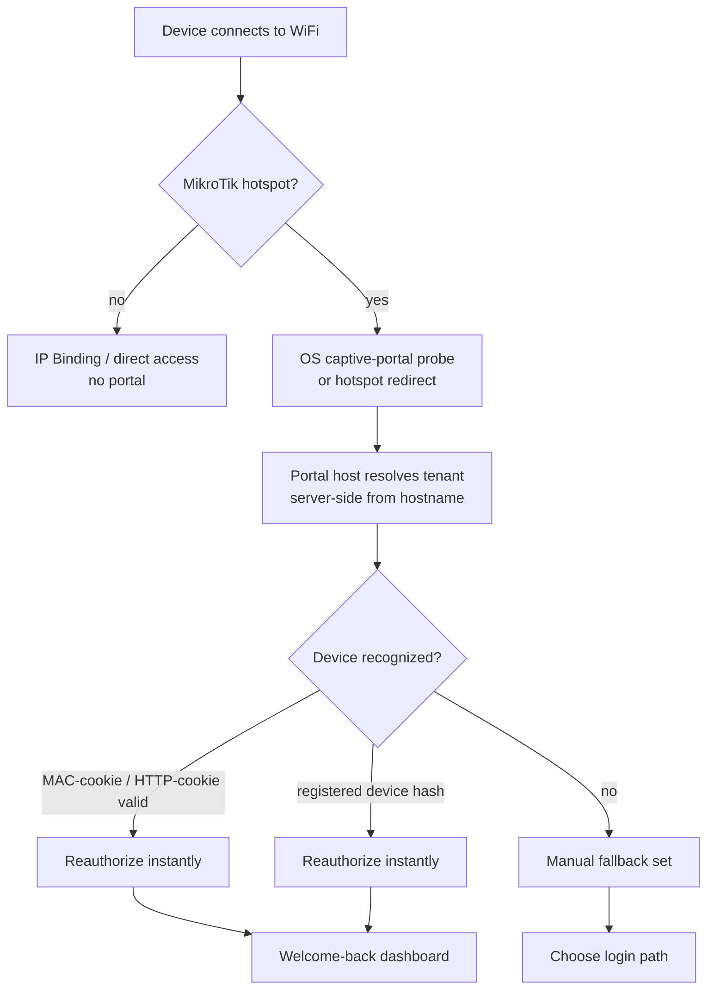
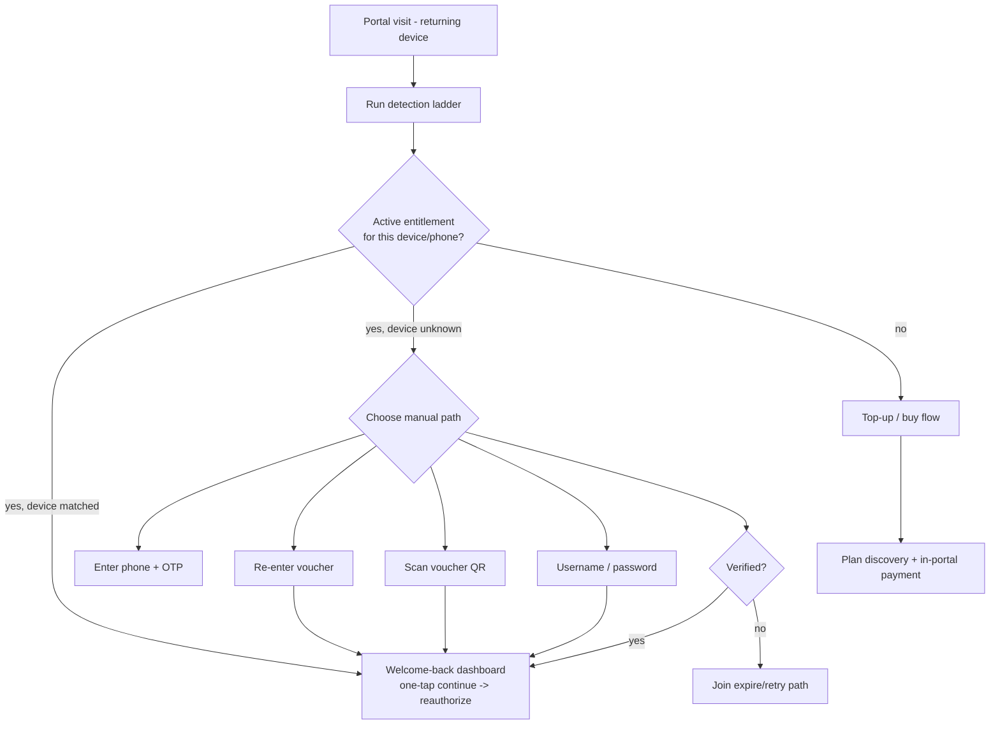
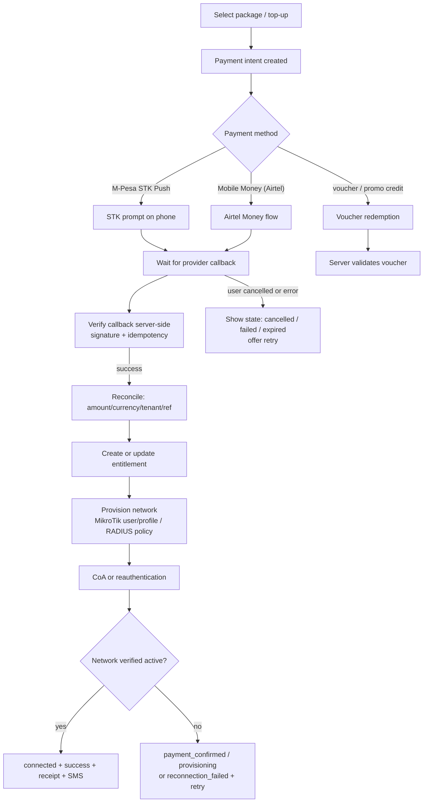
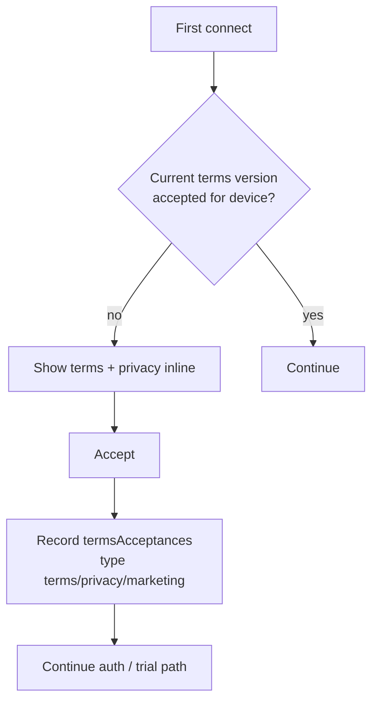

# MylesNet Captive Portal — User Flows

Companion to [[captive-portal-specification|MylesNet Captive Portal Specification]].
All flows are canonical; implementation must match these transitions. Repo mirror:
`docs/captive-portal/captive-portal-flows.md`.

## 1. Arrival and detection



## 2. Reconnection decision tree (returning subscriber)



> Requirement: a returning subscriber must always have **several** equivalent paths back
> online. No single disabled path can strand an active customer.

## 3. New user registration and trial

```mermaid
flowchart TD
    A[First visit] --> B[Terms + privacy acceptance<br/>recorded incl. version/device/IP]
    B --> C{Free trial available?}
    C -- yes --> D[Claim trial<br/>phone verify optional per tenant]
    D --> E{Already claimed on this device?}
    E -- inside reset window --> F[Show wait message<br/>time remaining until reclaimableAt]
    E -- reset passed or first claim --> G[Grant trial plan]
    F --> H[Offer top-up packages]
    G --> I[Provision network + connect]
    C -- no --> O[Register: phone + consent (progressive profiling)]
    O --> P[Verify phone via OTP]
    P --> Q[Plan discovery]
```

## 4. In-portal payment and activation



## 5. Free trial claim and reset

```mermaid
flowchart TD
    A[Device connects - no entitlement] --> B[Check freeTrialClaims<br/>deviceHash + phone]
    B --> C{Existing claim?}
    C -- no --> D[Create claim + grant trial<br/>set reclaimableAt = now + resetPeriod]
    C -- yes, inside window --> E[Show wait:<br/>available at reclaimableAt]
    C -- yes, window passed --> F[Allow new claim<br/>per tenant configuration]
    D --> G[Provision + connect (trial plan)]
    E --> H[Offer top-up]
    F --> D
```

## 6. Terms and consent

