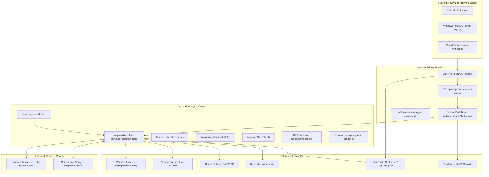

# MylesNet Captive Portal Specification — v1.0

## Document Control

| Field | Value |
|---|---|
| Product | [[MylesNet]] |
| Company | [[MylesCorp Technologies Ltd]] |
| Author | [[Jonathan Myles]] |
| Classification | Confidential internal source of truth |
| Version | v1.0 |
| Date | 2026-09-10 |
| Status | **Approved** — [[Jonathan Myles]], 2026-09-10 |
| Approved by | [[Jonathan Myles]] |
| Approval date | 2026-09-10 |
| Module | T-HOT (Hotspot & captive portal) |
| Component | Subscriber-facing captive portal + operator hotspot configuration |
| Vault scope | `products/mylesnet/` and child folders |
| Repository | `C:\Users\Admin\Projects\mylesnet-dashboard` (git `mylescorp/mylesnet-dashboard`) |
| Repo folder | `apps/web/captive-portal/` (portal boundary) + `docs/captive-portal/` (spec + flow mirrors) |
| Related modules | [[tasks/backlog\|backlog]] T-HOT, N-AAA, T-VOU, T-PAY, T-PRT, T-COM, T-TKT, T-SES |

## Source Of Truth Rule

This file is the canonical [[MylesNet]] captive portal and hotspot specification, approved
by [[Jonathan Myles]] on 2026-09-10. If any vault note, report, or company
document conflicts with this file for the captive portal and hotspot surface (including
the T-HOT backlog line and the technology-stack hotspot clauses), this file wins until
[[Jonathan Myles]] records a newer decision.

This spec is assembled from four authoritative inputs:

- **Part A-1** — [[MylesNet_Master_Technical_Specification_v3|MylesNet Master Technical
  Specification - Version 3 Final]] hotspot/captive-portal clauses (Part A Hotspot Mode,
  architecture diagram, data flow, tenant fields, settings screens), reproduced here as the
  governing baseline.
- **A-2** — [[tasks/backlog|Implementation Backlog]] T-HOT and N-AAA module definitions.
- **B** — The 2026-09-10 product decisions (see [[decisions]]) covering auth scope,
  reconnection methods, free-trial model, in-portal payments, branding, devices, splash
  model, architecture placement, and the standalone application folder.
- **C** — The modern captive-portal feature inventory (secure network-access, identity,
  payment, onboarding, communication, and customer self-service layer) ratified by
  [[Jonathan Myles]] on 2026-09-10.

---

## 1. Product Purpose And Journey

The captive portal is the **customer-facing access layer** of [[MylesNet]]. It is the
first and most visible point of contact a subscriber has with an operator's service. It
must be more than a login page: it is a **network-access, identity, payment, onboarding,
communication, and customer self-service layer** connected to RADIUS, billing, payments,
MikroTik hotspot infrastructure, notifications, analytics, and support operations.

The complete journey a modern captive portal must support:

> **Discover the network → understand the available service → register or authenticate →
> select a package → pay securely → receive verified access → monitor usage → renew or
> upgrade → get support → manage identity and devices.**

The portal must feel simple to the customer while coordinating complex backend processes
involving [[WorkOS AuthKit]], [[Convex]], payment gateways ([[M-Pesa Daraja]],
[[Airtel Money]]), FreeRADIUS, NAS devices, subscriber entitlements, notifications, fraud
controls, and analytics.

### Design principles

| Principle | Meaning |
|---|---|
| Simple to the customer | One job per screen; low-cognitive-load copy; no operator or infrastructure language |
| Verified access | Service is only ever claimed active when the network state is verified (payment **and** network state both confirmed) |
| Multi-path return | A returning subscriber with an active subscription can always get back online through several equivalent options, never a single locked path |
| Never blocks auth for non-essential work | Advertisements, analytics, and recommendations must never delay or deny authentication |
| First-party data first | Consent-controlled, privacy-respecting data collection; no secret sharing with third parties |
| Low bandwidth by default | Lightweight assets, compressed images, minimal JavaScript; usable on cheap Android handsets and unreliable rural links |
| Progressive profiling | Start with the minimum required to connect; collect more identity only when a compliance or product threshold requires it |
| Per-tenant configurability | Operators control their portal behaviour per tenant, site, SSID, plan, and segment |

---

## 2. Architecture And Routing

### 2.1 Placement

The captive portal is **not** a separate deployed application. Per the 2026-09-10 unified
system decision, [[MylesNet]] is **one system in one repository**: the portal is a **route
surface** inside the single Next.js application, tenant-resolved by hostname. All captive
portal logic, UI, templates, content, configuration, and tests live in a dedicated
folder `apps/web/captive-portal/` so portal code stays beside
the web product it serves.

### 2.2 Repository folder contract

```text
apps/web/captive-portal/
  README.md            # what it is, mount contract, how to add a feature
  ADR.md               # captive portal design decisions
  CHANGELOG.md
  core/                # pure domain logic — no React, no Next, no Convex
    auth/              #   auth flows, reconnect detection, session state machine
    trial/             #   free-trial engine (claim, device lock, reset window)
    payment/           #   payment intent + reconcile + application-vs-network state
    session/           #   sessions, devices, quota math
    state.ts           #   payment_confirmed / provisioning / connected / reconnection_failed
    types.ts           #   shared types (imported by Convex adapters)
  ui/                  # all portal screens & components
    screens/           #   login, welcome-back, register, plans, pay, devices, usage, support
    components/
  templates/           # theme definitions (colors, logo, background, font) — JSON + assets
  i18n/                # language packs (en, sw, lug) with en as base
  config/              # portal settings schema (Zod) — single source, shared with backend
  api/                 # protocol handlers: OS detection probes, callback parsers
  terms/               # consent + privacy copy (KDPA 2019, Uganda DP Act 2019)
  test/                # unit + integration tests
```

### 2.3 Mount contract

| Concern | Lives in | Why |
|---|---|---|
| All logic, UI, templates, i18n, config, tests, ADRs | `apps/web/captive-portal/` | web-local portal home |
| Next.js page **stubs** (thin `page.tsx` re-exporting portal screens) | `apps/web/app/(portal)/hotspot/**` | Next.js hard-requires routes under `app/`; stubs stay 5–10 lines and never contain business logic |
| Convex **adapters** (thin query/mutation/action/httpAction glue calling `apps/web/captive-portal/core`) | `convex/portal/` | Convex reads functions from a single function root; adapters hold only glue |
| Schema tables (central) | `convex/schema.ts` + schema additions (see §18) | Convex indexes schema centrally |
| Path alias `@portal/*` → `apps/web/captive-portal/*` | `apps/web/tsconfig.json` + `apps/web/next.config.ts` | clean imports from stubs and adapters |

**Rule of thumb:** logic is added in `apps/web/captive-portal/`, never in `app/` or `convex/`.
Those two only ever gain re-export stubs and thin adapters. A `apps/web/captive-portal/CHANGELOG.md`
entry and an update to the mount contract in `README.md` accompany every portal change.

### 2.4 Logical architecture



### 2.5 OS captive-portal detection probes

Operating systems probe for internet availability using well-known URLs. To avoid
false "no internet" states and to trigger the portal correctly, the route surface must
serve unauthenticated success responses at:

| Probe | OS | Expected response |
|---|---|---|
| `/hotspot-detect.html` + `/library/test/success.html` | Apple | `200` plain HTML `Success` |
| `/generate_204` | Android | `204 No Content` |
| `/connectivitycheck.gstatic.com/generate_204` (domain-allowlisted path) | Android | `204` |
| Windows NCSI (contact.msn.com / ntservice.msn.com) | Windows | `200` on `/ncsi.txt` |

These are **pre-auth** public handlers. They confirm only that the portal host is
reachable; they never declare a subscriber authenticated. The MikroTik hotspot redirect
points unauthenticated clients at the portal login surface (`/hotspot/login`).

### 2.6 Tenant resolution

- Portal hostname is derived from the tenant hostname (`<tenant>.<product-domain>`) or a
  configured custom captive portal domain.
- Tenant is resolved server-side from the verified hostname **before** any portal content
  renders. Client-supplied tenant identifiers are never authority.
- The portal itself is unauthenticated (network-level access). Operator configuration is
  authenticated via [[WorkOS AuthKit]] at `/dashboard/hotspot`.

---

## 3. Core Captive Portal Experience

| Feature | Requirement |
|---|---|
| Automatic detection | Detect a device joining an unauthenticated network (MikroTik hotspot redirect) and present the portal |
| Captive-network compatibility | Works on Android, iOS, Windows, macOS, ChromeOS, Linux, smart TVs, game consoles, and embedded devices where the OS probes allow |
| HTTPS portal | Valid TLS certificate and secure portal domain on every tenant portal; HSTS on the portal path |
| Responsive layout | Optimized for phones (primary), tablets, laptops, and large displays |
| Fast loading | Lightweight assets, compressed images, minimal JavaScript, low-bandwidth operation, CDN-cached public assets |
| Network-status awareness | Shows connected network/SSID, hotspot location, service status, and authentication state |
| Redirect preservation | After success, return the user to the originally requested page when possible |
| Session continuation | Avoid unnecessary reauthentication during a valid session (see §5 reconnection) |
| Logout | Clear method to end the current session (portal surface + operator-assisted) |
| Multi-language | Language selector and localized content (see §21) |
| Accessibility | Keyboard navigation, readable contrast, screen-reader labels, focus states, scalable text, accessible forms (see §20) |
| Offline-safe messaging | Explain when the portal cannot reach the network or payment service instead of failing silently |

---

## 4. Authentication Methods

### 4.1 Method matrix and status

The system supports multiple authentication workflows because different locations and
customer types require different methods. Administrators enable or disable methods per
**tenant, hotspot location, SSID, customer segment, plan, country, or device type**.

| Method | Use case | MVP | v1.1 | Later / gated |
|---|---|---|---|---|
| Voucher code | Prepaid hotspot access, agent distribution | ● | | |
| Phone number + SMS OTP | Mobile-first self-service; returning-subscriber lookup | ● | | |
| MAC-Cookie auto-reconnect | Returning devices with valid sessions | ● | | |
| HTTP Cookie auto-reconnect | Alternative to MAC-cookie | ● | | |
| IP Binding | Static devices that bypass hotspot auth (via `ipBindings`) | ● | | |
| Username / password | PPPoE or recurring subscriber accounts | | ● | |
| Scratch card | Physical prepaid cards from field agents | | ● | |
| Voucher QR code | Scan a printed/digital QR voucher to redeem | ● (voucher QR) | | |
| Email magic link | Passwordless access for supported accounts | | ● | |
| WhatsApp login | Authentication or renewal instructions via WhatsApp | | | gated (provider + allowlist) |
| Social login (Google/Apple/Facebook) | Fast identity for guest or promotional access | | | gated (allowlist + provider) |
| WorkOS/OIDC login | Enterprise / managed organizational access | | | gated |
| Free trial login | Controlled one-time trial after consent/verification | ● (trial engine) | | |
| Guest access | Limited access without a full customer account | | ● | |
| 802.1X/EAP | Enterprise wired/wireless, outside the visual portal | | | gated (RADIUS, Phase 7) |

> **Note on WhatsApp/social login.** OAuth and OTP providers require an internet path the
> pre-authentication client can reach. This demands an upstream **provider allowlist** on
> the MikroTik hotspot (domains for WhatsApp/Google/Apple/Facebook/SMS gateways) before
> these methods can authenticate an offline client. They are therefore **gated** and
> explicitly deferred from the MVP.

### 4.2 MVP authentication flows

- **Voucher entry** — customer types or scans a voucher code; `vouchers.redeem()` validates
  it server-side (status, expiry, package limits, one-use rule); entitlement is created and
  the MikroTik session is authorized.
- **Phone + SMS OTP** — customer enters phone number; an OTP is sent ([[Africa's Talking]]
  in MVP); verified OTP authenticates or returns the user to the matching active
  entitlement; a missed/expired OTP is retriable.
- **MAC-Cookie auto-reconnect** — a device already authorized by a valid session or
  registered MAC is automatically reauthorized without user input; the user lands on the
  welcome-back surface (§5).
- **IP Binding** — devices with an active static IP binding bypass the portal entirely and
  connect directly.

---

## 5. Reconnection And Welcome-Back

### 5.1 Requirement

> Whenever a subscriber has logged in and paid for access, they must have several ways to
> return to the WiFi. When they leave and come back, the system should detect them — by
> retrieving their voucher, by them typing their phone number, by device recognition, or by
> other means — and get them back online quickly. **It must never be only one option.**

### 5.2 Detection ladder (performed on every portal visit)

| Order | Detection | How | Result |
|---|---|---|---|
| 1 | **MAC-cookie / session cookie** | Router returns a remembered/valid session cookie or MAC-cookie for the previous session | Instant reauthorization |
| 2 | **Registered device (MAC/hostname hash)** | Device MAC hash matches a trusted device on an active entitlement | Instant reauthorization |
| 3 | **Device hash + phone prompt** | Unrecognized device; portal pre-fills last-used phone for this network | Short verification |
| 4 | **Manual fallback (any of):** voucher re-entry, phone+OTP, voucher QR scan, username/password, email magic link | User chooses the path they have | Verification → reauthorization |

The ladder is **configurable per tenant**: an operator may disable any rung or reorder the
manual fallback list. The default enables all of the MVP rungs.

### 5.3 Reauthorization outcomes

| Situation | Portal behaviour |
|---|---|
| Active entitlement found | Show **welcome-back dashboard** (§5.4); one-tap continue |
| Expired entitlement found | Show expiry notice; offer top-up / renewal pack (in-portal payment) |
| Never had access | Show login/register/plan discovery |
| Multiple active entitlements | Let the user pick the service to resume |
| Suspended/blocked | Explain the reason and the next action (support contact / payment) |

### 5.4 Welcome-back dashboard

A returning subscriber with an active subscription lands on a **welcome-back** surface:

- Network name / SSID and location verified.
- Active plan name, speed, and remaining time/data.
- Expiry date/time (countdown).
- **One-tap continue** (reauthorize now).
- Top-up / upgrade buttons when near limits.
- Support contact (phone, WhatsApp, email per tenant).
- Terms/help links; language selector.

Welcome-back never claims connectivity that has not been network-verified (see §14 state
distinction).

---

## 6. Registration And Onboarding

New users register without staff intervention while enforced identity and compliance
controls apply.

### 6.1 Progressive profiling

- **Level 0 (connect now):** minimum fields — phone number (or voucher code) + consent.
  Enough to grant trial/voucher access.
- **Level 1 (recurring account):** name, verified phone or email, password, location.
- **Level 2 (compliance threshold):** optional national ID / company details, KYC
  document upload where a territory or plan requires it, billing address.

The user begins with the minimum for access, then completes details when purchasing a
longer package, requesting a permanent account, or crossing a compliance threshold.

### 6.2 Registration features

- Phone and email verification (SMS OTP / magic link).
- Customer name, optional national ID or company details.
- Password creation (recurring accounts).
- Terms acceptance, privacy consent, marketing consent (separate toggles).
- Location capture (hotspot/site where registration happened).
- Service selection and referral / invitation codes.
- Duplicate-account detection (phone, email, device hash).
- KYC document upload where required.
- Age / eligibility checks where required.

---

## 7. Free Trial Engine

### 7.1 Model

> A free trial exists in the system. It is a **one-time** claim per device (and per phone)
> by default. Each tenant can configure a **reset window**: after that period, the same
> device may claim the trial again. The system detects that a device has already used the
> trial and either directs the user to wait until the reset, or re-opens the trial when the
> window has passed — exactly per the tenant's configuration.

### 7.2 Claim rules

- One active claim per **device hash** and per **phone** (combinable where configured).
- `freeTrialClaims` records `deviceHash`, `phone`, `tariffPlanId`, `claimedAt`, and the
  computed `reclaimableAt` (claim + tenant reset period).
- A claim attempt inside the window shows the time remaining until the trial can be
  claimed again — never a silent failure.
- Abuse controls are mandatory (see §19); POST-trial, the user is offered top-up packages.

### 7.3 Tenant configuration

| Setting | Default | Meaning |
|---|---|---|
| `trialEnabled` | false | Trial available on this tenant/portal |
| `trialPlanId` | — | The tariff plan issued as a trial |
| `freeTrialResetPeriodDays` | 30 | Window before the same device/phone may claim again |
| `freeTrialPhoneVerification` | true | Require SMS OTP before issuing |
| `freeTrialDeviceLimit` | 1 | Simultaneous devices per trial claim |
| `trialConsentRequired` | true | Terms/privacy acceptance before claim |

---

## 8. Plans And Package Discovery

The portal presents available packages and allows comparison before authenticating or
paying.

- **Catalogue:** hourly, daily, weekly, monthly, family, business, enterprise, night,
  weekend, and data packages (from `tariffPlans`).
- **Speed display:** download/upload speed, burst speed, fair-use conditions.
- **Time limits:** minutes, hours, days, recurring periods, scheduled access.
- **Data limits:** MB/GB, unlimited, shared quotas, rollover data.
- **Device limits:** simultaneous/registered device count.
- **Coverage:** hotspot, branch, neighbourhood, tower, or service-area availability.
- **Pricing:** local currency, taxes, fees, discounts, total payable.
- **Comparison:** side-by-side speed, duration, data, devices, benefits.
- **Promotions:** coupons, referral discounts, introductory offers, targeted packages.
- **Recommended plans:** personalized suggestions from usage or customer type.
- **Upgrade / downgrade:** change an active package with proration or immediate effect.
- **Plan scheduling:** start now, start later, renew automatically, activate at a time.

Every plan page clearly labels **prepaid / postpaid / recurring / capped / speed-limited /
shared / fair-use** so customers are never surprised.

---

## 9. Payments And Billing

### 9.1 In-portal payment

Payments happen **inside the captive portal** — no exit to an unrelated external page.

| Method | MVP | v1.1 | Later |
|---|---|---|---|
| M-Pesa STK Push ([[M-Pesa Daraja]]) | ● | | |
| M-Pesa Paybill / C2B | | ● | |
| [[Airtel Money]] | | ● | |
| Card payments | | | gated |
| Bank transfer / QR / USSD / wallet / PayPal / regional gateways | | | gated |

### 9.2 Payment experience

- Invoice/package reference, order summary, taxes, discounts, gateway selection.
- Payment-status polling, callback-based confirmation, retry, cancel, timeout handling.
- Duplicate-payment protection (idempotency), refund status, receipt generation.
- Payment history in the self-service area.

### 9.3 Payment state model

| State | Meaning |
|---|---|
| `pending` | Intent created; awaiting provider |
| `succeeded` | Server-verified success (callback/status check) |
| `failed` | Transaction rejected |
| `cancelled` | User/provider cancelled |
| `expired` | Session/token window elapsed |
| `reversed` | Provider reversed after success |
| `refunded` | Refund issued |
| `disputed` | Under dispute |

### 9.4 Activation flow

```text
Select package
  → Create payment intent
  → Select payment method
  → Complete provider authorization (STK Push prompt / redirect)
  → Verify callback or status (server-side, signature checked)
  → Reconcile payment (amount, currency, tenant, reference, idempotency)
  → Create or update entitlement
  → Update RADIUS policy (MVP: MikroTik user/profile; Phase 7: FreeRADIUS)
  → CoA or reauthentication
  → Confirm active session (network-verified)
  → Show success and receipt (+ SMS confirmation)
```

Access is **activated only after the provider result is verified server-to-server** —
never on a client-side "payment done" claim.

### 9.5 Application vs network state

```text
INTENT  → payment_confirmed → provisioning → connected → (renew / reconnection_failed)
```

The portal **must** distinguish application state from network state:

| State | Displayed when | Never claim |
|---|---|---|
| `payment_confirmed` | Payment verified, provisioning in progress | connectivity |
| `provisioning` | Network job running (voucher push / RADIUS update) | connectivity |
| `connected` | Router/RADIUS confirms active session (verified) | — |
| `reconnection_failed` | Payment/entitlement ok but router offline or CoA failed | connectivity without a retry path |

When the router is offline, the portal shows `payment_confirmed` plus an explicit
`reconnection_pending` notice and a retry path — not a false "you are online".

---

## 10. Sessions And Device Management

### 10.1 Session record (`captivePortalSessions`)

One record per portal-originated session: device, MAC hash, IP, authenticated user
(optional), voucher, plan, site, start/stop, idle/session timeouts, accounting counters,
channel (`voucher`, `otp`, `mac_cookie`, `trial`, `reconnect`, `qr`), and the 
application/network state driver.

### 10.2 Self-service devices

Subscribers can, at the operator's option (default on):

- See devices currently connected to their account.
- Rename devices (nickname) for recognition.
- Remove/disconnect a device from the network.
- See device limits enforced per plan; receive warnings at the limit.
- Approve a new device when device-binding is enforced.

Operator configuration controls whether customers may disconnect devices, rename devices,
bind devices, or approve new devices.

---

## 11. Usage And Quota Visibility

The portal presents **understandable** usage rather than raw accounting counters.

- Data consumed / remaining; time used / remaining.
- Daily and monthly usage summaries.
- Device-level usage and shared-family usage where applicable.
- Fair-use progress and projected exhaustion date where computable.
- Quota thresholds at 50%, 75%, 90%, 100% (configurable) trigger in-portal + SMS/WhatsApp
  notices.
- The portal explains whether reaching a limit causes **suspension, throttling, rollover,
  or an add-on purchase option**.

---

## 12. Customer Self-Service Account Area

A portal account area lets users manage identity and services without contacting support.

- Profile editing; phone/email change (re-verified).
- Password change and MFA setup where enabled.
- Trusted devices; service and billing addresses.
- Invoices, receipts, saved payment methods (where permitted).
- Notification and privacy preferences.
- Active services: upgrade, pause, reconnection request.
- Referrals (tenant referral program).
- Support tickets and their status.
- KYC information and consent records.
- Data export / deletion requests where applicable ([[Kenya Data Protection Act 2019|KDPA]],
  Uganda DP Act 2019).

For multi-service customers a **service switcher** lets the user view and pay each service
independently.

---

## 13. Branding And Templates

### 13.1 Template system

Operators customize the portal without source-code changes via a **template system**:

| Control | Source |
|---|---|
| Template selection | `hotspotTemplate` (tenants) |
| Main logo, compact logo, favicon, light/dark variants | tenant `logoFileId` + upload |
| Colors — primary, accent, gradient end, surface, text | `captivePortalColor`, `captivePortalGradientEnd`, [`design/tokens`] contract |
| Typography — font family, scale | `captivePortalFont` |
| Background — solid, image, gradient | `templateBackgroundFileId` (`hotspotSettings`) + upload |
| Layout — card style, radius, spacing, footer | template JSON |
| Content — headings, instructions, help, contact, FAQ | tenant-editable fields |
| Custom domain + TLS | `captivePortalUrl`; approval-gated DNS/TLS |
| Language | `captivePortalLanguage` + i18n packs (§21) |
| Per-location / per-SSID overrides | template override records |

### 13.2 Token contract

The portal uses the approved [[design/tokens|Design Token contract]] for its defaults and
allows tenant overrides only on the authorized tenant-facing surfaces (§13.1). Contrast
and focus defaults from the token system are **never** dimmed by tenant overrides.

---

## 14. Splash, Terms And Operator Content

### 14.1 MVP model

- **Terms + privacy acceptance** on first connect, recorded (version + timestamp + device +
  IP) in `termsAcceptances`.
- **Marketing consent** as a separate opt-in control.
- **Operator splash** (optional, admin-controlled): full-page operator promotions,
  images/video, notices before login/payment. An operator may enable or disable it per site.
- **No third-party advertising platform** in the MVP.

### 14.2 Consent & legal records

| Record | Requirements |
|---|---|
| Terms versioning | Current version stored; acceptance references the exact version |
| Privacy policy | Presented before collection; linked and versioned |
| Marketing opt-out | First-party and always available |
| Data retention | Documented retention; deletion/export flow |
| Legal scope | [[Kenya Data Protection Act 2019]] and Uganda DP Act 2019 |
| Provider disclosure | Clear list of third-party providers (payments, SMS, email) |

### 14.3 Later (outside MVP)

Third-party ad platform with consent controls and placement tracking — explicitly
scheduled after MVP (see §23).

---

## 15. Notifications And Communications

The portal integrates with SMS ([[Africa's Talking]]), WhatsApp (gated), email ([[Resend]]),
and in-portal alerts.

| Event | Channel (user preference + mandatory) |
|---|---|
| Registration | SMS, WhatsApp, email, in-portal |
| Login code delivery | SMS (mandatory for OTP path) |
| Payment initiated / succeeded / failed | SMS + receipt, in-portal |
| Package activated | SMS, in-portal |
| Package expiring / expired | SMS, in-portal |
| Quota warning (50/75/90/100%) | SMS, in-portal |
| Service suspended / reconnected | SMS, WhatsApp, in-portal |
| Ticket update | SMS, email, in-portal |
| Planned maintenance / router outage | SMS, in-portal |
| Password change / suspicious login | SMS/email (security) |
| Refund | SMS/email, in-portal |

Every message carries delivery status, retry policy, provider reference, and history.
Legally/operationally required notices override preferences.

---

## 16. Support And Help Desk

- Self-service FAQs, knowledge-base articles, search, guided troubleshooting.
- Service-status check (auth status, payment state, RADIUS/session state, router
  reachability, known incidents) **before** ticket creation.
- Ticket creation with category, priority, attachments; ticket status and response history.
- Chat / WhatsApp handoff; callback requests; email support.
- SLA visibility and satisfaction rating (surveys per operator config).

---

## 17. Security And Privacy

### 17.1 Security

- HTTPS, secure cookies, HSTS on portal paths.
- CSP, CSRF protection on mutating routes, input validation, output encoding.
- Rate limiting (login, OTP, voucher attempts, payment retries).
- Bot protection selected by risk (CAPTCHA/invisible controls only where needed).
- Session expiry, device trust, MFA where enabled, risk-based step-up.
- Signature-verified payment callbacks; secure voucher handling.
- Audit records for portal actions (idempotent, tenant-scoped).
- **Never** expose RADIUS shared secrets, payment secrets, router credentials, internal IPs,
  or administrative APIs through portal JavaScript.

### 17.2 Privacy

- Consent capture and privacy-policy presentation.
- Data minimization; access, deletion, and export requests.
- Document protection; analytics consent; marketing opt-out.
- Data-retention policies and third-party-disclosure records.
- Aligned to [[Kenya Data Protection Act 2019]] and Uganda DP Act 2019.

---

## 18. Schema Design

Tables are Convex-conformant (`createdAt`/`updatedAt` Unix timestamps, optional soft
`deletedAt`, `tenantId` + `by_tenant` index, indexes before queries, no unbounded reads).

### 18.1 `captivePortalSettings` (replaces/migrates stub `hotspotSettings`)

Per-tenant portal configuration, superseding loose fields on `tenants` and the
`hotspotSettings` stub. Migration note: rename `hotspotSettings` → `captivePortalSettings`
(additive; index preserved), not a silent drop.

> **Naming map (v2-era `tenants`/`hotspotSettings` fields → `captivePortalSettings`)** —
> `captivePortalColor`→`brandColor`, `captivePortalGradientEnd`→`gradientEnd`,
> `captivePortalFont`→`font`, `captivePortalLanguage`→`language`,
> `captivePortalUrl`→`portalUrl`, `hotspotTemplate`→`template`,
> `templateBackgroundFileId`(`hotspotSettings`)→add `templateBackgroundFileId`
> (optional `_storage`), `logoFileId`→`logoFileId` (optional `_storage`). §13 references
> the legacy names; the table below is the authoritative schema target.

| Field | Type | Notes |
|---|---|---|
| `tenantId` | id("tenants") | |
| `siteId` | optional id("sites") | Per-site override support; `sites` defined in §18.8 (planned inventory entity) |
| `ssid` | optional string | Per-SSID override |
| `portalUrl` | optional string | Custom portal domain; TLS approval-gated |
| `enabledAuthMethods` | array of enum | voucher, otp, mac_cookie, http_cookie, ip_binding, qr, username_password, scratch, trial |
| `enabledReconnectMethods` | array of enum | mac_cookie, device_hash, phone, voucher, qr, email |
| `template` | optional string | Template name |
| `brandColor` | optional string | Hex accent override |
| `gradientEnd` | optional string | |
| `font` | optional string | |
| `language` | optional string | Base language (en) |
| `redirectUrl` | optional string | Post-login redirect |
| `deviceRememberDays` | number | default 30 |
| `pruneInactiveDays` | number | default 30 |
| `autoReconnectMethod` | enum | mac_cookie / http_cookie / ip_binding |
| `trialEnabled` | boolean | |
| `trialPlanId` | optional id("tariffPlans") | |
| `freeTrialResetPeriodDays` | number | default 30 |
| `freeTrialPhoneVerification` | boolean | |
| `freeTrialDeviceLimit` | number | default 1 |
| `splashEnabled` | boolean | Operator splash toggle |
| `splashPageId` | optional id("portalContent") | |
| `quietQuotaWarnings` | optional array | thresholds default 50/75/90/100 |

### 18.2 `captivePortalSessions`

| Field | Type | Notes |
|---|---|---|
| `tenantId` | id("tenants") | |
| `customerId` | optional id("customers") | |
| `siteId` | optional id("sites") | see §18.8 |
| `routerId` | optional id("routers") | MikroTik/NAS |
| `voucherId` | optional id("vouchers") | |
| `tariffPlanId` | optional id("tariffPlans") | |
| `deviceHash` | optional string | privacy-safe hashed MAC/device |
| `macAddressHash` | optional string | |
| `ipAddress` | optional string | |
| `channel` | enum | voucher, otp, mac_cookie, http_cookie, ip_binding, qr, trial, reconnect |
| `status` | enum | pending, active, idle, expired, terminated, failed |
| `stateDriver` | enum | payment_confirmed, provisioning, connected, reconnection_failed |
| `startedAt` / `endedAt` | optional number | |
| `bytesUsed` / `secondsUsed` | optional number | |

### 18.3 `captivePortalTemplates`

Template definitions (layout JSON, background reference, default tokens); activation per
tenant/site via `captivePortalSettings.template`.

### 18.4 `freeTrialClaims` (full definition)

| Field | Type | Notes |
|---|---|---|
| `tenantId` | id("tenants") | |
| `phone` | optional string | |
| `deviceHash` | optional string | |
| `tariffPlanId` | id("tariffPlans") | |
| `claimedAt` | number | |
| `reclaimableAt` | number | `claimedAt` + tenant reset |
| `status` | enum | active, exhausted, revoked |

### 18.5 `portalContent`

Operator-authored portal content used by splash and informational pages
(`captivePortalSettings.splashPageId`, term/privacy presentation, notices).

| Field | Type | Notes |
|---|---|---|
| `tenantId` | id("tenants") | |
| `siteId` | optional id("sites") | Per-site content override |
| `slug` | string | splash, terms, privacy, notice, landing |
| `kind` | enum | text, html, image, video, page |
| `fileId` | optional id("_storage") | When kind is media |
| `body` | optional string | sections/blocks JSON |
| `language` | optional string | Content language |
| `active` | boolean | |
| `startAt` / `endAt` | optional number | Scheduling window |

### 18.6 `termsAcceptances`

| Field | Type | Notes |
|---|---|---|
| `tenantId` | id("tenants") | |
| `customerId` | optional id("customers") | |
| `deviceHash` | optional string | |
| `termsVersion` | string | exact version accepted |
| `acceptedAt` | number | |
| `ipAddress` | optional string | |
| `type` | enum | terms, privacy, marketing, trial_consent |

### 18.7 Additions to existing tables

- `advertisements` — add `placement` (`splash`, `banner`, `post_login`), `siteId`,
  impression/click counters.
- `customerFeedback` — keep `source` values `captive_portal` and `dashboard`; add category.

### 18.8 `sites` (planned inventory entity, introduced by this spec)

Logical location grouping — router + access points + switches + premises — used for
per-site portal overrides (`captivePortalSettings.siteId`, `captivePortalSessions.siteId`,
`portalContent.siteId`, `advertisements.siteId`). **Planned:** the formal definition lands
with the v3 inventory lane (backlog N-RT / N-IP, Phase 8). The captive portal schema keeps
only optional forward-compatible pointers and never requires `sites`.

| Field | Type | Notes |
|---|---|---|
| `tenantId` | id("tenants") | |
| `name` | string | |
| `routerIds` | array of id("routers") | Member NAS devices |
| `accessPointIds` | array of id("accessPoints") | |
| `switchIds` | array of id("networkSwitches") | |
| `timezone` | optional string | |
| `active` | boolean | |

---

## 19. Fraud And Abuse Prevention

| Detector | Control |
|---|---|
| Repeated failed logins | Rate limit, escalating lockout |
| Voucher guessing | Per-IP/device attempt limits; CAPTCHA only where needed |
| Excessive device churn | Device-change velocity on a phone/identity |
| Concurrent-session abuse | Device limits per plan; duplicate-login notice |
| Account sharing | Risk scoring on geography/devices; step-up verification |
| Suspicious payment attempts | Idempotency checks; provider status verification; review queue |
| Repeated refund requests | Manual-review flag |
| Automated scraping / bots | Rate limits + optional invisible bot controls |
| Impossible behaviour / unusual geo | Risk scoring and quarantine |

All detectors emit **explainable alerts** only; manual review and clear recovery procedures
are documented.

---

## 20. Accessibility

The portal follows WCAG-oriented design and the [[design/system|MylesNet Design System]]
accessibility rules:

- Keyboard-only navigation, visible focus states.
- Screen-reader labels on every control; ARIA where required.
- Readable contrast (AA at minimum; tenant overrides cannot reduce below the token
  contract defaults).
- Readable form errors; accessible modals; focus management.
- 320px–wide mobile and 400% zoom, reduced-motion preference, high-contrast mode.

---

## 21. Localization

- Base language packs (English) with per-tenant overrides.
- Launch language set: English, **Swahili, Luganda** (additive).
- Currency, taxes, date/time formats, time zones, phone-number and number formatting.
- Regional payment methods and local support contacts.
- Region-specific legal text (KDPA 2019 / Uganda DP Act 2019).
- Translation management via `i18n/` packs; no hard-coded strings in portal UI.

---

## 22. Performance And Resilience

- Lightweight bundles, code splitting, CDN caching of public assets, server-side
  validation, resilient payment polling, graceful error pages, retries, clear loading
  states.
- **Degraded-mode rule:** banners, analytics, recommendations, and ads must **never** block
  authentication, voucher redemption, or payment.
- Payment and RADIUS dependencies have explicit fallback and recovery behaviour; failure of
  a non-essential service degrades to no-show, not to splash-screen block.
- The portal remains usable on slow mobile networks and older devices.

---

## 23. Roadmap

### MVP (Phase 6 launch)

Responsive HTTPS portal; voucher, phone/OTP, MAC-cookie, HTTP-cookie, IP-binding auth;
welcome-back reconnection with the full manual fallback set; registration + progressive
profiling; one-time free trial with tenant reset window; plan display; in-portal M-Pesa
STK Push; payment callback verification + activation FSM; application-vs-network state;
session + device management; usage balance + expiry display; SMS confirmation; terms +
operator splash; support contact; basic branding/templates; core analytics; admin
configuration; audit logs; MikroTik integration (Convex-direct RouterOS API).

### v1.1

Airtel Money; cards; QR/USSD payments; username/password; scratch cards; guest access;
email magic link; package upgrades; multi-hotspot per tenant; customer accounts; WhatsApp
notifications; referrals; ticketing; campaigns; custom splash landing pages; reseller
support.

### v2 / gated

FreeRADIUS upstream (N-AAA/N-ACC, Phase 7); social login and WhatsApp login (provider
allowlist); enterprise SSO/OIDC; AI-assisted troubleshooting; personalized recommendations;
advertising platform with consent; advanced fraud detection; multi-country tenant
operations; 802.1X/EAP.

---

## 24. MikroTik Integration Protocol

### 24.1 Automation gate

Router automation (RouterOS API calls, SSH, SNMP) is gated behind explicit
[[Jonathan Myles]] approval per the Master specification Automation Gating clause:
provider selection, credential handling (never plaintext), API method selection, and
rollback plan. The portal implementation **does not automate routers until that approval
and the Phase-gate evidence exist**.

### 24.2 MVP integration (Convex-direct)

- Portal `core` calls the Convex adapter → RouterOS API action.
- Voucher redeemed → user/profile provisioned on the hotspot → session authorized.
- CoA/Disconnect on payment reversal, suspension, or customer disconnect, verified against
  live router state.
- MAC-cookie / HTTP-cookie profiles and device-remember configured per tenant settings.

### 24.3 Phase 7 upgrade path (FreeRADIUS)

- Portal authentication delegates to N-AAA; accounting from N-ACC; sessions from N-SES.
- CoA via N-COA. The portal consumes the same subscriber entitlements but the network
  boundary becomes RADIUS-backed.
- Active-session status merges RADIUS accounting with the portal session record (§18.2).

---

## 25. API And Integration Contract

Portal operations are exposed as typed Convex functions (`convex/portal/`) plus HTTP
actions for callbacks; the public surface is versioned, tenant-scoped, rate-limited,
idempotent, audited, and documented (OpenAPI-derived per `packages/api-contracts`).

| Area | Operations |
|---|---|
| Authentication | initiate auth, verify OTP, redeem voucher, reconnect lookup |
| Trials | claim trial, trial status, reset status |
| Plans | list plans, compare, recommend |
| Payments | create intent, status polling, verify callback, reconcile |
| Sessions/devices | list sessions, register device, remove device, disconnect |
| Usage | get usage/balance, quotas, thresholds |
| Account | profile, invoices, receipts, communication prefs, data requests |
| Support | tickets create/list, status-check |

Every mutation enforces tenant authority server-side; callbacks are signature-verified;
impatient clients retry with idempotency keys.

---

## 26. Analytics And Reporting

### 26.1 Core analytics (day one)

| Category | Metrics |
|---|---|
| Authentication | Portal visits, login attempts, success rate, rejection causes, method usage |
| Conversion | Registration rate, login completion, payment conversion |
| Payments | Success rate, failure reasons, average transaction, gateway latency |
| Packages | Popularity, upgrade rate, renewal rate, expiry rate |
| Sessions | Concurrent users, duration, disconnect reasons, duplicate sessions |
| Usage | Time, data, device, site, plan usage |
| Network | NAS status, CoA success, hotspot availability |
| Security | Failed logins, suspicious devices, voucher abuse, blocked requests |

### 26.2 Deferred

Ad impressions/conversions, campaign performance, A/B testing, funnel analysis, geographic
and device distribution (added with the marketing/ads tier, §14.3).

Reports support date ranges, locations, plans, auth types, devices, segments, exports,
scheduled delivery, and role-based access (operator staff only).

---

## 27. Administrator Controls

Operators configure the portal by tenant, site, SSID, NAS, segment, and plan:

- Authentication and reconnection method enablement (§4, §5).
- Session rules: idle timeout, session timeout, concurrent-device limits.
- RADIUS/network attributes: IP pools, VLANs (Phase 7).
- Providers: payments, SMS, WhatsApp (gated), email.
- Notification templates and triggers.
- Branding, translations, banners, splash, terms, privacy notices.
- Support contacts, maintenance messages, redirect behaviour.

Changes support drafts, approval, versioning, audit history, rollback, and environment
separation via [`X-OPS`] administrative configuration.

---

## 28. Multi-Tenant, Agent And Reseller Features

- **Tenant isolation** — every portal record carries `tenantId`; cross-tenant denial is a
  release gate (backlog X-TEN).
- **Per-branch/site** — portals, plans, brands, administrators per hotspot/branch.
- **Agents & resellers** — agent-created accounts, agent vouchers, commission tracking,
  agent credit balances, customer ownership, tenant-specific reports (T-AG).
- **Enterprise** — corporate SSO (gated), multiple sites, separate admins, usage policies,
  dedicated plans, invoice approval, cost centres, VLANs, static IPs (Phase 7).

---

## 29. Acceptance Criteria (go-live checklist)

- [ ] Responsive portal renders on 320px mobile and desktop; a11y checks pass (keyboard,
      focus, contrast AA, screen-reader).
- [ ] OS detection probes (`/hotspot-detect.html`, `/generate_204`, NCSI) respond without
      authentication on the portal host.
- [ ] Voucher redemption, phone+OTP, and MAC-cookie reconnect verified end-to-end against a
      MikroTik test hotspot (N-LAB when present).
- [ ] Welcome-back reconnection works through every enabled fallback (voucher, phone, QR,
      device) for a subscriber with an active entitlement.
- [ ] Free trial: first claim grants access; repeat claim inside the window is blocked with
      a clear wait message; a claim after the tenant-configured reset succeeds.
- [ ] Payment flow: intent → callback verified → entitlement → network job → verified active
      session; duplicate payment cannot double-activate; reversal/refund paths tested.
- [ ] Application-vs-network states display correctly (payment_confirmed, provisioning,
      connected, reconnection_failed) incl. offline-router case.
- [ ] Terms/privacy accepted and versioned in `termsAcceptances`.
- [ ] Cross-tenant denial verified for portal queries/mutations (test suite).
- [ ] Rate limits and bot controls active on login/OTP/voucher/payment attempts.
- [ ] Core analytics available to operator roles only; no analytics on unconsented data.
- [ ] Router automation behind the [[Jonathan Myles]] approval gate; no unattended push.
- [ ] Repo mirror (`docs/captive-portal/`) and vault spec identical.

---

## References

- [[MylesNet_Master_Technical_Specification_v3|MylesNet Master Technical Specification - Version 3 Final]]
- [[tasks/backlog|MylesNet Implementation Backlog]] (T-HOT, N-AAA, T-VOU, T-PAY, T-PRT)
- [[decisions|MylesNet Decisions]] (2026-09-10 captive portal + folder decisions)
- [[page-inventory|MylesNet Page Inventory]] (portal route surface)
- [[design/tokens|MylesNet Design Tokens]]
- [[design/system|MylesNet Design System]]
- [[design/captive-portal-flows|Captive Portal User Flows]]
- [[technology-stack|MylesNet Full Production Technology Stack]]
- Repository: `apps/web/captive-portal/` (code), `docs/captive-portal/` (mirrors)
